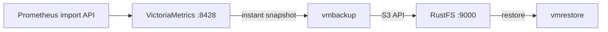
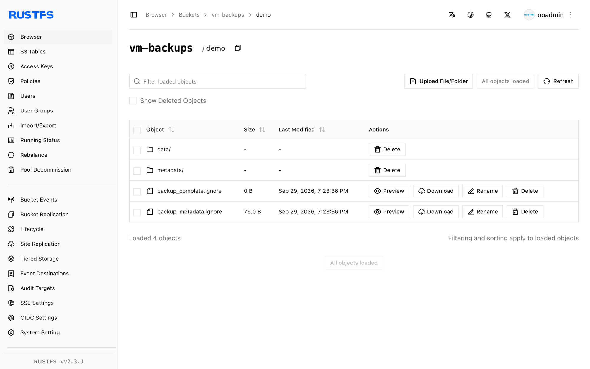

This guide connects [VictoriaMetrics](https://github.com/VictoriaMetrics/VictoriaMetrics) — the Prometheus-compatible time-series database — to **RustFS** through `vmbackup` and `vmrestore`. You will run a single-node instance, import metrics, create an instant snapshot, back it up to a RustFS bucket, and restore the data into a fresh directory. The workflow was verified with `victoria-metrics`, `vmbackup`, and `vmrestore` v1.x images against `rustfs/rustfs-x86-musl:v2.3.1`.

You need Docker. This deployment is intended for local integration testing, not production.

## Architecture



`vmbackup` uploads a consistent point-in-time snapshot of the storage directory to any S3-compatible endpoint. `vmrestore` reverses the process, producing a data directory a VictoriaMetrics instance can open directly.

## 1. Run VictoriaMetrics

Create the bucket and start a single-node instance:

```bash
rc mb rustfs/vm-backups

docker run -d --name vm --network oo-rustfs_default -p 8428:8428 \
  -v vm-data:/storage \
  victoriametrics/victoria-metrics:latest \
  -storageDataPath=/storage -retentionPeriod=100y
```

## 2. Import metrics

Write a couple of samples through the Prometheus import API:

```bash
echo "vm_demo_metric 123" | curl -s --data-binary @- http://localhost:8428/api/v1/import/prometheus
echo "vm_demo_metric 456" | curl -s --data-binary @- http://localhost:8428/api/v1/import/prometheus
```

The endpoint answers `204 No Content`. Confirm the data is queryable:

```bash
curl -s "http://localhost:8428/api/v1/export?match[]=vm_demo_metric"
```

```text
{"metric":{"__name__":"vm_demo_metric"},"values":[123,456],"timestamps":[1790680894604,1790680894619]}
```

## 3. Create a snapshot

Ask VictoriaMetrics for a consistent snapshot:

```bash
curl -s http://localhost:8428/snapshot/create
```

```text
{"status":"ok","snapshot":"20260929112134-18D9C6C76704F913"}
```

## 4. Back the snapshot up to RustFS

Run `vmbackup` against the same storage volume, replacing the credential placeholders. The snapshot name comes from step 3:

```bash
docker run --rm --network oo-rustfs_default \
  -e AWS_ACCESS_KEY_ID=<your-access-key> \
  -e AWS_SECRET_ACCESS_KEY=<your-secret-key> \
  --volumes-from vm \
  victoriametrics/vmbackup:latest \
  -storageDataPath=/storage \
  -snapshotName=20260929112134-18D9C6C76704F913 \
  -dst=s3://vm-backups/demo \
  -customS3Endpoint=http://<your-rustfs-endpoint>:9000
```

```text
backup ... to S3{bucket: "vm-backups", dir: "demo/"} is complete; uploaded 760 bytes
```

`-customS3Endpoint` redirects the AWS SDK to RustFS; custom endpoints are addressed with path-style requests automatically. Set `AWS_EC2_METADATA_DISABLED=true` on hosts without an EC2 metadata service to skip credential lookup delays.

## 5. Verify and restore

List the bucket prefix:

```bash
rc ls rustfs/vm-backups/demo/
```

```text
backup_complete.ignore
backup_metadata.ignore
data/
metadata/
```

`backup_complete.ignore` marks a complete backup. Restore it into a fresh directory:

```bash
docker run --rm --network oo-rustfs_default \
  -e AWS_ACCESS_KEY_ID=<your-access-key> \
  -e AWS_SECRET_ACCESS_KEY=<your-secret-key> \
  -v /opt/vm-restore:/restore \
  victoriametrics/vmrestore:latest \
  -src=s3://vm-backups/demo \
  -storageDataPath=/restore \
  -customS3Endpoint=http://<your-rustfs-endpoint>:9000
```

```text
restored 760 bytes from backup in 0.055 seconds
```

The restored directory contains `data/`, `metadata/`, and a lock file — exactly what a VictoriaMetrics instance expects at `-storageDataPath`.



## 6. Stop or reset

To tear down the demo while keeping the bucket objects:

```bash
docker rm -f vm
docker volume rm vm-data
```

To delete the stored backups:

```bash
rc rm rustfs/vm-backups/ --recursive --force
```

## Troubleshooting

### `vmbackup` hangs at startup or fails to find credentials

The AWS SDK probes the EC2 metadata service when environment credentials are absent. On machines without IMDS, export `AWS_EC2_METADATA_DISABLED=true` next to the key variables.

### Backup parts re-upload on every run

`vmbackup` performs incremental backups by comparing local and remote file hashes. Restoring to a fresh directory and running `vmbackup` from there re-uploads everything; keep the original data directory for incremental runs.

### Query returns nothing right after import

Imports are accepted asynchronously and the instant query endpoint can lag on a busy single node. Verify with `/api/v1/export` (or wait a few seconds) before creating the snapshot.

## Next steps

- Review [S3 compatibility notes](/administration/protocols/s3) before adopting additional VictoriaMetrics components.
- Create dedicated production credentials with [Access Key Management](/security-compliance/iam/access-token).
- Follow the [vmbackup documentation](https://docs.victoriametrics.com/vmbackup/) to schedule backups and prune old snapshots.
