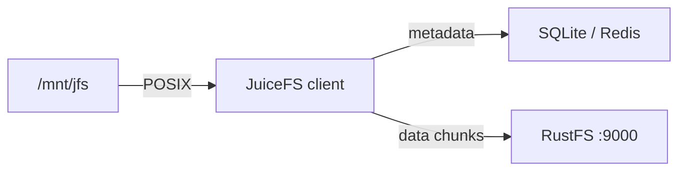
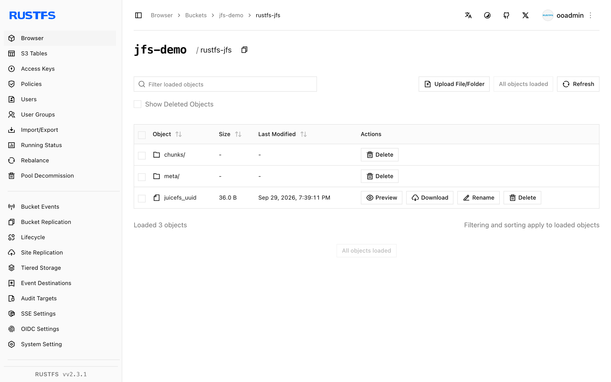

This guide connects [JuiceFS](https://github.com/juicedata/juicefs) — the cloud-native distributed POSIX filesystem — to **RustFS** as its object storage backend. You will format a volume whose data chunks live in a RustFS bucket, mount it locally, and read and write files through the mount. The workflow was verified with `juicefs v1.3.1` (community edition, SQLite metadata engine) against `rustfs/rustfs-x86-musl:v2.3.1`.

You need the JuiceFS binary, a metadata engine, and FUSE (`fuse3` on Linux). This deployment is intended for local integration testing, not production.

## Architecture



JuiceFS splits every file into chunks and stores them as objects under `chunks/` in the bucket, while the metadata engine tracks names, inodes, and layout. The filesystem behaves like a local disk but holds no data locally.

## 1. Format the volume

Create the bucket and format a JuiceFS volume backed by RustFS, replacing all connection placeholders. The bucket URL carries the endpoint, which selects path-style addressing:

```bash
rc mb rustfs/jfs-demo

juicefs format \
  --storage s3 \
  --bucket http://<your-rustfs-endpoint>:9000/jfs-demo \
  --access-key <your-access-key> \
  --secret-key <your-secret-key> \
  sqlite3:///opt/juicefs/jfs.db \
  rustfs-jfs
```

```text
Data use s3://<your-rustfs-endpoint>:9000/jfs-demo/rustfs-jfs/
<STATUS> OK, rustfs-jfs is ready
```

`sqlite3:///opt/juicefs/jfs.db` is the metadata engine for this test. In production, use Redis, MySQL, or PostgreSQL instead so multiple clients can mount the same volume.

## 2. Mount the volume

Mount the filesystem with the same metadata URL:

```bash
mkdir -p /mnt/jfs
juicefs mount -d sqlite3:///opt/juicefs/jfs.db /mnt/jfs
```

```text
OK, rustfs-jfs is ready at /mnt/jfs
```

The `-d` flag runs the mount in the background. The volume is now a POSIX filesystem.

## 3. Read and write files

Use the mount like any other directory:

```bash
echo "hello rustfs jfs" > /mnt/jfs/hello.txt
dd if=/dev/urandom of=/mnt/jfs/blob.bin bs=1M count=3
mkdir -p /mnt/jfs/dir1 && echo nested > /mnt/jfs/dir1/nested.txt
cat /mnt/jfs/hello.txt
```

```text
hello rustfs jfs
```

Inspect the volume with `juicefs info`:

```text
/mnt/jfs :
  inode: 1
  files: 2
   dirs: 2
 length: 3.00 MiB
```

## 4. Verify chunks in RustFS

List the bucket prefixes:

```bash
rc ls rustfs/jfs-demo/ -r
```

Every file was split into content-addressed chunk objects:

```text
rustfs-jfs/chunks/0/0/1_0_17
rustfs-jfs/chunks/0/0/3_0_3145728
rustfs-jfs/chunks/0/0/4_0_7
```

The chunk name encodes the inode, chunk index, and size — for example `3_0_3145728` is the 3 MiB file written in step 3.



## 5. Stop or reset

Unmount the volume, then optionally wipe the volume metadata and bucket data:

```bash
juicefs umount /mnt/jfs
juicefs destroy --force sqlite3:///opt/juicefs/jfs.db rustfs-jfs
rc rm rustfs/jfs-demo/ --recursive --force
```

## Troubleshooting

### `unknown option: --daemon`

The background flag is a single dash: `juicefs mount -d`. Running without it keeps the mount in the foreground (useful for debugging).

### `fusermount3: mount failed: Permission denied`

Mounting requires the FUSE device. Inside a container, add `--device /dev/fuse --cap-add SYS_ADMIN` (or `--privileged`); on a host, install `fuse3` and confirm `/dev/fuse` exists.

### Mount hangs or fails to reach storage

The client must reach both the metadata engine and the bucket endpoint. Because the bucket URL embeds the endpoint, verify it from the mounting host with `curl` before formatting.

## Next steps

- Review [S3 compatibility notes](/administration/protocols/s3) before adopting additional JuiceFS storage backends.
- Create dedicated production credentials with [Access Key Management](/security-compliance/iam/access-token).
- Follow the [JuiceFS documentation](https://juicefs.com/docs/community/quick_start_guide/) to switch the metadata engine to Redis and mount the volume from multiple clients.
