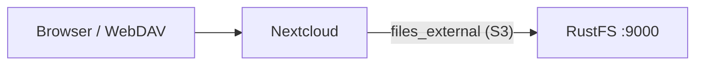
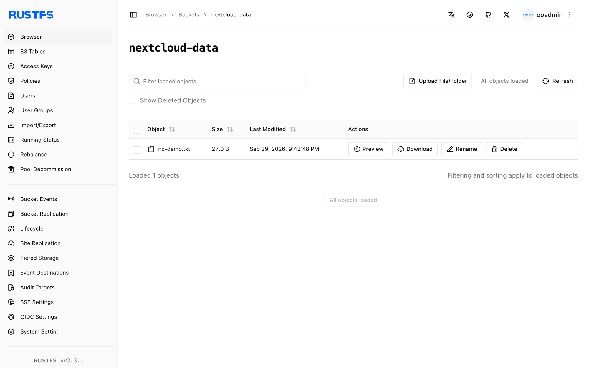

This guide connects [Nextcloud](https://github.com/nextcloud/server) — the self-hosted content collaboration platform — to **RustFS** through its External Storage app with the S3 backend. You will enable `files_external`, mount a RustFS bucket into every user's files view, and upload a file through WebDAV that lands directly in the bucket. The workflow was verified with `nextcloud:32.0.15` (SQLite, single container) against `rustfs/rustfs-x86-musl:v2.3.1`.

You need Docker, or an existing Nextcloud instance with `occ` access. This deployment is intended for local integration testing, not production.

## Architecture



Nextcloud proxies file operations on the mount point to the S3 backend. Objects are stored under their mount-relative paths, so the bucket mirrors the names users see.

## 1. Install Nextcloud

Run Nextcloud with an admin account, replacing all connection placeholders. SQLite keeps the test self-contained; use MariaDB or PostgreSQL in production:

```bash
docker run -d --name nextcloud --network oo-rustfs_default -p 8080:80 \
  -e NEXTCLOUD_ADMIN_USER=<admin-user> \
  -e NEXTCLOUD_ADMIN_PASSWORD=<admin-password> \
  nextcloud:32.0.15
```

If the web UI still shows the installer after startup, finish it manually:

```bash
docker exec -u www-data nextcloud php occ maintenance:install \
  --admin-user <admin-user> --admin-password <admin-password>
```

## 2. Enable the External Storage app

The `files_external` app ships with Nextcloud but starts disabled, and its `occ` commands only exist once the app is enabled:

```bash
docker exec -u www-data nextcloud php occ app:enable files_external
```

```text
files_external 1.24.1 enabled
```

## 3. Mount the RustFS bucket

Create an external storage of backend type `amazons3` with the `amazons3::accesskey` authentication backend. Replace all connection placeholders:

```bash
docker exec -u www-data nextcloud php occ files_external:create \
  /rustfs amazons3 amazons3::accesskey \
  --user <admin-user> \
  --config bucket=<your-bucket> \
  --config hostname=<your-rustfs-endpoint> \
  --config port=9000 \
  --config use_ssl=false \
  --config use_path_style=true \
  --config key=<your-access-key> \
  --config secret=<your-secret-key>
```

```text
Storage created with id 1
```

The mount point `/rustfs` appears in the files view of the given user. `use_path_style=true` is required for a non-AWS endpoint. Check the connection before using it:

```bash
docker exec -u www-data nextcloud php occ files_external:verify 1
```

```text
  - status: ok
  - code: 0
```

## 4. Upload a file and verify

Upload through the WebDAV endpoint, which writes through the external storage:

```bash
echo "nextcloud writes to rustfs" > /tmp/nc-demo.txt

curl -u <admin-user>:<admin-password> \
  -T /tmp/nc-demo.txt \
  http://localhost:8080/remote.php/dav/files/<admin-user>/rustfs/nc-demo.txt \
  -o /dev/null -w "%{http_code}\n"
```

```text
201
```

Read it back through the same path, then confirm the object in RustFS:

```bash
rc ls rustfs/<your-bucket>/ -r
```

```text
[2026-09-29 13:42:48]       27 B nc-demo.txt
```

The object key equals the path inside the mount, so files uploaded through Nextcloud can also be read directly with any S3 client.



## 5. Stop or reset

To remove the mount without touching the bucket:

```bash
docker exec -u www-data nextcloud php occ files_external:delete 1
```

To delete the bucket contents:

```bash
rc rm rustfs/<your-bucket>/ --recursive --force
```

## Troubleshooting

### `There are no commands defined in the "files_external" namespace`

The app is not enabled yet. Run `occ app:enable files_external` first; the `occ files_external:*` commands only register afterwards.

### `Not enough arguments (missing: "authentication_backend")`

`files_external:create` takes the storage backend and the authentication backend as two separate arguments: `amazons3 amazons3::accesskey`. The backend identifiers are listed by `occ files_external:backends`.

### Mount shows but is empty, or uploads fail

Confirm `hostname` is reachable from the Nextcloud container (use the container network name, not `localhost`), `use_path_style` is `true`, and the bucket exists. `occ files_external:verify <id>` reports the exact connection error.

## Next steps

- Review [S3 compatibility notes](/administration/protocols/s3) before adopting additional external storage backends.
- Create dedicated production credentials with [Access Key Management](/security-compliance/iam/access-token).
- Follow the [Nextcloud external storage documentation](https://docs.nextcloud.com/server/latest/admin_manual/configuration_files/external_storage_configuration_gui.html) to share the mount with groups and enable versioning.
