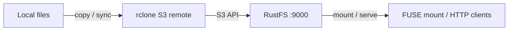

This guide connects [rclone](https://github.com/rclone/rclone) — the command-line tool for syncing files to and from cloud storage — to **RustFS** through its S3 backend. You will configure an S3 remote for RustFS, copy and sync files, read objects back, publish a bucket over HTTP with `rclone serve`, and mount the bucket as a local filesystem with `rclone mount`. The workflow was verified with `rclone v1.75.1` against `rustfs/rustfs-x86-musl:v2.3.1`.

You need Docker, or a local rclone binary. This deployment is intended for local integration testing, not production.

## Architecture



One remote definition drives every rclone command: data transfer, mounting, and serving all use the same S3 connection.

## 1. Configure the remote

Create an rclone config file with an S3 remote for RustFS, replacing all connection placeholders. The `Other` provider disables AWS-specific behavior, and path-style addressing is used automatically for custom endpoints:

```ini title="rclone.conf"
[rustfs]
type = s3
provider = Other
access_key_id = <your-access-key>
secret_access_key = <your-secret-key>
endpoint = http://<your-rustfs-endpoint>:9000
region = us-east-1
```

## 2. Copy and read objects

Create the bucket and upload a directory with `rclone copy`:

```bash
rc mb rustfs/rclone-demo
rclone copy /data rustfs:rclone-demo/seed
```

List and read back:

```bash
rclone ls rustfs:rclone-demo/seed
rclone cat rustfs:rclone-demo/seed/hello.txt
```

```text
  3145728 blob.bin
       18 hello.txt
hello from rclone
```

`rclone lsd rustfs:` lists every bucket on the endpoint.

## 3. Sync a directory

`rclone sync` makes the destination identical to the source, including deletions. Remove a local file and sync:

```bash
rm /data/hello.txt
rclone sync /data rustfs:rclone-demo/seed
rclone lsf rustfs:rclone-demo/seed
```

```text
blob.bin
```

`hello.txt` disappears from the bucket. Add `--dry-run` first to preview the changes without touching the bucket.

## 4. Serve a bucket over HTTP

Publish the bucket contents as an HTTP file server:

```bash
rclone serve http --addr 0.0.0.0:8080 rustfs:rclone-demo/seed
```

Any HTTP client can now download objects:

```bash
curl -s http://localhost:8080/blob.bin -o /dev/null -w "%{http_code} %{size_download} bytes\n"
```

```text
200 3145728 bytes
```

`rclone serve` also supports WebDAV, SFTP, and S3 endpoints over the same remote.

## 5. Mount the bucket as a filesystem

With FUSE available, mount the bucket locally and use it like a directory:

```bash
rclone mount rustfs:rclone-demo /mnt/rclone --daemon
ls /mnt/rclone/seed
echo test > /mnt/rclone/write-test.txt
cat /mnt/rclone/write-test.txt
```

Files written through the mount appear in RustFS as regular objects:

```bash
rc ls rustfs/rclone-demo/ -r
```

```text
[2026-09-29 11:12:41]        5 B write-test.txt
```

Unmount with `fusermount -u /mnt/rclone` when finished.

## 6. Stop or reset

rclone holds no server-side state. To delete the demo data:

```bash
rclone purge rustfs:rclone-demo
```

## Troubleshooting

### `Access Denied` or empty listings

Confirm `endpoint` includes the scheme and that the key pair matches a RustFS access key. The `region` value is required by the S3 signer even though RustFS ignores it; keep `us-east-1`.

### Mount fails with `fusermount3: mount failed: Permission denied`

Mounting needs the FUSE device and elevated privileges. Inside a container, run with `--device /dev/fuse --cap-add SYS_ADMIN` — and use `--privileged` if the mount helper still fails. On a host, verify that `fuse3` is installed and `/dev/fuse` exists.

### Sync deleted nothing on the destination

`rclone copy` never deletes. Only `rclone sync` (or `rclone delete`) removes destination objects, and `--dry-run` is the safe way to preview either.

## Next steps

- Review [S3 compatibility notes](/administration/protocols/s3) before adopting additional rclone backends.
- Create dedicated production credentials with [Access Key Management](/security-compliance/iam/access-token).
- Follow the [rclone S3 documentation](https://rclone.org/s3/) for flags such as `--transfers`, bandwidth limits, and crypt overlays.
