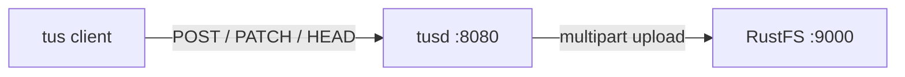
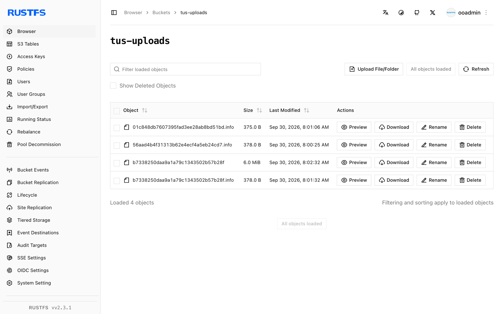

This guide connects [tusd](https://github.com/tus/tusd) — the official reference implementation of the tus resumable-upload protocol — to **RustFS** as its S3 storage backend. You will run tusd against a RustFS bucket, create an upload with the tus protocol, send the file in two chunks with an interruption in between, resume from the reported offset, and verify the assembled object in the bucket. The workflow was verified with `tusproject/tusd:v2.10.1` against `rustfs/rustfs-x86-musl:v2.3.1`.

You need Docker, or a local tusd binary. This deployment is intended for local integration testing, not production.

## Architecture



tusd stores each in-progress upload as S3 multipart parts in the bucket. A client that loses its connection asks the server for the last committed offset with `HEAD` and continues from there — the data already received is never sent twice.

## 1. Run tusd

Create the bucket and start tusd with the S3 backend, replacing all connection placeholders. The AWS region must be set even though RustFS ignores it:

```bash
rc mb rustfs/tus-uploads

docker run -d --name tusd --network oo-rustfs_default -p 8080:8080 \
  -e AWS_ACCESS_KEY_ID=<your-access-key> \
  -e AWS_SECRET_ACCESS_KEY=<your-secret-key> \
  -e AWS_REGION=us-east-1 \
  tusproject/tusd:latest \
  -s3-bucket tus-uploads \
  -s3-endpoint http://<your-rustfs-endpoint>:9000
```

Check that the server is healthy:

```bash
curl -s -o /dev/null -w "%{http_code}\n" http://localhost:8080/health
```

```text
200
```

## 2. Create the upload

Create a 6 MiB upload and read the `Location` header:

```bash
curl -s -D - -o /dev/null -X POST http://localhost:8080/files/ \
  -H "Upload-Length: 6291456" -H "Tus-Resumable: 1.0.0" \
  | grep -i "^Location:"
```

```text
Location: http://localhost:8080/files/b7338250daa9...+NGVmNDRhZjEt...
```

The upload URL contains the file ID and a message-authentication tag. Strip the scheme and host before re-sending it (the server echoes whatever `Host` it received, which may not be reachable from your next client).

## 3. Upload in chunks with an interruption

Send the first 2.5 MB, then stop — this is the point where a mobile client would lose its connection:

```bash
head -c 2500000 demo.bin > part1.bin

curl -s -o /dev/null -w "%{http_code}\n" -X PATCH "http://localhost:8080${LOC}" \
  -H "Upload-Offset: 0" -H "Tus-Resumable: 1.0.0" \
  -H "Content-Type: application/offset+octet-stream" \
  --data-binary @part1.bin
```

```text
204
```

Ask the server how much it actually has — this is the resumable-upload core:

```bash
curl -s -X HEAD "http://localhost:8080${LOC}" \
  -H "Tus-Resumable: 1.0.0" -D - -o /dev/null | grep -i upload-offset
```

```text
Upload-Offset: 2500000
```

## 4. Resume and finish

Continue from offset 2500000 with the remaining bytes:

```bash
tail -c 3791456 demo.bin > part2.bin

curl -s -o /dev/null -w "%{http_code}\n" -X PATCH "http://localhost:8080${LOC}" \
  -H "Upload-Offset: 2500000" -H "Tus-Resumable: 1.0.0" \
  -H "Content-Type: application/offset+octet-stream" \
  --data-binary @part2.bin
```

```text
204
```

Download the finished upload through tusd and compare checksums with the source:

```bash
curl -s -o download.bin "http://localhost:8080${LOC}"
sha1sum demo.bin download.bin
```

```text
d9016032ced6c7515b67a0c556e006c4b25a5858  demo.bin
d9016032ced6c7515b67a0c556e006c4b25a5858  download.bin
```

## 5. Verify objects in RustFS

List the bucket:

```bash
rc ls rustfs/tus-uploads/ -r
```

The bucket holds the assembled object plus one `.info` metadata file per upload — both live and finished:

```text
b7338250daa9a1a79c1343502b57b28f       6 MiB
b7338250daa9a1a79c1343502b57b28f.info  378 B
```

The object key is the upload ID, and the object body is the uploaded file byte-for-byte — so any S3 client can read completed uploads directly from the bucket.



## 6. Stop or reset

To tear down the server while keeping the bucket objects:

```bash
docker rm -f tusd
```

To delete the stored uploads:

```bash
rc rm rustfs/tus-uploads/ --recursive --force
```

## Troubleshooting

### `CreateMultipartUpload ... A region must be set when sending requests to S3`

tusd builds its S3 client from the AWS environment, and the region is mandatory for endpoint resolution. Export `AWS_REGION=us-east-1` next to the credentials, as in step 1.

### `PATCH` returns `404` or connects to the wrong host

The `Location` URL echoes the `Host` header of the creation request. When your client and the server use different hostnames (container name versus published port), strip the scheme and host from the URL and send the path to the address the client can reach.

### Upload disappears after server restart

The S3 backend keeps `.info` files in the bucket, so uploads survive restarts. If you run tusd against an empty bucket that another process prunes, the metadata is lost — protect the `tus-uploads` prefix from cleanup jobs.

## Next steps

- Review [S3 compatibility notes](/administration/protocols/s3) before adopting additional tusd backends.
- Create dedicated production credentials with [Access Key Management](/security-compliance/iam/access-token).
- Follow the [tus protocol documentation](https://tus.io/protocols/resumable-upload) for creation-with-upload, termination, and checksum extensions that tusd supports on top of the core protocol.
