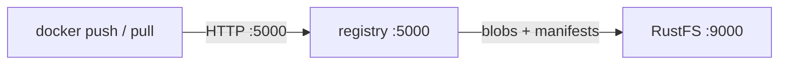
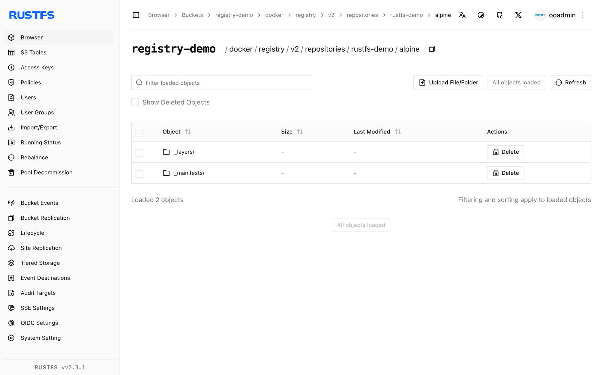

This guide connects the open-source [Docker Registry](https://github.com/distribution/distribution) (distribution) to **RustFS** as its S3 storage backend. You will run a registry that stores all layers and manifests in a RustFS bucket, then push and pull an image. The workflow was verified with `registry:2` against `rustfs/rustfs-x86-musl:v2.3.1`.

You need Docker on the registry host.

## Architecture



The registry stores every blob (layers and configs) and manifest as objects under `docker/registry/v2/` in the bucket. The container itself is stateless, so registry nodes can be scaled horizontally against the same bucket.

## 1. Run the registry

Configure the S3 driver entirely through environment variables. `REGISTRY_STORAGE_S3_REGIONENDPOINT` points the AWS SDK at RustFS:

```bash
docker run -d --name registry --network oo-rustfs_default -p 5000:5000 \
  -e REGISTRY_STORAGE=s3 \
  -e REGISTRY_STORAGE_S3_ACCESSKEY=<your-access-key> \
  -e REGISTRY_STORAGE_S3_SECRETKEY=<your-secret-key> \
  -e REGISTRY_STORAGE_S3_REGION=us-east-1 \
  -e REGISTRY_STORAGE_S3_BUCKET=registry-demo \
  -e REGISTRY_STORAGE_S3_REGIONENDPOINT=http://<your-rustfs-endpoint>:9000 \
  registry:2
```

Check that the v2 API is up:

```bash
curl -s -o /dev/null -w "%{http_code}\n" http://localhost:5000/v2/
```

```text
200
```

## 2. Push an image

Tag any local image for the registry and push it:

```bash
docker pull alpine:3.20
docker tag alpine:3.20 localhost:5000/rustfs-demo/alpine:3.20
docker push localhost:5000/rustfs-demo/alpine:3.20
```

```text
3.20: digest: sha256:c64c687cbea9300178b30c95835354e34c4e4febc4badfe27102879de0483b5e
```

## 3. Verify objects in RustFS

```bash
rc ls rustfs/registry-demo/docker/registry/v2/repositories/rustfs-demo/alpine/ -r | head -4
```

```text
_repositories/rustfs-demo/alpine/_layers/sha256/25f1d6b1.../link
_repositories/rustfs-demo/alpine/_manifests/revisions/sha256/c64c687c.../link
_repositories/rustfs-demo/alpine/_manifests/tags/3.20/current/link
```

Every `_layers` link points at a blob object stored in the same bucket — the image data itself lives in RustFS, not on the registry host.



## 4. Pull the image back

Remove the local copy and pull from the registry — the layers come back from RustFS:

```bash
docker rmi localhost:5000/rustfs-demo/alpine:3.20
docker pull localhost:5000/rustfs-demo/alpine:3.20
```

```text
3.20: Pulling from rustfs-demo/alpine
Digest: sha256:c64c687cbea9300178b30c95835354e34c4e4febc4badfe27102879de0483b5e
Status: Downloaded newer image for localhost:5000/rustfs-demo/alpine:3.20
```

## 5. Stop or reset

```bash
docker rm -f registry
rc rm rustfs/registry-demo/ --recursive --force
```

## Troubleshooting

### Push fails with `unknown` or empty digest

Confirm `REGISTRY_STORAGE_S3_REGIONENDPOINT` is set — without it the registry sends requests to real AWS. Also check the bucket exists.

### `InvalidAccessKeyId` at push time

The access key and secret key must be passed with `REGISTRY_STORAGE_S3_ACCESSKEY` / `SECRETKEY`; the registry does not read the AWS credential environment chain in this driver.

### Pull returns `manifest unknown` after the registry restarted

Manifests and blobs live in the bucket, so a restart cannot lose them — check that both registry instances point at the same `REGISTRY_STORAGE_S3_BUCKET` and `REGIONENDPOINT`.

## Next steps

- Compare with the [Harbor](/developer/integration/registry/harbor) guide when you need a UI, RBAC, or replication on top of the same bucket.
- Create dedicated production credentials with [Access Key Management](/security-compliance/iam/access-token).
- Follow the [distribution documentation](https://distribution.github.io/distribution/) for storage driver tuning and proxy-caching setups.
