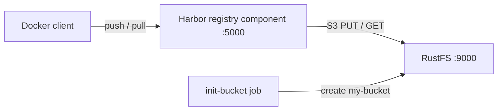

Diese Anleitung verbindet [Harbor](https://github.com/goharbor/harbor) — die CNCF-graduierte Cloud-native-Registry — mit **RustFS**. Harbor persistiert Image-Layer, Manifeste und andere OCI-Artefakte über seine eingebettete Registry-Komponente, die den S3-Storage-Treiber des [distribution](https://distribution.github.io/distribution/)-Projekts implementiert. Sie betreiben diese Registry-Komponente mit Docker Compose gegen RustFS, pushen ein Image, pullen es zurück und prüfen die Objekte in RustFS. Dasselbe Speicher-Setup gilt für eine vollständige Harbor-Bereitstellung. Der Ablauf wurde mit `goharbor/registry-photon:v2.12.2` und `rustfs/rustfs-x86-musl:v2.3.1` verifiziert.

Sie benötigen Docker mit dem Compose-Plugin. Dieses Setup ist für lokale Integrationstests gedacht, nicht für den Produktivbetrieb.

## Architektur



Die Registry speichert alle Blobs, Manifeste und Repository-Links über den S3-Storage-Treiber unterhalb von `docker/registry/v2/` im Bucket. Die Treibereinstellungen `regionendpoint`, `secure: false` und `skipverify: true` richten den von der Registry verwendeten AWS-S3-Client auf den RustFS-Endpunkt mit Path-Style-Adressierung über Plain HTTP aus.

## 1. Projektdateien anlegen

Erstellen Sie ein Arbeitsverzeichnis:

```bash
mkdir rustfs-harbor
cd rustfs-harbor
```

Erstellen Sie eine Umgebungsdatei und ersetzen Sie beide Platzhalter für die Anmeldeinformationen:

```ini title=".env"
RUSTFS_ACCESS_KEY=<your-access-key>
RUSTFS_SECRET_KEY=<your-secret-key>
```

Verwenden Sie dedizierte Anmeldeinformationen für den Bucket. Committen Sie `.env` nicht in die Versionsverwaltung.

Erstellen Sie die Registry-Konfiguration, die Harbor für seine Registry-Komponente verwendet:

```yaml title="config.yml"
version: 0.1
log:
  level: info
storage:
  s3:
    accesskey: <your-access-key>
    secretkey: <your-secret-key>
    region: us-east-1
    regionendpoint: http://rustfs:9000
    bucket: my-bucket
    secure: false
    skipverify: true
  delete:
    enabled: true
  redirect:
    disable: true
http:
  addr: 0.0.0.0:5000
health:
  storagedriver:
    enabled: true
    interval: 10s
    threshold: 3
```

`regionendpoint` leitet den Treiber zu RustFS statt zu AWS, `secure: false` wählt Plain HTTP innerhalb des Compose-Netzwerks, und `redirect.disable: true` lässt die Registry die Blobs selbst ausliefern — Harbor setzt dieselbe Option für Backends ohne Redirect-Unterstützung.

Erstellen Sie die Compose-Datei:

```yaml title="compose.yaml"
services:
  rustfs:
    image: rustfs/rustfs-x86-musl:v2.3.1
    environment:
      RUSTFS_ACCESS_KEY: ${RUSTFS_ACCESS_KEY}
      RUSTFS_SECRET_KEY: ${RUSTFS_SECRET_KEY}
      RUSTFS_VOLUMES: /data
      RUSTFS_ADDRESS: ":9000"
      RUSTFS_CONSOLE_ADDRESS: ":9001"
      RUSTFS_CONSOLE_ENABLE: "true"
    volumes:
      - rustfs-data:/data
    ports:
      - "9000:9000"
      - "9001:9001"
    healthcheck:
      test: ["CMD", "curl", "-sf", "http://127.0.0.1:9000/health"]
      interval: 10s
      timeout: 5s
      retries: 6
      start_period: 10s
    networks:
      - registry

  create-bucket:
    image: rustfs/rc:latest
    depends_on:
      rustfs:
        condition: service_healthy
    environment:
      RUSTFS_ACCESS_KEY: ${RUSTFS_ACCESS_KEY}
      RUSTFS_SECRET_KEY: ${RUSTFS_SECRET_KEY}
    entrypoint:
      - /bin/sh
      - -c
      - |
        until /usr/bin/rc alias set rustfs http://rustfs:9000 "$${RUSTFS_ACCESS_KEY}" "$${RUSTFS_SECRET_KEY}"; do
          echo "Waiting for RustFS..."
          sleep 2
        done
        /usr/bin/rc ls rustfs/my-bucket >/dev/null 2>&1 || /usr/bin/rc mb rustfs/my-bucket
    networks:
      - registry

  registry:
    image: goharbor/registry-photon:v2.12.2
    volumes:
      - ./config.yml:/etc/registry/config.yml:ro
    ports:
      - "5000:5000"
    depends_on:
      create-bucket:
        condition: service_completed_successfully
    networks:
      - registry

networks:
  registry:

volumes:
  rustfs-data:
```

Das [`rc`-Image](https://github.com/rustfs/cli) stellt den offiziellen RustFS-Kommandozeilenclient bereit. Der Initialisierer prüft vor dem Anlegen, ob `my-bucket` bereits existiert, sodass wiederholte Starts keine bestehenden Artefakte löschen.

## 2. Bereitstellung starten

Prüfen Sie die Compose-Datei, bevor Sie Container starten:

```bash
docker compose config
```

Starten Sie die Dienste und warten Sie, bis die Bucket-Initialisierung abgeschlossen ist:

```bash
docker compose up -d
docker compose ps -a
```

Die Registry-API sollte mit einem leeren Katalog antworten:

```bash
curl -s http://localhost:5000/v2/_catalog
```

```text
{"repositories":[]}
```

## 3. Ein Image pushen

Pullen Sie ein kleines Image, taggen Sie es für die lokale Registry um und pushen Sie es:

```bash
docker pull busybox:latest
docker tag busybox:latest localhost:5000/demo/app:v1
docker push localhost:5000/demo/app:v1
```

```text
v1: digest: sha256:1cfa4e2b09e127b9c4ed43578d3f3c18e7d44ea47b9ea98475c0cbe9086525f8 size: 527
```

## 4. Das Image zurückpullen

Entfernen Sie die lokalen Tags und pullen Sie das Image aus der Registry — die Layer kommen jetzt aus RustFS:

```bash
docker rmi localhost:5000/demo/app:v1
docker pull localhost:5000/demo/app:v1
```

```text
localhost:5000/demo/app:v1
```

## 5. Objekte in RustFS prüfen

Listen Sie das Repository-Präfix über das Bucket-Initialisierungs-Image auf:

```bash
docker compose run --rm --entrypoint /bin/sh create-bucket -c \
  '/usr/bin/rc alias set rustfs http://rustfs:9000 "$RUSTFS_ACCESS_KEY" "$RUSTFS_SECRET_KEY" >/dev/null && /usr/bin/rc ls rustfs/my-bucket/docker/registry/v2/repositories/demo --recursive'
```

```text
[2026-09-20 12:11:25]       71 B docker/registry/v2/repositories/demo/app/_layers/sha256/b05093807bb0294152bb9cf86d64da722732dddaf7f8882fa1f120477dbc4db3/link
[2026-09-20 12:11:25]       71 B docker/registry/v2/repositories/demo/app/_layers/sha256/c6348fa86ba0fb2108c9334f5fe913ddc6d853313e655891f133a0127c30099f/link
[2026-09-20 12:11:25]       71 B docker/registry/v2/repositories/demo/app/_manifests/revisions/sha256/1cfa4e2b09e127b9c4ed43578d3f3c18e7d44ea47b9ea98475c0cbe9086525f8/link
[2026-09-20 12:11:25]       71 B docker/registry/v2/repositories/demo/app/_manifests/tags/v1/current/link
[2026-09-20 12:11:25]       71 B docker/registry/v2/repositories/demo/app/_manifests/tags/v1/index/sha256/1cfa4e2b09e127b9c4ed43578d3f3c18e7d44ea47b9ea98475c0cbe9086525f8/link
```

Die Blob-Payloads selbst liegen unterhalb von `docker/registry/v2/blobs/`. Sie können das Präfix auch in der RustFS-Konsole unter `http://localhost:9001/rustfs/console/` anzeigen:


## 6. RustFS in einer vollständigen Harbor-Bereitstellung verwenden

Die oben verifizierte Registry-Komponente ist dieselbe, die eine vollständige Harbor-Bereitstellung ausführt — die Speichereinstellungen lassen sich daher direkt übernehmen.

Setzen Sie im Helm-Chart die S3-Optionen unter `persistence.imageChartStorage`:

```yaml title="values.yaml"
persistence:
  imageChartStorage:
    type: s3
    disableredirect: true
    s3:
      region: us-east-1
      bucket: my-bucket
      accesskey: <your-access-key>
      secretkey: <your-secret-key>
      regionendpoint: http://rustfs:9000
      secure: false
      skipverify: true
```

Legen Sie beim Harbor-Installer mit einer `harbor.yml`-Datei dieselben Treiberschlüssel unter `storage_service.s3` ab. Beide Dateien akzeptieren die Storage-Treiber-Optionen, die im [distribution-Projekt](https://distribution.github.io/distribution/about/configuration/) dokumentiert sind — genau diese Konfigurationsoberfläche wurde in dieser Anleitung verifiziert.

## 7. Stack stoppen oder zurücksetzen

Stoppen Sie die Container und behalten Sie das RustFS-Datenvolumen:

```bash
docker compose down
```

Um die gespeicherten Artefakte zu löschen und mit einem leeren RustFS-Volumen zu beginnen, fügen Sie ausdrücklich `--volumes` hinzu:

```bash
docker compose down --volumes
```

## Fehlerbehebung

### Die Registry startet nicht oder meldet einen Storage-Fehler

Prüfen Sie die Registry-Logs auf Meldungen des S3-Treibers:

```bash
docker compose logs registry
```

`regionendpoint` muss aus dem Registry-Container erreichbar sein. Verwenden Sie innerhalb des Compose-Netzwerks `http://rustfs:9000`; für einen Prozess auf dem Host `http://localhost:9000`.

### TLS- oder Zertifikatsfehler mit einem Plain-HTTP-Endpunkt

`secure: false` wählt Plain HTTP für den RustFS-Endpunkt. Ohne diese Einstellung versucht der Treiber HTTPS und schlägt mit einem Verbindungs- oder Zertifikatsfehler fehl. Bei einem TLS-Endpunkt mit selbstsigniertem Zertifikat belassen Sie `secure: true`, setzen `skipverify: true` und stellen das CA-Bundle über die `ca_bundle`-Option bereit, die Harbor in `harbor.yml` anbietet.

### AccessDenied- oder 403-Antworten

Stellen Sie sicher, dass die Anmeldeinformationen in `config.yml` mit den RustFS-Anmeldeinformationen übereinstimmen und dass der Dienst `create-bucket` erfolgreich abgeschlossen wurde:

```bash
docker compose logs create-bucket
```

### Der Push ist erfolgreich, aber Objekte erscheinen nicht im erwarteten Präfix

Der Treiber schreibt unterhalb von `docker/registry/v2/` im Bucket. Listen Sie den gesamten Bucket rekursiv auf, um den Repository-Baum zu finden, bevor Sie ein Konfigurationsproblem annehmen.

## Nächste Schritte

- Lesen Sie die [S3-Kompatibilitätshinweise](/administration/protocols/s3), bevor Sie weitere S3-Operationen verwenden.
- Erstellen Sie dedizierte Produktions-Anmeldeinformationen mit dem [Access Key Management](/security-compliance/iam/access-token).
- Folgen Sie der [Harbor-Dokumentation](https://goharbor.io/docs/), um eine vollständige Harbor-Bereitstellung mit Replikation, Vulnerability-Scanning und RBAC zu konfigurieren.
