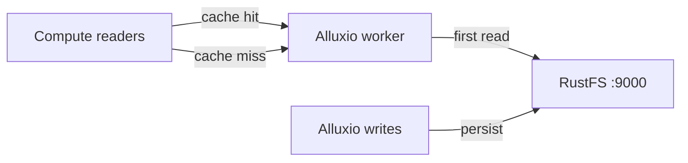
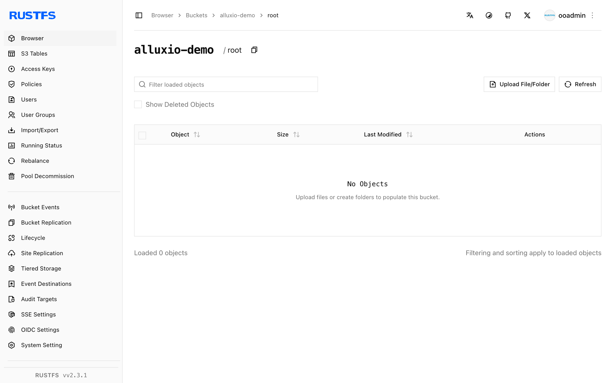

This guide connects [Alluxio](https://github.com/Alluxio/alluxio) — the distributed data orchestration layer — to **RustFS** as an under filesystem (UFS). You will run a standalone Alluxio cluster in Docker, mount a RustFS bucket, read an object through the cache, and write a file back to the bucket through Alluxio. The workflow was verified with Alluxio 2.9.4 against `rustfs/rustfs-x86-musl:v2.3.1`.

You need Docker with `--shm-size 2g` capacity (the worker uses a tmpfs ramdisk).

## Architecture



Objects read once are cached in the worker's ramdisk; repeated reads are served from memory. Writes through Alluxio land in the bucket as regular objects.

## 1. Run the master and worker

The standalone image starts one process per invocation. Run the master first, then the worker:

```bash
docker run -d --name alluxio-master --hostname alluxio --network oo-rustfs_default \
  -p 19998:19998 -p 19999:19999 --shm-size 2g \
  -e ALLUXIO_JAVA_OPTS="-Dalluxio.master.hostname=alluxio -Dalluxio.worker.ramdisk.size=1G" \
  alluxio/alluxio:2.9.4 master

docker exec alluxio /entrypoint.sh worker &
```

```text
Capacity information for all workers:
    Total Capacity: 1024.00MB
```

If the worker exits immediately with `tmpfs is smaller than the configured size`, the container was started without `--shm-size`.

## 2. Mount the RustFS bucket

The credential options must use the full `alluxio.underfs.s3.*` key names — short `s3a.*` or `aws.*` keys are accepted by the CLI but ignored by the UFS client:

```bash
docker exec alluxio alluxio fs mount \
  --option alluxio.underfs.s3.accessKeyId=<your-access-key> \
  --option alluxio.underfs.s3.secretKey=<your-secret-key> \
  --option alluxio.underfs.s3.endpoint=http://<your-rustfs-endpoint>:9000 \
  --option alluxio.underfs.s3.disable.dns.buckets=true \
  --option alluxio.underfs.s3.path.style.access=true \
  /rustfs s3://alluxio-demo/
```

```text
Mounted s3://alluxio-demo/ at /rustfs
```

`disable.dns.buckets` forces path-style addressing, which the IP-style endpoint requires.

## 3. Read through the cache

List the mount and read a seeded object:

```bash
docker exec alluxio alluxio fs ls /rustfs
docker exec alluxio alluxio fs cat /rustfs/rustfs-test.txt
```

```text
-rw-r--r--  rustfs  rustfs   15  PERSISTED ... /rustfs/rustfs-test.txt
hello from s3fs
```

`PERSISTED` means the source of truth is in RustFS; the worker caches blocks after the first read.

## 4. Write through Alluxio

Copy a local file into the mount:

```bash
echo "written via alluxio cache to rustfs" > /tmp/rt.txt
docker cp /tmp/rt.txt alluxio:/tmp/rt.txt
docker exec alluxio alluxio fs copyFromLocal /tmp/rt.txt /rustfs/alluxio-write.txt
```

```text
Copied 'file:///tmp/rt.txt' to '/rustfs/alluxio-write.txt'
```

Verify the object in RustFS:

```bash
rc ls rustfs/alluxio-demo/
rc cat rustfs/alluxio-demo/alluxio-write.txt
```

```text
[2026-10-07 04:07:25]       36 B alluxio-write.txt
[2026-10-07 04:01:01]       15 B rustfs-test.txt
written via alluxio cache to rustfs
```



## 5. Stop or reset

```bash
docker exec alluxio alluxio fs unmount /rustfs
docker rm -f alluxio
rc rm rustfs/alluxio-demo/ --recursive --force
```

## Troubleshooting

### Worker exits with `tmpfs is smaller than the configured size`

The worker places its ramdisk in `/dev/shm`, which Docker caps at 64 MB by default. Start the container with `--shm-size 2g` or lower `alluxio.worker.ramdisk.size`.

### Mount succeeds but `fs ls` returns `InvalidAccessKeyId`

The mount options used short key names (`s3a.*`, `aws.*`). Alluxio's UFS client only honors the full `alluxio.underfs.s3.*` keys shown in step 2.

### `S3 client v2 does not support global bucket access`

Path-style addressing is off. Add `--option alluxio.underfs.s3.disable.dns.buckets=true` — the IP-style RustFS endpoint requires it.

## Next steps

- Review [S3 compatibility notes](/administration/protocols/s3) before adopting additional Alluxio UFS types.
- Create dedicated production credentials with [Access Key Management](/security-compliance/iam/access-token).
- Follow the [Alluxio documentation](https://docs.alluxio.io/os/user/stable/ufs/S3.html) for cache policies, TTLs, and multi-tier storage on top of the same bucket.
