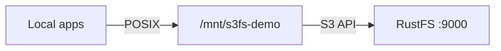
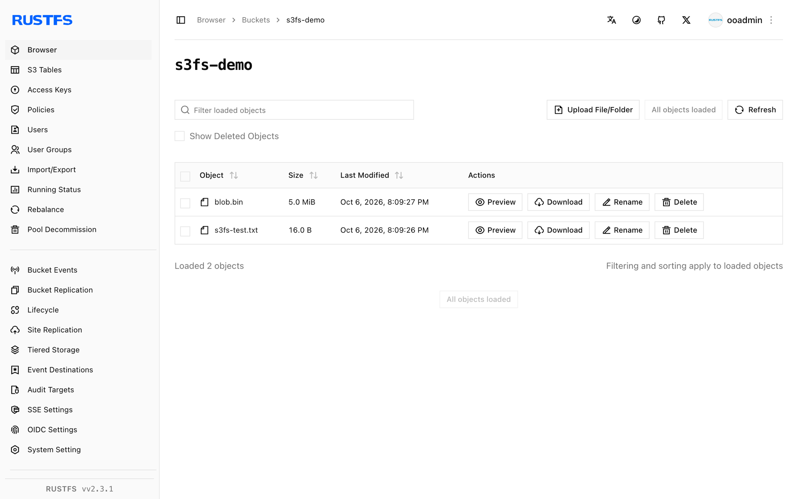

This guide connects [s3fs-fuse](https://github.com/s3fs-fuse/s3fs-fuse) — the FUSE-based S3 filesystem — to **RustFS**. You will mount a bucket as a local directory, write files through the mount, unmount, and confirm the objects persist in the bucket. The workflow was verified with s3fs v1.93 against `rustfs/rustfs-x86-musl:v2.3.1` on Ubuntu 24.04.

You need a Linux host with FUSE (`fuse3` package) and the `s3fs` binary.

## Architecture



Every file created under the mount point becomes an object in the bucket, keyed by its relative path — a plain 1:1 mapping with no caching layer.

## 1. Install

```bash
apt-get install -y s3fs
s3fs --version
```

```text
Amazon Simple Storage Service File System V1.93 ...
```

## 2. Store the credentials

Write the access key and secret key to the password file s3fs expects:

```bash
echo "<your-access-key>:<your-secret-key>" > ~/.passwd-s3fs
chmod 600 ~/.passwd-s3fs
```

## 3. Mount the bucket

```bash
mkdir -p /mnt/s3fs-demo
s3fs s3fs-demo /mnt/s3fs-demo \
  -o passwd_file=~/.passwd-s3fs \
  -o url=http://<your-rustfs-endpoint>:9000 \
  -o endpoint=us-east-1 \
  -o use_path_request_style \
  -o allow_other -o umask=000
```

`use_path_request_style` selects path-style addressing, which is what RustFS serves. `allow_other` lets non-root users read the mount.

## 4. Write and read files

```bash
echo "hello from s3fs" > /mnt/s3fs-demo/s3fs-test.txt
dd if=/dev/urandom of=/mnt/s3fs-demo/blob.bin bs=1M count=5
cat /mnt/s3fs-demo/s3fs-test.txt
```

```text
hello from s3fs
```

## 5. Verify objects and persistence

Unmount and remount — the objects persist in the bucket:

```bash
fusermount -u /mnt/s3fs-demo
s3fs s3fs-demo /mnt/s3fs-demo -o passwd_file=~/.passwd-s3fs \
  -o url=http://<your-rustfs-endpoint>:9000 -o endpoint=us-east-1 \
  -o use_path_request_style
ls /mnt/s3fs-demo/
```

```text
blob.bin  s3fs-test.txt
```

List the bucket to see the same objects from the S3 side:

```bash
rc ls rustfs/s3fs-demo/
```

```text
[2026-10-06 12:09:27]      5 MiB blob.bin
[2026-10-06 12:09:26]       16 B s3fs-test.txt
```



## 6. Stop or reset

```bash
fusermount -u /mnt/s3fs-demo
rc rm rustfs/s3fs-demo/ --recursive --force
```

## Troubleshooting

### `fuse: device not found` inside a container

Pass `--device /dev/fuse --cap-add SYS_ADMIN` to `docker run`, or `--privileged` if the mount helper still fails.

### `Permission denied` reading the mount as another user

s3fs mounts are private to the mounting user by default. Add `-o allow_other -o umask=000` (or a tighter umask) at mount time.

### Mount succeeds but listing is empty on another client

s3fs has no metadata cache shared across mounts, but clients and list operations are eventually consistent. Remount or re-list after a few seconds.

## Next steps

- Review [S3 compatibility notes](/administration/protocols/s3) before adopting additional FUSE options.
- Create dedicated production credentials with [Access Key Management](/security-compliance/iam/access-token).
- Follow the [s3fs-fuse documentation](https://github.com/s3fs-fuse/s3fs-fuse/wiki/Fuse-Over-https) for performance tuning options such as `-o multipart` and `-o parallel_count`.
