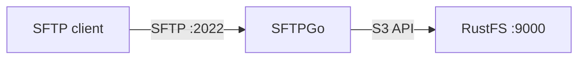
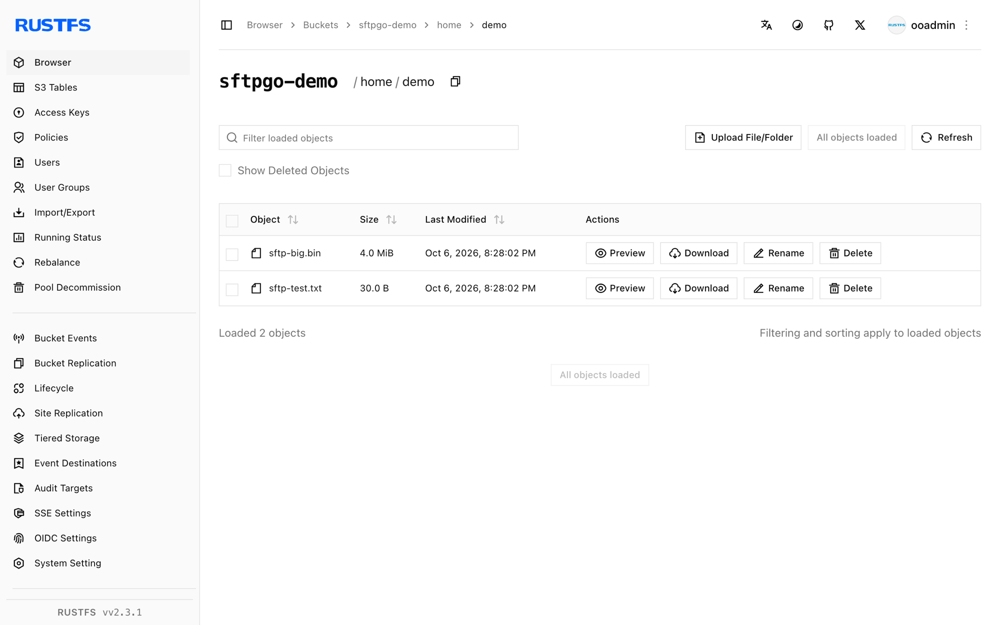

This guide connects [SFTPGo](https://github.com/drakkan/sftpgo) — the full-featured SFTP/WebDAV/FTP server — to **RustFS** as a per-user S3 backend. You will create an SFTP user whose home directory is a RustFS bucket prefix, upload files over SFTP, and verify the objects in the bucket. The workflow was verified with SFTPGo 2.7.6 against `rustfs/rustfs-x86-musl:v2.3.1`.

You need Docker and an SFTP client (`sftp` ships with OpenSSH).

## Architecture



SFTPGo maps the user's virtual paths onto bucket prefixes. Files uploaded over SFTP become objects under the configured `key_prefix` — nothing is stored on the SFTPGo host itself.

## 1. Run SFTPGo

```bash
docker run -d --name sftpgo --hostname sftpgo --network oo-rustfs_default \
  -p 2022:2022 -p 8080:8080 \
  -e SFTPGO_COMMON__TEMP_PATH=/tmp \
  drakkan/sftpgo:latest
```

`SFTPGO_COMMON__TEMP_PATH` matters: for S3 backends SFTPGo streams uploads through a local pipe file, and the default temp path may not exist or be writable.

## 2. Create the admin user

The image does not create the admin automatically. Open `http://localhost:8080/web/admin/setup` once and submit the form, or drive it with curl:

```bash
FORM=$(curl -s -c /tmp/sg-cookie.txt http://localhost:8080/web/admin/setup)
FT=$(echo "$FORM" | grep -oE "name=\"_form_token\" value=\"[^\"]+\"" | sed "s/.*value=\"//;s/\"//")
curl -s -b /tmp/sg-cookie.txt -X POST http://localhost:8080/web/admin/setup \
  --data-urlencode "username=admin" \
  --data-urlencode "password=<admin-password>" \
  --data-urlencode "confirm_password=<admin-password>" \
  --data-urlencode "_form_token=$FT" \
  -o /dev/null -w "setup: %{http_code}\n"
```

```text
setup: 302
```

## 3. Create an S3-backed user

Get an API token and create the user. Three details matter: `home_dir` must be an existing writable directory inside the container (`/tmp` works), `force_path_style` must be `true` for RustFS, and `access_secret` is a KMS object — pass the secret inside `{"status": "Plain", "payload": ...}`:

```json title="sftpgo-user.json"
{
  "username": "demo",
  "password": "<user-password>",
  "home_dir": "/tmp",
  "status": 1,
  "permissions": { "/": ["*"] },
  "filesystem": {
    "provider": 1,
    "s3config": {
      "bucket": "sftpgo-demo",
      "region": "us-east-1",
      "access_key": "<your-access-key>",
      "access_secret": { "status": "Plain", "payload": "<your-secret-key>" },
      "endpoint": "http://<your-rustfs-endpoint>:9000",
      "key_prefix": "home/demo/",
      "force_path_style": true
    }
  }
}
```

```bash
TOKEN=$(curl -s "http://localhost:8080/api/v2/token" -u "admin:<admin-password>" \
  | python3 -c "import json,sys; print(json.load(sys.stdin)['access_token'])")
curl -s -X POST http://localhost:8080/api/v2/users \
  -H "Authorization: Bearer $TOKEN" -H "Content-Type: application/json" \
  --data-binary @sftpgo-user.json -o /dev/null -w "create-user: %{http_code}\n"
```

```text
create-user: 201
```

## 4. Upload and read files over SFTP

```bash
printf "uploaded via sftpgo to rustfs\n" > /tmp/sftp-test.txt
printf "up1\n" > /tmp/sftp-batch.txt
echo "put /tmp/sftp-test.txt" >> /tmp/sftp-batch.txt
echo "ls" >> /tmp/sftp-batch.txt

sshpass -p <user-password> sftp \
  -o StrictHostKeyChecking=no -o UserKnownHostsFile=/dev/null -P 2022 \
  demo@localhost < /tmp/sftp-batch.txt
```

```text
sftp> put /tmp/sftp-test.txt
Uploading /tmp/sftp-test.txt to /sftp-test.txt
sftp> ls
sftp-big.bin    sftp-test.txt
```

## 5. Verify objects in RustFS

```bash
rc ls rustfs/sftpgo-demo/home/demo/ -r
rc cat rustfs/sftpgo-demo/home/demo/sftp-test.txt
```

```text
[2026-10-06 12:28:02]      4 MiB home/demo/sftp-big.bin
[2026-10-06 12:28:02]       30 B home/demo/sftp-test.txt
uploaded via sftpgo to rustfs
```

The object key is the user's virtual path under `key_prefix` — a plain mapping.



## 6. Stop or reset

```bash
docker rm -f sftpgo
rc rm rustfs/sftpgo-demo/ --recursive --force
```

## Troubleshooting

### `create resource error` / `InvalidAccessKeyId` on upload

Check three things in order: `force_path_style` must be `true` (SFTPGo's AWS SDK defaults to virtual-host addressing, which breaks IP endpoints), `access_secret` must use the KMS-object form, and `home_dir` must point at a writable directory (SFTPGo pipes S3 uploads through it).

### `unknown command init` / admin login rejected

The admin account only exists after the web setup form is submitted once. Repeat step 2; do not reuse an old browser cookie jar.

### API returns `405 Method Not allowed` for the token

The token endpoint only accepts `GET` with basic auth: `GET /api/v2/token`.

## Next steps

- Review [S3 compatibility notes](/administration/protocols/s3) before adopting additional SFTPGo backends.
- Create dedicated production credentials with [Access Key Management](/security-compliance/iam/access-token).
- Follow the [SFTPGo documentation](https://github.com/drakkan/sftpgo/blob/main/README.md) to add WebDAV/FTP listeners, per-user quotas, and two-factor auth on top of the same bucket.
