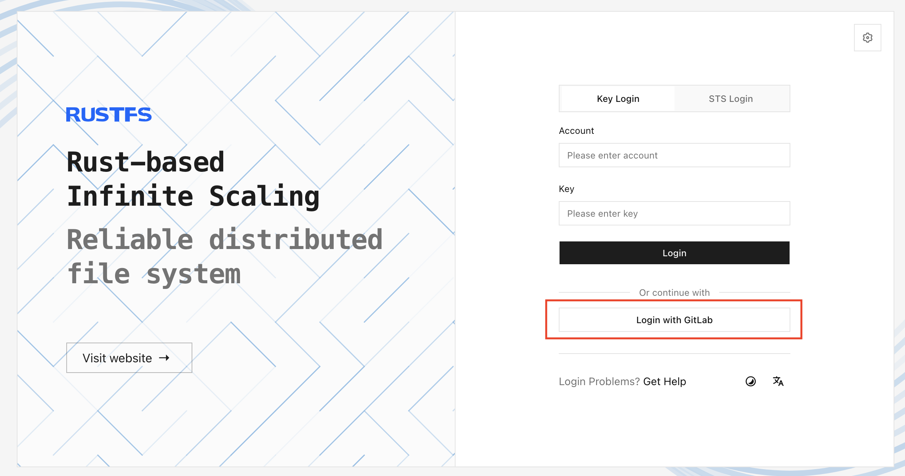

RustFS integrates with **GitLab** through the OpenID Connect (OIDC) Authorization Code Flow. The examples on this page use the default RustFS provider ID, `default`.

## Requirements

Before you begin, prepare:

- An [installed GitLab instance](https://about.gitlab.com/install/) and access to its Admin area.
- A RustFS deployment with a public HTTPS Console origin.
- A RustFS policy to assign to GitLab users. The examples use `consoleAdmin`; use a policy with only the permissions your users require in production.

## Overview

The browser login flow is:

1. RustFS sends an authorization-code request with a Proof Key for Code Exchange (PKCE) S256 challenge.
2. GitLab authenticates the user and redirects the browser to RustFS with `code` and `state`.
3. RustFS exchanges the code at the GitLab token endpoint.
4. RustFS verifies the ID token signature, issuer, audience, expiry, and nonce.
5. RustFS assigns the configured local Identity and Access Management (IAM) policy and issues temporary credentials for the Console session.

GitLab authenticates the user, while RustFS policies authorize S3 and administration operations.

The examples use the following values. Replace the hostnames and client secret for your environment:

| Setting | Example |
| --- | --- |
| GitLab issuer | `https://gitlab.example.com` |
| GitLab application ID | `<gitlab-application-id>` |
| Public RustFS origin | `https://rustfs.example.com` |
| RustFS callback URL | `https://rustfs.example.com/rustfs/admin/v3/oidc/callback/default` |

## Configuration

### GitLab configuration

#### Create the OAuth application

1. Sign in to GitLab as an administrator.
2. Open **Admin Area**, select **Applications**, and select **New application**.
3. Enter `RustFS OIDC` as the application name.
4. Set **Redirect URI** to the exact RustFS callback URL:

  ```text
  https://rustfs.example.com/rustfs/admin/v3/oidc/callback/default
  ```

5. Enable **Confidential**.
6. Enable **Trusted** to skip the user authorization prompt for this instance-wide application.
7. Select the `openid`, `profile`, and `email` scopes.
8. Save the application, then copy the generated application ID and secret.

See the [GitLab OAuth provider documentation](https://docs.gitlab.com/integration/oauth_provider/) for details about administering applications.


:::note[Test environment shown]

The screenshot shows an HTTP callback URL from a test environment. Use the public HTTPS callback URL for your RustFS deployment.

:::

### RustFS configuration

Configure the GitLab provider through environment variables.

#### Configure with environment variables

Add the GitLab provider and public browser origin to the RustFS service environment:

```ini title="/etc/default/rustfs"
RUSTFS_BROWSER_REDIRECT_URL="https://rustfs.example.com"

RUSTFS_IDENTITY_OPENID_ENABLE=on
RUSTFS_IDENTITY_OPENID_CONFIG_URL="https://gitlab.example.com"
RUSTFS_IDENTITY_OPENID_CLIENT_ID="<gitlab-application-id>"
RUSTFS_IDENTITY_OPENID_CLIENT_SECRET="<gitlab-application-secret>"
RUSTFS_IDENTITY_OPENID_SCOPES="openid,profile,email"
RUSTFS_IDENTITY_OPENID_REDIRECT_URI="https://rustfs.example.com/rustfs/admin/v3/oidc/callback/default"
RUSTFS_IDENTITY_OPENID_REDIRECT_URI_DYNAMIC=off
RUSTFS_IDENTITY_OPENID_DISPLAY_NAME="GitLab"
RUSTFS_IDENTITY_OPENID_EMAIL_CLAIM="email"
RUSTFS_IDENTITY_OPENID_USERNAME_CLAIM="preferred_username"
RUSTFS_IDENTITY_OPENID_ROLE_POLICY="consoleAdmin"
```

Restart RustFS after applying the configuration.

`RUSTFS_BROWSER_REDIRECT_URL` must contain the public scheme and authority without a path. It controls the Console success redirect and logout fallback URL. The provider callback URL must exactly match the URL registered in GitLab.

:::warning[Limit the assigned policy]

`RUSTFS_IDENTITY_OPENID_ROLE_POLICY` assigns the same RustFS policy to every user who signs in through this provider. Replace `consoleAdmin` with a policy that grants only the permissions required by your GitLab users.

:::

For a reverse proxy or load balancer, preserve the callback query string and route the authorize and callback requests to the same RustFS node. The in-flight OIDC `state` is local to that node.

## Verification

### Verify GitLab discovery

Query the GitLab discovery document:

```bash
curl -fsS "https://gitlab.example.com/.well-known/openid-configuration" | jq '{
  issuer,
  authorization_endpoint,
  token_endpoint,
  jwks_uri,
  scopes_supported,
  code_challenge_methods_supported
}'
```

Confirm that:

- `issuer` is `https://gitlab.example.com`.
- `authorization_endpoint`, `token_endpoint`, and `jwks_uri` are present.
- `scopes_supported` includes `openid`, `profile`, and `email`.
- `code_challenge_methods_supported` includes `S256`.

### Verify the RustFS provider

After restarting RustFS, check that the provider is available:

```bash
curl -fsS "https://rustfs.example.com/rustfs/admin/v3/oidc/providers" | jq
```

The response should include the `default` provider with the display name `GitLab`.

### Test Console login

Open the RustFS Console and select **GitLab**, or open the authorization endpoint directly:

```text
https://rustfs.example.com/rustfs/admin/v3/oidc/authorize/default
```



Verify the complete flow:

1. The browser redirects to GitLab.
2. The user signs in and authorizes the application when prompted.
3. GitLab redirects to the RustFS callback URL with `code` and `state`.
4. RustFS validates the ID token and creates the Console session.
5. The Console opens with the configured RustFS policy.

If GitLab reports a redirect URI mismatch, confirm that the URI registered in the GitLab application exactly matches `RUSTFS_IDENTITY_OPENID_REDIRECT_URI`.

## Next steps

- Review [users, groups, and policies](../iam/policies.md) before selecting the policy assigned to GitLab users.
- Review the [Console security notes](/administration/console) before exposing the login endpoint publicly.