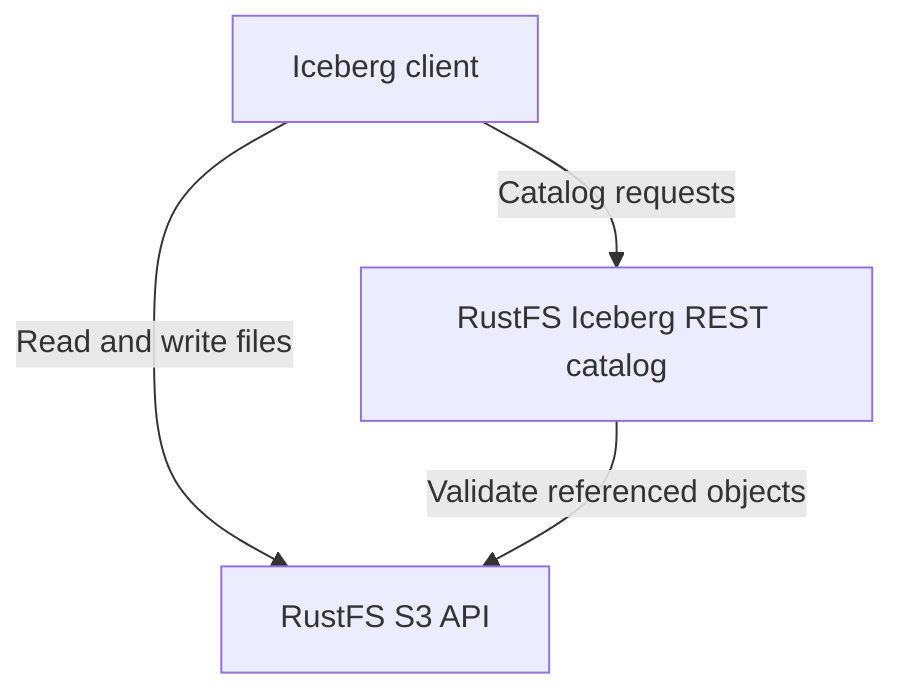

RustFS S3 Tables manages **Apache Iceberg** tables through a built-in REST catalog. Table data, manifests, and Iceberg metadata remain S3 objects in RustFS. This guide enables a dedicated table bucket and explains client connections, permissions, and maintenance boundaries.

:::note[Preview and version scope]

S3 Tables is a preview feature; client compatibility is limited to the workflows listed below. This page follows RustFS commit [`7e0c6711`](https://github.com/rustfs/rustfs/commit/7e0c67111b97703d47e23719b0264a739c8acea8), reviewed on September 8, 2026. Check the [support matrix](https://github.com/rustfs/rustfs/blob/7e0c67111b97703d47e23719b0264a739c8acea8/docs/architecture/s3-tables-support-matrix.md) and your release before adopting additional catalog operations or clients.

:::

## How it works

An Iceberg client uses the REST catalog to discover tables and commit metadata changes. It uses the S3 API to read and write table files. Both interfaces are served by RustFS on the S3 API port.



| Resource | Purpose |
| --- | --- |
| Table bucket | An existing S3 bucket enabled for catalog use; its name is the client `warehouse`. |
| Namespace | A logical group of tables within that warehouse. |
| Table | An Iceberg schema, snapshots, and a current metadata location maintained by the catalog. |

Enabling a table bucket does not register existing Parquet files as Iceberg tables. Create or register tables through an Iceberg client. If no `location` is supplied, RustFS assigns one; a custom location must be in the same bucket. Clients should use the returned location.

The default `object` catalog backing persists catalog state in RustFS object storage. A table commit validates its base metadata and referenced objects before conditionally updating the current metadata pointer. A conflicting writer must reload the table and resolve the conflict. The transaction boundary is one table.

## Before you begin

- Start a RustFS deployment with the S3 Tables endpoints described above. See [Installation](/installation).
- Install the [AWS CLI](/developer/examples/aws-cli) and `curl` 7.76 or later, which supports `--aws-sigv4` and `--fail-with-body`.
- Use a new, dedicated bucket for this walkthrough. The example uses `my-bucket`.
- Use an existing administrative account with access to both catalog operations and S3 objects. The built-in `consoleAdmin` policy covers this walkthrough; configure narrower policies for applications.

The examples use `http://localhost:9000`. Replace it with your server endpoint, and use [TLS](/integration/tls-configured) with certificate verification enabled outside a local test environment.

:::warning[Table bucket lifecycle behavior]

Table buckets are excluded from ordinary bucket lifecycle expiration. Enabling this mode on an existing bucket changes how its expiration rules are applied. Use catalog maintenance that understands Iceberg references to expire snapshots and clean up table files.

:::

## 1. Create a bucket

Set the endpoint and access credentials for the example clients:

```bash
export RUSTFS_ENDPOINT="http://localhost:9000"
export AWS_ACCESS_KEY_ID="<your-access-key>"
export AWS_SECRET_ACCESS_KEY="<your-secret-key>"
export AWS_DEFAULT_REGION="us-east-1"
```

Create the dedicated bucket:

```bash
aws --endpoint-url "$RUSTFS_ENDPOINT" s3api create-bucket --bucket my-bucket
```

These examples use an access key and secret key, without a temporary session token. Keep the same shell environment for the following requests and the PyIceberg guide.

## 2. Enable the table bucket

Send an empty, SigV4-signed request to the table bucket endpoint:

```bash
curl --fail-with-body --silent --show-error \
	--aws-sigv4 "aws:amz:us-east-1:s3" \
	--user "$AWS_ACCESS_KEY_ID:$AWS_SECRET_ACCESS_KEY" \
	--header "x-amz-content-sha256: e3b0c44298fc1c149afbf4c8996fb92427ae41e4649b934ca495991b7852b855" \
	--request PUT "$RUSTFS_ENDPOINT/iceberg/v1/buckets/my-bucket"
```

Read the state back with the same credentials:

```bash
curl --fail-with-body --silent --show-error \
	--aws-sigv4 "aws:amz:us-east-1:s3" \
	--user "$AWS_ACCESS_KEY_ID:$AWS_SECRET_ACCESS_KEY" \
	--header "x-amz-content-sha256: e3b0c44298fc1c149afbf4c8996fb92427ae41e4649b934ca495991b7852b855" \
	"$RUSTFS_ENDPOINT/iceberg/v1/buckets/my-bucket"
```

Both requests return HTTP `200` on success. Confirm that the response includes these values:

```json
{
	"table-bucket": "my-bucket",
	"enabled": true,
	"catalog-type": "iceberg-rest",
	"warehouse": "my-bucket",
	"catalog-entry-present": true
}
```

This is a response excerpt. The returned `catalog-uri` is a bucket-specific route; use the client base URI in the next section when configuring an Iceberg REST client.

## 3. Connect an Iceberg client

Use these settings for the canonical RustFS endpoint:

| Setting | Value |
| --- | --- |
| REST catalog URI | `http://localhost:9000/iceberg` |
| Warehouse and prefix | `my-bucket` |
| REST authentication | AWS Signature Version 4, signing name `s3` |
| Region | `us-east-1` |
| S3 file endpoint | `http://localhost:9000` with path-style addressing |

The client adds `/v1` to the catalog URI. The warehouse is a bucket name, not an S3 URI or an AWS S3 Tables ARN. Configure both REST request signing and S3 file access, even when they use the same account.

If you already operate a separate Iceberg REST catalog, use the [Apache Iceberg integration](/developer/integration/big-data/iceberg) for the external-catalog deployment pattern.

## Permissions and credentials

Table bucket enablement requires `admin:SetTableBucket`; inspecting it requires `admin:GetTableBucket`. Catalog discovery uses `admin:GetTableCatalog`. Namespace and table operations have their own RustFS admin actions, including `admin:SetTableNamespace`, `admin:CreateTable`, `admin:GetTableMetadata`, and `admin:CommitTable`.

Table file reads and writes also require ordinary S3 permissions. RustFS checks table permissions on warehouse object paths: reads require the corresponding `admin:GetTableMetadata` authorization, and writes require `admin:SetTableMetadata`. A catalog commit grant alone does not authorize the S3 file writes that precede it. Configure [IAM policies](/security-compliance/iam/policies) for both interfaces.

Catalog credential vending is disabled by default. When enabled, a compatible client must negotiate `X-Iceberg-Access-Delegation: vended-credentials`, and the caller must have permission to request table credentials. Initial catalog setup still requires an authorized principal. The linked PyIceberg walkthrough uses explicitly configured credentials.

## Maintenance and data protection

Metadata deletion and background maintenance are disabled by default. RustFS exposes explicit planning, scheduler-run, and worker-run operations; it does not run a built-in periodic maintenance scheduler. Review a maintenance plan and its retained references before enabling deletion.

Dropping a table removes its catalog entry while retaining its underlying objects. Complete any required table maintenance before unregistering the table; afterward, maintenance operations can no longer find it. Cleanup of retained objects needs a separate plan that accounts for all remaining references. Do not recursively delete S3 paths that snapshots or other metadata may still reference.

Keep the default catalog backing for this walkthrough. Switching an existing deployment to `durable-strong` requires the [catalog cutover procedure](https://github.com/rustfs/rustfs/blob/7e0c67111b97703d47e23719b0264a739c8acea8/docs/operations/s3-tables-cutover-runbook.md), including migration preflight and coordinated writer fencing.

## Client compatibility and limits

The source repository maintains the following validation scope:

| Client | Validation scope |
| --- | --- |
| PyIceberg | Automated create, append, reload, scan, and catalog operation checks. |
| DuckDB Iceberg 1.5.5 | Automated generic REST catalog checks for single-table reads, writes, and schema changes. |
| Spark | An opt-in live harness; validate the exact Spark and Iceberg versions you deploy. |
| Trino | A manual read-only probe; write compatibility is not claimed. |

Iceberg format v1 and v2 are supported, with v2 as the default. Staged table creation, purge-on-drop, and Iceberg format v3 are unsupported.

RustFS S3 Tables does not provide a SQL execution engine, multi-table atomic transactions, or independent active-active writes across regions. It does not claim full AWS S3 Tables control-plane compatibility. Consult the [support matrix](https://github.com/rustfs/rustfs/blob/7e0c67111b97703d47e23719b0264a739c8acea8/docs/architecture/s3-tables-support-matrix.md) before using another engine or vendor profile.

## Next steps

- Run the [PyIceberg walkthrough](/developer/integration/big-data/pyiceberg).
- Review [IAM policies](/security-compliance/iam/policies) before granting application access.
- Use the repository's [client conformance checks](https://github.com/rustfs/rustfs/blob/7e0c67111b97703d47e23719b0264a739c8acea8/scripts/table-catalog/README.md) to validate additional client versions.
