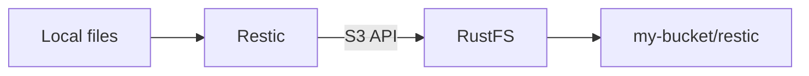

Restic is a command-line backup tool that stores snapshots in a repository. This guide shows how to point Restic at RustFS, back up a local directory, restore a snapshot, and verify the stored objects in RustFS.

You need a running RustFS instance, a bucket such as `my-bucket`, Restic installed, access keys for the bucket, and a password for the Restic repository.

:::note[Path-style access]

Restic's S3 backend should use path-style access for RustFS. This guide sets `-o s3.bucket-lookup=path` and uses the bucket name in the repository URL.

:::

## Architecture



Restic writes repository metadata and backup snapshots into RustFS through the S3 API. The repository prefix in this guide is `restic`, and the bucket is `my-bucket`.

## 1. Prepare the bucket

Open the RustFS Console at `http://localhost:9001` and create `my-bucket`, or choose an existing bucket that is dedicated to backups.


Use a dedicated bucket for each backup job. The example screenshot shows the Console in English and light theme.

## 2. Initialize the Restic repository

Set the credentials, region, repository password, and repository location:

```bash
export AWS_ACCESS_KEY_ID=<your-access-key>
export AWS_SECRET_ACCESS_KEY=<your-secret-key>
export AWS_DEFAULT_REGION=us-east-1
export RESTIC_PASSWORD=<your-restic-password>
export RESTIC_REPOSITORY=s3:http://localhost:9000/my-bucket/restic
```

Run `restic init` with path-style bucket lookup:

```bash
restic -o s3.bucket-lookup=path init
```

The repository password protects the snapshot data. Keep it separate from the RustFS access keys.

## 3. Back up data

Create a small test directory and back it up:

```bash
mkdir -p ~/Documents/restic-demo
printf 'hello from RustFS\n' > ~/Documents/restic-demo/hello.txt
restic -o s3.bucket-lookup=path backup ~/Documents/restic-demo
```

Restic prints a snapshot ID after the backup completes. Run the command again after changing a file to create a second snapshot.

## 4. Restore a snapshot

Restore the latest snapshot to a separate directory:

```bash
mkdir -p ~/Documents/restic-restore
restic -o s3.bucket-lookup=path restore latest --target ~/Documents/restic-restore
```

You can also restore a specific snapshot ID if you want to recover an earlier version.

## 5. Verify the repository in RustFS

Open `my-bucket` in the RustFS Console and confirm that Restic created repository objects under the `restic/` prefix.

You can also run a repository check:

```bash
restic -o s3.bucket-lookup=path check
```

## Next steps

- [CLI Client (rc)](/operations/rc) to create buckets and inspect objects from the command line.
- [TLS Configuration](/integration/tls-configured) if you expose RustFS outside a trusted network.