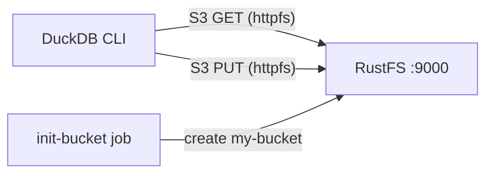

This guide runs **DuckDB** against **RustFS** as its S3-compatible storage. You will start both services with Docker Compose, configure DuckDB's `httpfs` extension for the RustFS endpoint, write query results to the bucket as Parquet, read them back, and verify the objects in RustFS. The workflow was verified with the `duckdb/duckdb:latest` image (v1.5.5) and `rustfs/rustfs-x86-musl:v2.3.1`.

You need Docker with the Compose plugin. This deployment is intended for local integration testing, not production.

## Architecture



DuckDB reads and writes objects through its [`httpfs` extension](https://duckdb.org/docs/stable/extensions/httpfs/overview), which implements the S3 API. An S3 secret carries the RustFS endpoint, credentials, path-style addressing, and the plain-HTTP setting; Parquet files then load from and write to `s3://my-bucket/...` paths like local files.

## 1. Create the project files

Create a working directory:

```bash
mkdir rustfs-duckdb
cd rustfs-duckdb
```

Create an environment file and replace both credential placeholders:

```ini title=".env"
RUSTFS_ACCESS_KEY=<your-access-key>
RUSTFS_SECRET_KEY=<your-secret-key>
```

Use dedicated credentials for the bucket. Do not commit `.env` to source control.

Create the Compose file:

```yaml title="compose.yaml"
services:
  rustfs:
    image: rustfs/rustfs-x86-musl:v2.3.1
    environment:
      RUSTFS_ACCESS_KEY: ${RUSTFS_ACCESS_KEY}
      RUSTFS_SECRET_KEY: ${RUSTFS_SECRET_KEY}
      RUSTFS_VOLUMES: /data
      RUSTFS_ADDRESS: ":9000"
      RUSTFS_CONSOLE_ADDRESS: ":9001"
      RUSTFS_CONSOLE_ENABLE: "true"
    volumes:
      - rustfs-data:/data
    ports:
      - "9000:9000"
      - "9001:9001"
    healthcheck:
      test: ["CMD", "curl", "-sf", "http://127.0.0.1:9000/health"]
      interval: 10s
      timeout: 5s
      retries: 6
      start_period: 10s
    networks:
      - warehouse

  create-bucket:
    image: rustfs/rc:latest
    depends_on:
      rustfs:
        condition: service_healthy
    environment:
      RUSTFS_ACCESS_KEY: ${RUSTFS_ACCESS_KEY}
      RUSTFS_SECRET_KEY: ${RUSTFS_SECRET_KEY}
    entrypoint:
      - /bin/sh
      - -c
      - |
        until /usr/bin/rc alias set rustfs http://rustfs:9000 "$${RUSTFS_ACCESS_KEY}" "$${RUSTFS_SECRET_KEY}"; do
          echo "Waiting for RustFS..."
          sleep 2
        done
        /usr/bin/rc ls rustfs/my-bucket >/dev/null 2>&1 || /usr/bin/rc mb rustfs/my-bucket
    networks:
      - warehouse

  duckdb:
    image: duckdb/duckdb:latest
    entrypoint: ["/duckdb"]
    depends_on:
      create-bucket:
        condition: service_completed_successfully
    networks:
      - warehouse

networks:
  warehouse:

volumes:
  rustfs-data:
```

The [`rc` image](https://github.com/rustfs/cli) provides the official RustFS command-line client. The initializer checks for `my-bucket` before creating it, so repeated starts do not delete existing data. The `duckdb/duckdb` image contains only the `/duckdb` binary and no shell, so the service sets `entrypoint: ["/duckdb"]`.

## 2. Start the deployment

Resolve the Compose file before starting containers:

```bash
docker compose config
```

Start the services and wait for the bucket initializer to finish:

```bash
docker compose up -d
docker compose ps -a
```

The `create-bucket` service should show an exit code of `0`. Open the RustFS Console at `http://localhost:9001/rustfs/console/` to inspect the bucket at any time.

## 3. Configure the S3 secret in DuckDB

Start an interactive DuckDB session:

```bash
docker compose run --rm duckdb
```

Install the extension and register the RustFS endpoint:

```sql
INSTALL httpfs;
LOAD httpfs;

CREATE SECRET rustfs (
    TYPE S3,
    KEY_ID '<your-access-key>',
    SECRET '<your-secret-key>',
    ENDPOINT 'rustfs:9000',
    USE_SSL FALSE,
    URL_STYLE 'path'
);
```

The endpoint is given as `host:port` without a scheme. `USE_SSL FALSE` selects plain HTTP inside the Compose network, and `URL_STYLE 'path'` selects path-style addressing, which is what RustFS expects. Secrets live for the current session — re-create the secret each time you start a new session.

## 4. Write query results to RustFS

Write a small table as Parquet into the bucket:

```sql
COPY
    (SELECT i AS id, 'rustfs-duckdb-demo' AS source FROM range(1000) t(i))
    TO 's3://my-bucket/duckdb-demo/events.parquet'
    (FORMAT PARQUET);
```

```text
┌─────────┐
│ Success │
│ boolean │
├─────────┤
│   true  │
└─────────┘
```

## 5. Read Parquet back from RustFS

Query the object you just wrote as if it were a local file:

```sql
SELECT count(*) AS rows, min(id) AS min_id, max(id) AS max_id
FROM read_parquet('s3://my-bucket/duckdb-demo/events.parquet');
```

```text
┌───────┬────────┬────────┐
│ rows  │ min_id │ max_id │
│ int64 │ int64  │ int64  │
├───────┼────────┼────────┤
│  1000 │      0 │    999 │
└───────┴────────┴────────┘
```

Any Parquet object under the bucket can be queried this way, including files written by other systems such as OpenObserve, Spark, or Iceberg.

## 6. Verify objects in RustFS

List the prefix through the bucket-initializer image:

```bash
docker compose run --rm --entrypoint /bin/sh create-bucket -c \
  '/usr/bin/rc alias set rustfs http://rustfs:9000 "$RUSTFS_ACCESS_KEY" "$RUSTFS_SECRET_KEY" >/dev/null && /usr/bin/rc ls rustfs/my-bucket/duckdb-demo --recursive'
```

```text
[2026-09-20 06:52:45]   5.32 KiB duckdb-demo/events.parquet
```

You can also inspect the `duckdb-demo` prefix in the RustFS Console:


## 7. Stop or reset the stack

Stop the containers while keeping the RustFS data volume:

```bash
docker compose down
```

To delete the local objects and start from an empty RustFS volume, explicitly include `--volumes`:

```bash
docker compose down --volumes
```

## Troubleshooting

### DuckDB cannot reach RustFS

Inside the Compose network the endpoint is `rustfs:9000`. From a DuckDB process running on the host, use `localhost:9000` instead and publish port `9000` as shown in the Compose file.

### SSL or connection errors with a plain-HTTP endpoint

`ENDPOINT` takes no scheme. If RustFS runs without TLS, `USE_SSL FALSE` must be set in the secret; otherwise `httpfs` attempts HTTPS and fails with a connection or certificate error.

### AccessDenied responses

Check that the credentials in the secret match the RustFS credentials, and that the bucket initializer completed successfully:

```bash
docker compose logs create-bucket
```

### Virtual-host style requests

`URL_STYLE 'path'` is required for the container-network endpoint. Virtual-host style requests need a RustFS domain configuration (`RUSTFS_SERVER_DOMAINS`) and matching DNS records, and are not needed for this setup.

## Next steps

- Review [S3 compatibility notes](/administration/protocols/s3) before adopting additional S3 operations.
- Create dedicated production credentials with [Access Key Management](/security-compliance/iam/access-token).
- Follow the [DuckDB httpfs documentation](https://duckdb.org/docs/stable/extensions/httpfs/overview) for advanced options such as region overrides and connection limits.
