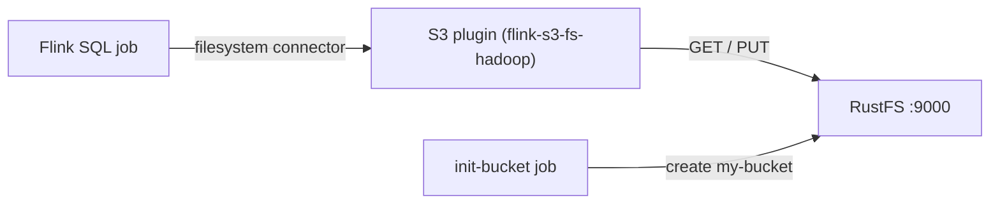
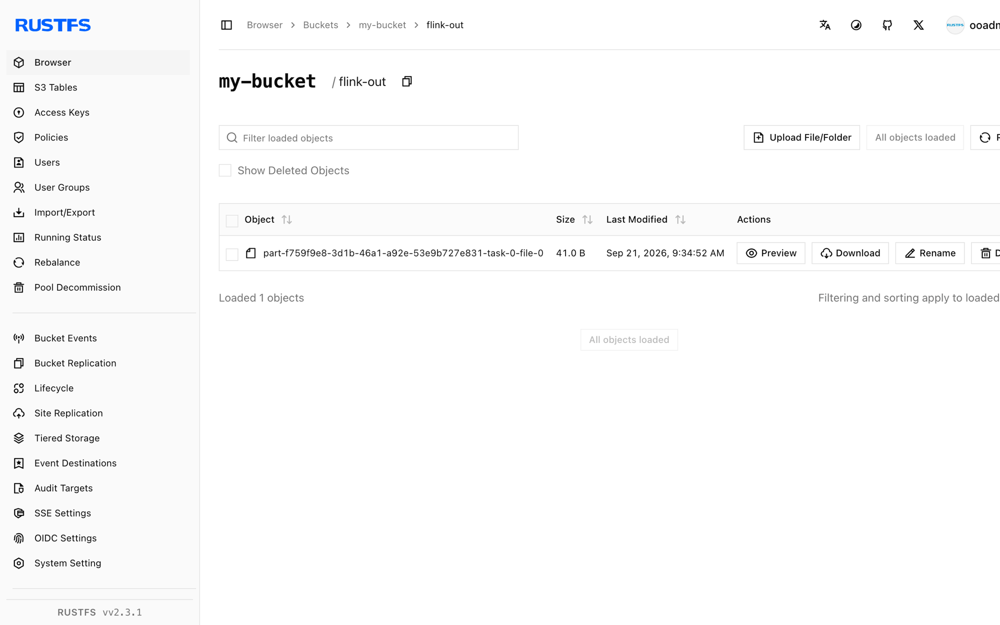

This guide connects [Apache Flink](https://github.com/apache/flink) to **RustFS** through Flink's S3 filesystem plugin (`flink-s3-fs-hadoop`). You will start a session cluster with Docker Compose, write a bounded result set to the bucket in batch mode, and read it back through Flink SQL. The workflow was verified with `flink:1.20` and `rustfs/rustfs-x86-musl:v2.3.1`.

You need Docker with the Compose plugin. This deployment is intended for local integration testing, not production.

## Architecture



The `flink-s3-fs-hadoop` plugin registers the `s3://` scheme for Flink's filesystem connector. Endpoint, path-style addressing, plain HTTP, and credentials are configured through `s3.*` properties in `flink-conf.yaml` (passed via `FLINK_PROPERTIES`).

## 1. Create the project files

Create a working directory:

```bash
mkdir rustfs-flink
cd rustfs-flink
```

Create an environment file and replace both credential placeholders:

```ini title=".env"
RUSTFS_ACCESS_KEY=<your-access-key>
RUSTFS_SECRET_KEY=<your-secret-key>
```

Use dedicated credentials for the bucket. Do not commit `.env` to source control.

The S3 plugin ships inside the image under `/opt/flink/opt/` and must be copied to `/opt/flink/plugins/s3fs/` to load. Prepare a local directory for it:

```bash
mkdir -p s3fs
docker create --name flink-tmp flink:1.20
docker cp flink-tmp:/opt/flink/opt/flink-s3-fs-hadoop-1.20.5.jar s3fs/
docker rm flink-tmp
```

Create the Compose file:

```yaml title="compose.yaml"
services:
  rustfs:
    image: rustfs/rustfs-x86-musl:v2.3.1
    environment:
      RUSTFS_ACCESS_KEY: ${RUSTFS_ACCESS_KEY}
      RUSTFS_SECRET_KEY: ${RUSTFS_SECRET_KEY}
      RUSTFS_VOLUMES: /data
      RUSTFS_ADDRESS: ":9000"
      RUSTFS_CONSOLE_ADDRESS: ":9001"
      RUSTFS_CONSOLE_ENABLE: "true"
    volumes:
      - rustfs-data:/data
    ports:
      - "9000:9000"
      - "9001:9001"
    healthcheck:
      test: ["CMD", "curl", "-sf", "http://127.0.0.1:9000/health"]
      interval: 10s
      timeout: 5s
      retries: 6
      start_period: 10s
    networks:
      - flink

  create-bucket:
    image: rustfs/rc:latest
    depends_on:
      rustfs:
        condition: service_healthy
    environment:
      RUSTFS_ACCESS_KEY: ${RUSTFS_ACCESS_KEY}
      RUSTFS_SECRET_KEY: ${RUSTFS_SECRET_KEY}
    entrypoint:
      - /bin/sh
      - -c
      - |
        until /usr/bin/rc alias set rustfs http://rustfs:9000 "$${RUSTFS_ACCESS_KEY}" "$${RUSTFS_SECRET_KEY}"; do
          echo "Waiting for RustFS..."
          sleep 2
        done
        /usr/bin/rc ls rustfs/my-bucket >/dev/null 2>&1 || /usr/bin/rc mb rustfs/my-bucket
    networks:
      - flink

  jobmanager:
    image: flink:1.20
    command: jobmanager
    environment:
      FLINK_PROPERTIES: |
        jobmanager.rpc.address: jobmanager
        rest.address: jobmanager
        rest.bind-address: 0.0.0.0
        s3.access-key: ${RUSTFS_ACCESS_KEY}
        s3.secret-key: ${RUSTFS_SECRET_KEY}
        s3.endpoint: http://rustfs:9000
        s3.path-style-access: true
    volumes:
      - ./s3fs:/opt/flink/plugins/s3fs:ro
    ports:
      - "8081:8081"
    depends_on:
      create-bucket:
        condition: service_completed_successfully
    networks:
      - flink

  taskmanager:
    image: flink:1.20
    command: taskmanager
    environment:
      FLINK_PROPERTIES: |
        jobmanager.rpc.address: jobmanager
        taskmanager.host: taskmanager
        s3.access-key: ${RUSTFS_ACCESS_KEY}
        s3.secret-key: ${RUSTFS_SECRET_KEY}
        s3.endpoint: http://rustfs:9000
        s3.path-style-access: true
    volumes:
      - ./s3fs:/opt/flink/plugins/s3fs:ro
    depends_on:
      jobmanager:
        condition: service_started
    networks:
      - flink

networks:
  flink:

volumes:
  rustfs-data:
```

The `s3.access-key`, `s3.secret-key`, `s3.endpoint`, and `s3.path-style-access` properties configure the S3 plugin on both the JobManager and the TaskManager.

## 2. Start the deployment

Resolve the Compose file before starting containers:

```bash
docker compose config
```

Start the services and wait for the bucket initializer to finish:

```bash
docker compose up -d
docker compose ps -a
```

## 3. Write a result set to RustFS

Create the SQL job — batch mode with the filesystem sink:

```yaml title="batch.sql"
SET 'execution.runtime-mode' = 'batch';

CREATE TABLE sink (
  id INT,
  payload STRING
) WITH (
  'connector' = 'filesystem',
  'path' = 's3://my-bucket/flink-out/',
  'format' = 'csv'
);

INSERT INTO sink
  VALUES (1, 'alpha'), (2, 'bravo'), (3, 'charlie'), (4, 'delta'), (5, 'echo');
```

Submit it through the SQL client inside the JobManager:

```bash
docker compose exec jobmanager bash -c "/opt/flink/bin/sql-client.sh embedded -f /dev/stdin" < batch.sql
```

The job finishes when all rows are written.

## 4. Read the data back

Create the read query — the filesystem connector scans the prefix:

```yaml title="read.sql"
CREATE TABLE readings (
  id INT,
  payload STRING
) WITH (
  'connector' = 'filesystem',
  'path' = 's3://my-bucket/flink-out/',
  'format' = 'csv'
);

SET 'sql-client.execution.result-mode' = 'TABLEAU';

SELECT * FROM readings;
```

```bash
docker compose exec jobmanager bash -c "/opt/flink/bin/sql-client.sh embedded -f /dev/stdin" < read.sql
```

```text
+----+-------------+--------------------------------+
| op |          id |                         payload |
+----+-------------+--------------------------------+
| +I |           1 |                           alpha |
| +I |           2 |                           bravo |
| +I |           3 |                         charlie |
| +I |           4 |                           delta |
| +I |           5 |                            echo |
+----+-------------+--------------------------------+
```

## 5. Verify objects in RustFS

List the prefix through the bucket-initializer image:

```bash
docker compose run --rm --entrypoint /bin/sh create-bucket -c \
  '/usr/bin/rc alias set rustfs http://rustfs:9000 "$RUSTFS_ACCESS_KEY" "$RUSTFS_SECRET_KEY" >/dev/null && /usr/bin/rc ls rustfs/my-bucket/flink-out --recursive'
```

```text
[2026-09-21 01:34:52]       41 B flink-out/part-f759f9e8-3d1b-46a1-a92e-53e9b727e831-task-0-file-0
```

You can also browse the prefix in the RustFS Console:



## 6. Use RustFS S3 Tables

RustFS S3 Tables provides a built-in Apache Iceberg REST catalog, so Flink can treat a table bucket as a managed Iceberg warehouse while the data stays in RustFS. Enable a table bucket and point the Flink Iceberg connector's REST catalog at RustFS as described in [S3 Tables](/administration/data/s3-tables): the REST catalog URI is `http://<rustfs-host>:9000/iceberg`, the warehouse is the bucket name, and both catalog requests (AWS Signature Version 4, signing name `s3`) and S3 file access use path-style addressing.

Per the S3 Tables support matrix, validate the exact Flink and Iceberg versions you deploy against the catalog before adopting this path in production.

## 7. Stop or reset the stack

Stop the containers while keeping the RustFS data volume:

```bash
docker compose down
```

To delete the stored files and start from an empty RustFS volume, explicitly include `--volumes`:

```bash
docker compose down --volumes
```

## Troubleshooting

### No AWS Credentials provided / AccessDenied on writes

The S3 plugin reads its credentials from the `s3.*` properties in `flink-conf.yaml`. Confirm that `s3.access-key`, `s3.secret-key`, `s3.endpoint`, and `s3.path-style-access` are present in `FLINK_PROPERTIES` for **both** the JobManager and the TaskManager, and that the plugin jar exists in `/opt/flink/plugins/s3fs/` on each.

### Cannot resolve the `rustfs` host from the TaskManager

All Flink containers and RustFS must share a Compose network. If you attach RustFS to an external network, connect the Flink containers to it as well before submitting the job.

### A streaming write fails with "Stream closed" after a failed attempt

Recovering an in-progress S3 upload after a failure can leave the writer in an unrecoverable state. Delete the job's output prefix in the bucket and resubmit the job, or use batch mode as shown in this guide for one-shot writes.

## Next steps

- Review [S3 compatibility notes](/administration/protocols/s3) before adopting additional S3 operations.
- Create dedicated production credentials with [Access Key Management](/security-compliance/iam/access-token).
- Follow the [Apache Flink documentation](https://nightlies.apache.org/flink/flink-docs-stable/) for filesystem connector options such as partitioning and compaction.
