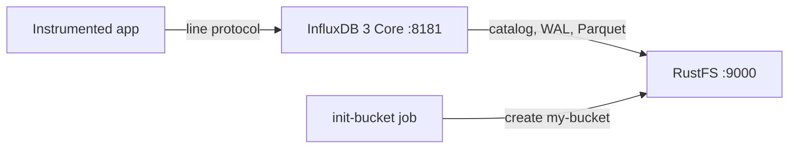

This guide runs [InfluxDB](https://github.com/influxdata/influxdb) — specifically **InfluxDB 3 Core**, the Rust-based time-series database with a Parquet storage engine — with **RustFS** as its object store. You will start InfluxDB with Docker Compose, write line protocol through the HTTP API, query it back with SQL, verify the persisted objects in RustFS, and confirm the data survives an InfluxDB restart. The workflow was verified with `influxdb:3-core` (v3.11.5) and `rustfs/rustfs-x86-musl:v2.3.1`.

You need Docker with the Compose plugin. This deployment is intended for local integration testing, not production.

## Architecture



InfluxDB 3 Core keeps its catalog, write-ahead log, and Parquet data files in the configured object store. Writes land in the WAL first and are persisted to RustFS, so every write survives a restart even before compaction produces Parquet files. The server uses path-style addressing against the configured endpoint by default.

## 1. Create the project files

Create a working directory:

```bash
mkdir rustfs-influxdb
cd rustfs-influxdb
```

Create an environment file and replace both credential placeholders:

```ini title=".env"
RUSTFS_ACCESS_KEY=<your-access-key>
RUSTFS_SECRET_KEY=<your-secret-key>
```

Use dedicated credentials for the bucket. Do not commit `.env` to source control.

Create the Compose file:

```yaml title="compose.yaml"
services:
  rustfs:
    image: rustfs/rustfs-x86-musl:v2.3.1
    environment:
      RUSTFS_ACCESS_KEY: ${RUSTFS_ACCESS_KEY}
      RUSTFS_SECRET_KEY: ${RUSTFS_SECRET_KEY}
      RUSTFS_VOLUMES: /data
      RUSTFS_ADDRESS: ":9000"
      RUSTFS_CONSOLE_ADDRESS: ":9001"
      RUSTFS_CONSOLE_ENABLE: "true"
    volumes:
      - rustfs-data:/data
    ports:
      - "9000:9000"
      - "9001:9001"
    healthcheck:
      test: ["CMD", "curl", "-sf", "http://127.0.0.1:9000/health"]
      interval: 10s
      timeout: 5s
      retries: 6
      start_period: 10s
    networks:
      - influxdb

  create-bucket:
    image: rustfs/rc:latest
    depends_on:
      rustfs:
        condition: service_healthy
    environment:
      RUSTFS_ACCESS_KEY: ${RUSTFS_ACCESS_KEY}
      RUSTFS_SECRET_KEY: ${RUSTFS_SECRET_KEY}
    entrypoint:
      - /bin/sh
      - -c
      - |
        until /usr/bin/rc alias set rustfs http://rustfs:9000 "$${RUSTFS_ACCESS_KEY}" "$${RUSTFS_SECRET_KEY}"; do
          echo "Waiting for RustFS..."
          sleep 2
        done
        /usr/bin/rc ls rustfs/my-bucket >/dev/null 2>&1 || /usr/bin/rc mb rustfs/my-bucket
    networks:
      - influxdb

  influxdb:
    image: influxdb:3-core
    command:
      - serve
      - --node-id
      - influxdb-demo
      - --object-store
      - s3
      - --bucket
      - my-bucket
      - --aws-endpoint
      - http://rustfs:9000
      - --aws-access-key-id
      - ${RUSTFS_ACCESS_KEY}
      - --aws-secret-access-key
      - ${RUSTFS_SECRET_KEY}
      - --aws-allow-http
    ports:
      - "8181:8181"
    depends_on:
      create-bucket:
        condition: service_completed_successfully
    networks:
      - influxdb

networks:
  influxdb:

volumes:
  rustfs-data:
```

`--object-store s3` with `--aws-endpoint` routes all catalog, WAL, and Parquet writes to RustFS. InfluxDB uses path-style addressing against the endpoint by default, and `--aws-allow-http` permits plain HTTP inside the Compose network.

## 2. Start the deployment

Resolve the Compose file before starting containers:

```bash
docker compose config
```

Start the services and wait for the bucket initializer to finish:

```bash
docker compose up -d
docker compose ps -a
```

## 3. Create the admin token

InfluxDB 3 Core protects every API request with a bearer token. Create the admin token once after the first start and keep the printed value:

```bash
docker compose exec influxdb3 influxdb3 create token --admin
```

```text
Token: <your-admin-token>
```

:::note[Token creation]

The token value is printed only once and cannot be recovered later. If the token name is already taken (HTTP 409), the node has existing metadata — start from a fresh bucket prefix or delete the node prefix in the bucket before retrying.

:::

## 4. Write line protocol

Send a batch of CPU measurements in line protocol to the `rustfs_demo` database:

```bash
python3 - <<'PY'
import time, urllib.request

token = "<your-admin-token>"
now_ns = int(time.time() * 1e9)
lines = []
for i in range(30):
    ts = now_ns - i * 1_000_000_000
    lines.append(f"cpu_usage,host=az-server,region=us-east-1 usage={60 + i % 30}.{i % 10} {ts}")

req = urllib.request.Request(
    "http://localhost:8181/api/v3/write_lp?db=rustfs_demo",
    data="\n".join(lines).encode(),
    headers={"Content-Type": "text/plain", "Authorization": f"Bearer {token}"},
    method="POST",
)
with urllib.request.urlopen(req, timeout=30) as r:
    print("write:", r.status)
PY
```

```text
write: 204
```

## 5. Query with SQL

Query the measurement back through the SQL API:

```bash
curl -sG "http://localhost:8181/api/v3/query_sql" \
  --data-urlencode "db=rustfs_demo" \
  --data-urlencode "format=json" \
  --data-urlencode "q=SELECT count(*) AS cnt FROM cpu_usage" \
  -H "Authorization: Bearer <your-admin-token>"
```

```text
[{"cnt":30}]
```

## 6. Verify objects in RustFS

List the node prefix through the bucket-initializer image:

```bash
docker compose run --rm --entrypoint /bin/sh create-bucket -c \
  '/usr/bin/rc alias set rustfs http://rustfs:9000 "$RUSTFS_ACCESS_KEY" "$RUSTFS_SECRET_KEY" >/dev/null && /usr/bin/rc ls rustfs/my-bucket/influxdb-demo --recursive'
```

The catalog, the write-ahead log, and later the Parquet data files live under the node identifier prefix:

```text
[2026-09-20 23:18:28]      105 B influxdb-demo/catalog/v3/snapshot
[2026-09-20 23:20:54]     1.45 KiB influxdb-demo/wal/00000000001.wal
[2026-09-20 23:20:19]       31 B influxdb-demo/table-index-conversion-completed
```

You can also browse the prefix in the RustFS Console:


## 7. Confirm persistence across a restart

Restart InfluxDB and repeat the SQL query:

```bash
docker compose restart influxdb
curl -sG "http://localhost:8181/api/v3/query_sql" \
  --data-urlencode "db=rustfs_demo" \
  --data-urlencode "format=json" \
  --data-urlencode "q=SELECT count(*) AS cnt FROM cpu_usage" \
  -H "Authorization: Bearer <your-admin-token>"
```

```text
[{"cnt":30}]
```

The count is unchanged because the catalog and WAL were replayed from RustFS — the object store is the persistence layer, exactly as in production topologies.

## 8. Stop or reset the stack

Stop the containers while keeping the RustFS data volume:

```bash
docker compose down
```

To delete the stored data and start from an empty RustFS volume, explicitly include `--volumes`:

```bash
docker compose down --volumes
```

## Troubleshooting

### "the request was not authenticated" on every request

InfluxDB 3 Core requires the admin bearer token on API requests. Create it once with `influxdb3 create token --admin` and send it as `Authorization: Bearer <token>`.

### "token name already exists" when creating the admin token

The node already has an admin token, and the value cannot be recovered. Delete the node prefix in the bucket (for example `influxdb-demo/`) while the container is stopped, start it again, and create the token fresh.

### AccessDenied or 403 responses

Confirm the credentials in the Compose file match the RustFS credentials and that the `create-bucket` service completed successfully:

```bash
docker compose logs create-bucket
```

### Connection or certificate errors

`--aws-endpoint` takes a full URL; `--aws-allow-http` permits plain HTTP for the container-network endpoint. Inside the Compose network use `http://rustfs:9000`; from the host use `http://localhost:9000`.

## Next steps

- Review [S3 compatibility notes](/administration/protocols/s3) before adopting additional S3 operations.
- Create dedicated production credentials with [Access Key Management](/security-compliance/iam/access-token).
- Follow the [InfluxDB 3 Core documentation](https://docs.influxdata.com/influxdb3/core/) to connect telegraf or the write APIs as data producers.
