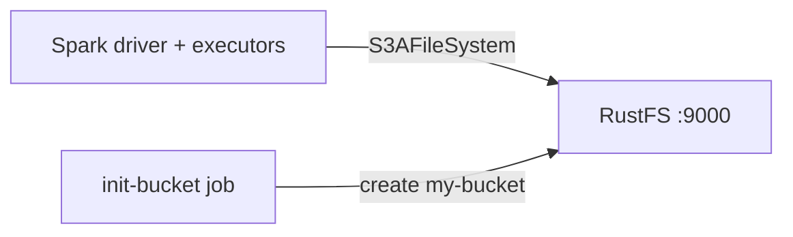

This guide connects [Apache Spark](https://github.com/apache/spark) to **RustFS** through the `s3a` connector. You will start RustFS with Docker Compose, run a Spark job that writes a Parquet dataset to the bucket, read it back, and verify the objects in RustFS. The workflow was verified with `apache/spark:3.5.6` (Hadoop 3.3.4 via `hadoop-aws`) and `rustfs/rustfs-x86-musl:v2.3.1`.

You need Docker with the Compose plugin. This deployment is intended for local integration testing, not production.

## Architecture



Spark talks to RustFS through the `hadoop-aws` S3A filesystem. The connector settings — endpoint, path-style addressing, plain HTTP, and credentials — are passed as `spark.hadoop.fs.s3a.*` properties.

## 1. Create the project files

Create a working directory:

```bash
mkdir rustfs-spark
cd rustfs-spark
```

Create an environment file and replace both credential placeholders:

```ini title=".env"
RUSTFS_ACCESS_KEY=<your-access-key>
RUSTFS_SECRET_KEY=<your-secret-key>
```

Use dedicated credentials for the bucket. Do not commit `.env` to source control.

Create the Spark job:

```python title="job.py"
from pyspark.sql import SparkSession

spark = SparkSession.builder.appName("rustfs-spark-demo").getOrCreate()
spark.sparkContext.setLogLevel("WARN")

spark.range(1000).withColumnRenamed("id", "num") \
    .write.mode("overwrite").parquet("s3a://my-bucket/spark-demo/events")

back = spark.read.parquet("s3a://my-bucket/spark-demo/events")
print("ROWS_READ_BACK:", back.count())
spark.stop()
```

Create the Compose file:

```yaml title="compose.yaml"
services:
  rustfs:
    image: rustfs/rustfs-x86-musl:v2.3.1
    environment:
      RUSTFS_ACCESS_KEY: ${RUSTFS_ACCESS_KEY}
      RUSTFS_SECRET_KEY: ${RUSTFS_SECRET_KEY}
      RUSTFS_VOLUMES: /data
      RUSTFS_ADDRESS: ":9000"
      RUSTFS_CONSOLE_ADDRESS: ":9001"
      RUSTFS_CONSOLE_ENABLE: "true"
    volumes:
      - rustfs-data:/data
    ports:
      - "9000:9000"
      - "9001:9001"
    healthcheck:
      test: ["CMD", "curl", "-sf", "http://127.0.0.1:9000/health"]
      interval: 10s
      timeout: 5s
      retries: 6
      start_period: 10s
    networks:
      - warehouse

  create-bucket:
    image: rustfs/rc:latest
    depends_on:
      rustfs:
        condition: service_healthy
    environment:
      RUSTFS_ACCESS_KEY: ${RUSTFS_ACCESS_KEY}
      RUSTFS_SECRET_KEY: ${RUSTFS_SECRET_KEY}
    entrypoint:
      - /bin/sh
      - -c
      - |
        until /usr/bin/rc alias set rustfs http://rustfs:9000 "$${RUSTFS_ACCESS_KEY}" "$${RUSTFS_SECRET_KEY}"; do
          echo "Waiting for RustFS..."
          sleep 2
        done
        /usr/bin/rc ls rustfs/my-bucket >/dev/null 2>&1 || /usr/bin/rc mb rustfs/my-bucket
    networks:
      - warehouse

  spark:
    image: apache/spark:3.5.6
    entrypoint: ["/opt/spark/bin/spark-submit"]
    volumes:
      - ./job.py:/job.py:ro
    command:
      - --conf
      - spark.jars.ivy=/tmp/.ivy2
      - --packages
      - org.apache.hadoop:hadoop-aws:3.3.4
      - --conf
      - spark.hadoop.fs.s3a.endpoint=http://rustfs:9000
      - --conf
      - spark.hadoop.fs.s3a.access.key=${RUSTFS_ACCESS_KEY}
      - --conf
      - spark.hadoop.fs.s3a.secret.key=${RUSTFS_SECRET_KEY}
      - --conf
      - spark.hadoop.fs.s3a.path.style.access=true
      - --conf
      - spark.hadoop.fs.s3a.connection.ssl.enabled=false
      - --conf
      - spark.hadoop.fs.s3a.impl=org.apache.hadoop.fs.s3a.S3AFileSystem
      - /job.py
    depends_on:
      create-bucket:
        condition: service_completed_successfully
    networks:
      - warehouse

networks:
  warehouse:

volumes:
  rustfs-data:
```

`--packages org.apache.hadoop:hadoop-aws:3.3.4` downloads the S3 connector at launch; it must match the Hadoop version bundled with the Spark image. `spark.jars.ivy=/tmp/.ivy2` moves the download cache to a writable directory.

## 2. Start RustFS and run the job

Start the storage services:

```bash
docker compose up -d
docker compose ps -a
```

Run the Spark job:

```bash
docker compose run --rm spark
```

```text
ROWS_READ_BACK: 1000
```

## 3. Verify objects in RustFS

List the dataset through the bucket-initializer image:

```bash
docker compose run --rm --entrypoint /bin/sh create-bucket -c \
  '/usr/bin/rc alias set rustfs http://rustfs:9000 "$RUSTFS_ACCESS_KEY" "$RUSTFS_SECRET_KEY" >/dev/null && /usr/bin/rc ls rustfs/my-bucket/spark-demo --recursive'
```

```text
[2026-09-21 00:58:22]        0 B spark-demo/events/_SUCCESS
[2026-09-21 00:58:21]   1.46 KiB spark-demo/events/part-00000-...-c000.snappy.parquet
[2026-09-21 00:58:21]   1.46 KiB spark-demo/events/part-00001-...-c000.snappy.parquet
[2026-09-21 00:58:21]   1.46 KiB spark-demo/events/part-00002-...-c000.snappy.parquet
```

You can also browse the prefix in the RustFS Console:


## 4. Use RustFS S3 Tables

RustFS S3 Tables provides a built-in Apache Iceberg REST catalog, so Spark can treat a table bucket as a managed Iceberg warehouse while the data stays in RustFS. Enable a table bucket and connect Spark's Iceberg REST catalog as described in [S3 Tables](/administration/data/s3-tables): the REST catalog URI is `http://<rustfs-host>:9000/iceberg`, the warehouse is the bucket name, and both catalog requests (AWS Signature Version 4, signing name `s3`) and S3 file access use path-style addressing.

Per the S3 Tables support matrix, validate the exact Spark and Iceberg versions you deploy against the catalog before adopting this path in production.

## 5. Stop or reset the stack

Stop the containers while keeping the RustFS data volume:

```bash
docker compose down
```

To delete the dataset and start from an empty RustFS volume, explicitly include `--volumes`:

```bash
docker compose down --volumes
```

## Troubleshooting

### NumberFormatException: For input string: "60s"

The `hadoop-aws` version does not match the Hadoop version inside the Spark image. Spark 4.x images need `hadoop-aws` 3.4.x; this guide pins `apache/spark:3.5.6` together with `hadoop-aws:3.3.4`.

### Connection failures to `rustfs:9000`

`fs.s3a.endpoint` is resolved inside the Compose network. From a Spark process running on the host, use `http://localhost:9000` instead.

### AccessDenied or 403 responses

Confirm that the connector settings match the RustFS credentials and that the `create-bucket` service completed successfully:

```bash
docker compose logs create-bucket
```

## Next steps

- Review [S3 compatibility notes](/administration/protocols/s3) before adopting additional S3 operations.
- Create dedicated production credentials with [Access Key Management](/security-compliance/iam/access-token).
- Follow the [Spark documentation](https://spark.apache.org/docs/latest/) for structured streaming and data source options.
