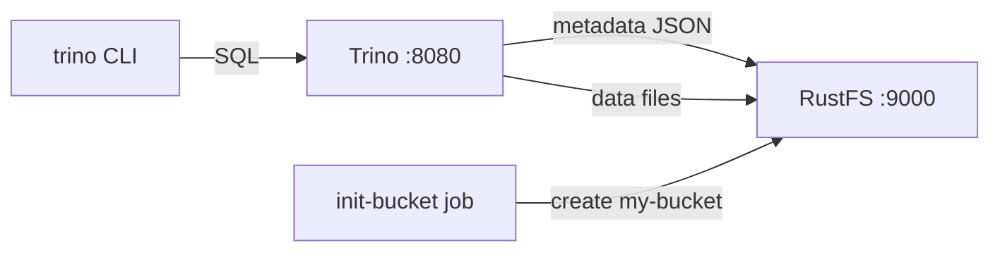

This guide connects [Trino](https://github.com/trinodb/trino) — the distributed SQL query engine — to **RustFS** through the hive connector with its file-based metastore and the native S3 filesystem. You will create a schema and a table, insert rows, read them back, and verify the objects in RustFS. Both the table metadata and the data files live in RustFS. The workflow was verified with `trinodb/trino:435` and `rustfs/rustfs-x86-musl:v2.3.1`.

You need Docker with the Compose plugin. This deployment is intended for local integration testing, not production.

## Architecture



The hive connector with `hive.metastore=file` keeps schema and table metadata as JSON objects under the catalog directory, and the native S3 filesystem (`fs.s3.enabled`) stores both metadata and data files in RustFS with path-style addressing over plain HTTP.

## 1. Create the project files

Create a working directory:

```bash
mkdir rustfs-trino
cd rustfs-trino
```

Create an environment file and replace both credential placeholders:

```ini title=".env"
RUSTFS_ACCESS_KEY=<your-access-key>
RUSTFS_SECRET_KEY=<your-secret-key>
```

Use dedicated credentials for the bucket. Do not commit `.env` to source control.

Create the catalog configuration for Trino:

```ini title="hive.properties"
connector.name=hive
hive.metastore=file
hive.metastore.catalog.dir=s3://my-bucket/trino-metastore
fs.s3.enabled=true
s3.endpoint=http://rustfs:9000
s3.region=us-east-1
s3.path-style-access=true
s3.aws-access-key=<your-access-key>
s3.aws-secret-key=<your-secret-key>
```

`hive.metastore.catalog.dir` points the file metastore into the bucket, so metadata and data both live in RustFS. `fs.s3.enabled` activates the native S3 filesystem; `s3.path-style-access` is required for the container-network endpoint.

Create the Compose file:

```yaml title="compose.yaml"
services:
  rustfs:
    image: rustfs/rustfs-x86-musl:v2.3.1
    environment:
      RUSTFS_ACCESS_KEY: ${RUSTFS_ACCESS_KEY}
      RUSTFS_SECRET_KEY: ${RUSTFS_SECRET_KEY}
      RUSTFS_VOLUMES: /data
      RUSTFS_ADDRESS: ":9000"
      RUSTFS_CONSOLE_ADDRESS: ":9001"
      RUSTFS_CONSOLE_ENABLE: "true"
    volumes:
      - rustfs-data:/data
    ports:
      - "9000:9000"
      - "9001:9001"
    healthcheck:
      test: ["CMD", "curl", "-sf", "http://127.0.0.1:9000/health"]
      interval: 10s
      timeout: 5s
      retries: 6
      start_period: 10s
    networks:
      - warehouse

  create-bucket:
    image: rustfs/rc:latest
    depends_on:
      rustfs:
        condition: service_healthy
    environment:
      RUSTFS_ACCESS_KEY: ${RUSTFS_ACCESS_KEY}
      RUSTFS_SECRET_KEY: ${RUSTFS_SECRET_KEY}
    entrypoint:
      - /bin/sh
      - -c
      - |
        until /usr/bin/rc alias set rustfs http://rustfs:9000 "$${RUSTFS_ACCESS_KEY}" "$${RUSTFS_SECRET_KEY}"; do
          echo "Waiting for RustFS..."
          sleep 2
        done
        /usr/bin/rc ls rustfs/my-bucket >/dev/null 2>&1 || /usr/bin/rc mb rustfs/my-bucket
    networks:
      - warehouse

  trino:
    image: trinodb/trino:435
    volumes:
      - ./hive.properties:/etc/trino/catalog/hive.properties:ro
      - metastore-data:/data/metastore
    depends_on:
      create-bucket:
        condition: service_completed_successfully
    networks:
      - warehouse

networks:
  warehouse:

volumes:
  rustfs-data:
  metastore-data:
```

## 2. Start the deployment

Resolve the Compose file before starting containers:

```bash
docker compose config
```

Start the services and wait for the bucket initializer to finish:

```bash
docker compose up -d
docker compose ps -a
```

Trino is up when the server log reports `SERVER STARTED`. The container runs as user `trino` (uid 1000); make sure the metastore volume is writable:

```bash
docker compose exec trino id
docker compose exec trino ls -la /data/metastore
```

## 3. Create a schema and a table

Create the schema without an explicit location — Trino places it under the catalog directory in RustFS:

```bash
docker compose exec trino trino --execute \
  "CREATE SCHEMA hive.demo"
```

Create a table and insert five rows:

```bash
docker compose exec trino trino --execute \
  "CREATE TABLE hive.demo.events (id bigint, label varchar) WITH (format = 'parquet')"

docker compose exec trino trino --execute \
  "INSERT INTO hive.demo.events VALUES (1,'alpha'),(2,'bravo'),(3,'charlie'),(4,'delta'),(5,'echo')"
```

```text
INSERT: 5 rows
```

## 4. Query the data

Read the rows back:

```bash
docker compose exec trino trino --execute \
  "SELECT * FROM hive.demo.events ORDER BY id"
```

```text
"1","alpha"
"2","bravo"
"3","charlie"
"4","delta"
"5","echo"
```

## 5. Verify objects in RustFS

List the metastore prefix through the bucket-initializer image:

```bash
docker compose run --rm --entrypoint /bin/sh create-bucket -c \
  '/usr/bin/rc alias set rustfs http://rustfs:9000 "$RUSTFS_ACCESS_KEY" "$RUSTFS_SECRET_KEY" >/dev/null && /usr/bin/rc ls rustfs/my-bucket/trino-metastore --recursive'
```

```text
[2026-09-21 01:55:16]      155 B trino-metastore/.demo.trinoSchema
[2026-09-21 01:55:19]      474 B trino-metastore/demo/events/.trinoPermissions/user_trino
[2026-09-21 01:55:25]     1007 B trino-metastore/demo/events/.trinoSchema
[2026-09-21 01:55:25]      432 B trino-metastore/demo/events/20260921_..._cb761cec-...parquet
```

You can also browse the prefix in the RustFS Console:


## 6. Use RustFS S3 Tables

RustFS S3 Tables provides a built-in Apache Iceberg REST catalog, so Trino can treat a table bucket as a managed Iceberg warehouse while the data stays in RustFS. Enable a table bucket and connect Trino's Iceberg connector to the REST catalog as described in [S3 Tables](/administration/data/s3-tables): the REST catalog URI is `http://<rustfs-host>:9000/iceberg`, the warehouse is the bucket name, and both catalog requests (AWS Signature Version 4, signing name `s3`) and S3 file access use path-style addressing.

Per the S3 Tables support matrix, Trino has been probed for read-only access against the catalog; validate write compatibility and the exact Trino version you deploy before adopting this path in production.

## 7. Stop or reset the stack

Stop the containers while keeping the RustFS data volume:

```bash
docker compose down
```

To delete the stored metadata and data and start from an empty RustFS volume, explicitly include `--volumes`:

```bash
docker compose down --volumes
```

## Troubleshooting

### Configuration errors for `fs.native-s3.enabled` or `fs.s3.enabled`

The native S3 filesystem property changed across Trino versions: Trino 435 uses `fs.native-s3.enabled`, newer releases use `fs.s3.enabled`. This guide pins `trinodb/trino:435`, so use `fs.native-s3.enabled`.

### "Table directory must be ..." when creating a table

With the file metastore, table locations must stay under `hive.metastore.catalog.dir`. Create the schema without an explicit location, or point the schema location at a directory inside the same bucket prefix.

### Hive CSV storage format only supports VARCHAR

The CSV format rejects non-string columns. Use `format = 'parquet'` (as in this guide) for typed tables.

### AccessDenied or 403 responses

Confirm that the credentials in `hive.properties` match the RustFS credentials and that the `create-bucket` service completed successfully:

```bash
docker compose logs create-bucket
```

## Next steps

- Review [S3 compatibility notes](/administration/protocols/s3) before adopting additional S3 operations.
- Create dedicated production credentials with [Access Key Management](/security-compliance/iam/access-token).
- Follow the [Trino documentation](https://trino.io/docs/current/) to connect BI tools and add object storage catalogs.
