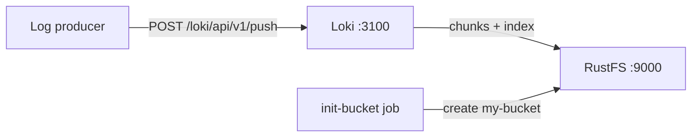

This guide runs [Grafana Loki](https://github.com/grafana/loki) — the log aggregation system from Grafana Labs — with **RustFS** as its object storage backend. You will start a single-binary Loki with Docker Compose, push log streams through the HTTP API, query them back, and verify that the log chunks are stored as objects in RustFS. The workflow was verified with `grafana/loki:latest` (v3.7.8) and `rustfs/rustfs-x86-musl:v2.3.1`.

You need Docker with the Compose plugin. This deployment is intended for local integration testing, not production.

## Architecture



Loki ingests log streams into an in-memory chunk and a write-ahead log, flushes compressed chunks to object storage once a stream goes idle, and ships TSDB index files to the same bucket. Queries resolve chunks through the index and read them from object storage.

## 1. Create the project files

Create a working directory:

```bash
mkdir rustfs-loki
cd rustfs-loki
```

Create an environment file and replace both credential placeholders:

```ini title=".env"
RUSTFS_ACCESS_KEY=<your-access-key>
RUSTFS_SECRET_KEY=<your-secret-key>
```

Use dedicated credentials for the bucket. Do not commit `.env` to source control.

Create the Loki configuration — a single-binary setup with the TSDB schema and the S3 backend pointed at RustFS:

```yaml title="loki.yml"
auth_enabled: false

server:
  http_listen_port: 3100

common:
  instance_addr: 127.0.0.1
  path_prefix: /loki
  storage:
    s3:
      endpoint: rustfs:9000
      insecure: true
      bucketnames: my-bucket
      access_key_id: ${RUSTFS_ACCESS_KEY}
      secret_access_key: ${RUSTFS_SECRET_KEY}
      s3forcepathstyle: true
  replication_factor: 1
  ring:
    kvstore:
      store: inmemory

schema_config:
  configs:
    - from: 2020-10-24
      store: tsdb
      object_store: s3
      schema: v13
      index:
        prefix: index_
        period: 24h

ingester:
  chunk_idle_period: 30s
  max_chunk_age: 1m

ruler:
  alertmanager_url: http://localhost:9093
```

`s3forcepathstyle: true` and `insecure: true` select path-style addressing over plain HTTP, which is what RustFS expects for the container-network endpoint. `chunk_idle_period` and `max_chunk_age` are lowered so a verification run does not have to wait the default 30 minutes for chunks to flush.

Create the Compose file:

```yaml title="compose.yaml"
services:
  rustfs:
    image: rustfs/rustfs-x86-musl:v2.3.1
    environment:
      RUSTFS_ACCESS_KEY: ${RUSTFS_ACCESS_KEY}
      RUSTFS_SECRET_KEY: ${RUSTFS_SECRET_KEY}
      RUSTFS_VOLUMES: /data
      RUSTFS_ADDRESS: ":9000"
      RUSTFS_CONSOLE_ADDRESS: ":9001"
      RUSTFS_CONSOLE_ENABLE: "true"
    volumes:
      - rustfs-data:/data
    ports:
      - "9000:9000"
      - "9001:9001"
    healthcheck:
      test: ["CMD", "curl", "-sf", "http://127.0.0.1:9000/health"]
      interval: 10s
      timeout: 5s
      retries: 6
      start_period: 10s
    networks:
      - loki

  create-bucket:
    image: rustfs/rc:latest
    depends_on:
      rustfs:
        condition: service_healthy
    environment:
      RUSTFS_ACCESS_KEY: ${RUSTFS_ACCESS_KEY}
      RUSTFS_SECRET_KEY: ${RUSTFS_SECRET_KEY}
    entrypoint:
      - /bin/sh
      - -c
      - |
        until /usr/bin/rc alias set rustfs http://rustfs:9000 "$${RUSTFS_ACCESS_KEY}" "$${RUSTFS_SECRET_KEY}"; do
          echo "Waiting for RustFS..."
          sleep 2
        done
        /usr/bin/rc ls rustfs/my-bucket >/dev/null 2>&1 || /usr/bin/rc mb rustfs/my-bucket
    networks:
      - loki

  loki:
    image: grafana/loki:latest
    command: -config.file=/etc/loki/loki-config.yml
    volumes:
      - ./loki.yml:/etc/loki/loki-config.yml:ro
    ports:
      - "3100:3100"
    depends_on:
      create-bucket:
        condition: service_completed_successfully
    networks:
      - loki

networks:
  loki:

volumes:
  rustfs-data:
```

## 2. Start the deployment

Resolve the Compose file before starting containers:

```bash
docker compose config
```

Start the services and wait for the bucket initializer to finish:

```bash
docker compose up -d
docker compose ps -a
```

Loki is ready when the readiness endpoint reports success:

```bash
curl -s http://localhost:3100/ready
```

```text
ready
```

## 3. Push log streams

Send a batch of log entries through the push API:

```bash
python3 - <<'PY'
import json, time, urllib.request

values = []
base_ns = int(time.time() * 1e9)
for i in range(20):
    values.append([
        str(base_ns - i * 1_000_000_000),
        f"[rustfs-loki-integration] log line {i} stored in RustFS object storage",
    ])

payload = {
    "streams": [{
        "stream": {"job": "rustfs-demo", "service": "loki-integration"},
        "values": values,
    }]
}

req = urllib.request.Request(
    "http://localhost:3100/loki/api/v1/push",
    data=json.dumps(payload).encode(),
    headers={"Content-Type": "application/json"},
    method="POST",
)
with urllib.request.urlopen(req, timeout=30) as r:
    print("push:", r.status)
PY
```

```text
push: 204
```

## 4. Query the logs

Query the stream back through the range query API:

```bash
curl -sG "http://localhost:3100/loki/api/v1/query_range" \
  --data-urlencode 'query={job="rustfs-demo"}' \
  --data-urlencode "start=$(($(date +%s) - 3600))000000000" \
  --data-urlencode "end=$(($(date +%s) + 60))000000000" \
  | python3 -m json.tool | head -20
```

The response contains the pushed lines:

```text
"values": [
    [
      "1789916564000000000",
      "[rustfs-loki-integration] log line 0 stored in RustFS object storage"
    ],
```

## 5. Verify chunks in RustFS

With `chunk_idle_period: 30s`, the ingester flushes the stream to object storage roughly one minute after the last line. List the tenant prefix through the bucket-initializer image:

```bash
docker compose run --rm --entrypoint /bin/sh create-bucket -c \
  '/usr/bin/rc alias set rustfs http://rustfs:9000 "$RUSTFS_ACCESS_KEY" "$RUSTFS_SECRET_KEY" >/dev/null && /usr/bin/rc ls rustfs/my-bucket/fake --recursive'
```

`fake` is the tenant Loki uses when `auth_enabled` is `false`; each object is one compressed log chunk:

```text
[2026-09-20 14:48:57]      398 B fake/51610c9b43452db8/1a0bf49f028:1a0bf49f028:f0ed52f7
[2026-09-20 14:49:33]      670 B fake/cd916b27d004a688/1a0bf4a03ca:1a0bf4a4e03:1376b308
```

You can also browse the prefix in the RustFS Console:


## 6. Stop or reset the stack

Stop the containers while keeping the RustFS data volume:

```bash
docker compose down
```

To delete the stored logs and start from an empty RustFS volume, explicitly include `--volumes`:

```bash
docker compose down --volumes
```

## Troubleshooting

### Loki throttles writes and reports "disk usage exceeded threshold"

Loki monitors the disk that holds its write-ahead log and throttles the ingester when usage passes 90 percent. Make sure the volume behind `path_prefix` has enough free space, or run the container with a tmpfs for the WAL when the machine is otherwise healthy.

### The ring fails with connection errors to port 8500

The default ring key-value store is Consul. For a single binary set `common.ring.kvstore.store: inmemory`, as shown in the configuration above.

### Push requests fail with "Ingester is shutting down"

The ingester never reached a running state — usually a leftover container from an earlier failed start. Remove the container with `docker compose down` and start it again, or check the logs for the underlying storage error.

### AccessDenied or 403 responses

Confirm the credentials in `loki.yml` match the RustFS credentials and that the `create-bucket` service completed successfully:

```bash
docker compose logs create-bucket
```

## Next steps

- Review [S3 compatibility notes](/administration/protocols/s3) before adopting additional S3 operations.
- Create dedicated production credentials with [Access Key Management](/security-compliance/iam/access-token).
- Follow the [Grafana Loki documentation](https://grafana.com/docs/loki/latest/) to connect Promtail, Alloy, or the OpenTelemetry Collector as log producers.
