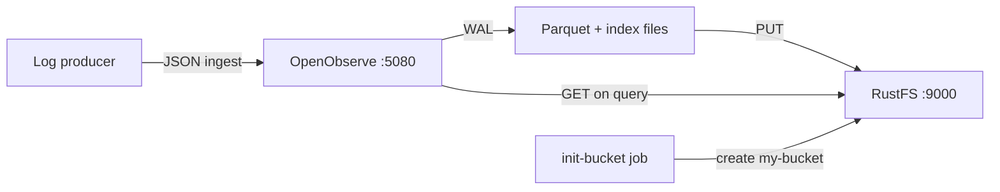

This guide runs **OpenObserve** with **RustFS** as its object storage backend. You will start both services with Docker Compose, ingest log records into OpenObserve, flush them to object storage, verify the resulting Parquet files in RustFS, and query them back through the OpenObserve UI and search API.

You need Docker with the Compose plugin and a machine that can run three containers. This deployment is intended for local integration testing, not production.

## Product introduction

### OpenObserve

[OpenObserve](https://openobserve.ai/) is an open-source observability platform for logs, metrics, traces, and real user monitoring. It separates storage from compute: ingested data lands in a local write-ahead log (WAL) first, is converted to Parquet files with full-text indexes, and is then uploaded to object storage, which acts as the only persistent data layer. Queries locate remote Parquet files through file list metadata and download them on demand into a local cache.

OpenObserve talks to object storage through the Rust `object_store` client. By default it uses **path-style** requests with SigV4 signing, so any S3-compatible endpoint works — including RustFS — when you provide the endpoint URL, region, credentials, and bucket name.

### RustFS

RustFS is a distributed object storage system built in Rust. It implements the Amazon S3 API, including SigV4 signing, path-style and virtual-host style addressing, and multipart uploads, and it ships with a web console and multi-tenant IAM. RustFS runs from a single node up to multi-node clusters and covers the S3 operations OpenObserve needs for its telemetry data.

### How the integration works



- **Write path**: OpenObserve merges WAL records into Parquet files once they reach a size threshold or `ZO_MAX_FILE_RETENTION_TIME` (600 seconds by default), then uploads them under the `files/` prefix of the bucket and records them in its file list.
- **Query path**: the search API resolves files for the requested time range, downloads them from RustFS into the local cache, and runs the query.

## Integration steps

### 1. Create the project files

Create a working directory:

```bash
mkdir rustfs-openobserve
cd rustfs-openobserve
```

Create an environment file and replace the credential placeholders:

```ini title=".env"
RUSTFS_ACCESS_KEY=<your-access-key>
RUSTFS_SECRET_KEY=<your-secret-key>
RUSTFS_BUCKET_NAME=my-bucket
ZO_ROOT_USER_EMAIL=root@example.com
ZO_ROOT_USER_PASSWORD=Complexpass#123
```

:::note[Sample OpenObserve credentials]

`root@example.com` and `Complexpass#123` are the sample values from the OpenObserve documentation. OpenObserve v1.0.x enforces a password policy of 8 to 128 characters with uppercase, lowercase, digit, and special characters. Change both values for any real deployment, and do not commit `.env` to source control.

:::

Create the Compose file:

```yaml title="compose.yaml"
services:
  rustfs:
    image: rustfs/rustfs-x86-musl:v2.3.1
    environment:
      RUSTFS_ACCESS_KEY: ${RUSTFS_ACCESS_KEY}
      RUSTFS_SECRET_KEY: ${RUSTFS_SECRET_KEY}
      RUSTFS_VOLUMES: /data
      RUSTFS_ADDRESS: ":9000"
      RUSTFS_CONSOLE_ADDRESS: ":9001"
      RUSTFS_CONSOLE_ENABLE: "true"
    volumes:
      - rustfs-data:/data
    ports:
      - "9000:9000"
      - "9001:9001"
    healthcheck:
      test: ["CMD", "curl", "-sf", "http://127.0.0.1:9000/health"]
      interval: 10s
      timeout: 5s
      retries: 6
      start_period: 10s
    networks:
      - observability

  init-bucket:
    image: rustfs/rc:latest
    depends_on:
      rustfs:
        condition: service_healthy
    environment:
      RUSTFS_ACCESS_KEY: ${RUSTFS_ACCESS_KEY}
      RUSTFS_SECRET_KEY: ${RUSTFS_SECRET_KEY}
    entrypoint:
      - /bin/sh
      - -c
      - |
        until /usr/bin/rc alias set rustfs http://rustfs:9000 "$${RUSTFS_ACCESS_KEY}" "$${RUSTFS_SECRET_KEY}"; do
          echo "Waiting for RustFS..."
          sleep 2
        done
        /usr/bin/rc ls rustfs/my-bucket >/dev/null 2>&1 || /usr/bin/rc mb rustfs/my-bucket
    networks:
      - observability

  openobserve:
    image: openobserve/openobserve:v1.0.3
    depends_on:
      rustfs:
        condition: service_healthy
      init-bucket:
        condition: service_completed_successfully
    environment:
      ZO_ROOT_USER_EMAIL: ${ZO_ROOT_USER_EMAIL}
      ZO_ROOT_USER_PASSWORD: ${ZO_ROOT_USER_PASSWORD}
      ZO_LOCAL_MODE: "true"
      ZO_LOCAL_MODE_STORAGE: "s3"
      ZO_DATA_DIR: /data
      ZO_HTTP_PORT: "5080"
      RUST_LOG: INFO
      ZO_S3_PROVIDER: s3
      ZO_S3_SERVER_URL: http://rustfs:9000
      ZO_S3_REGION_NAME: us-east-1
      ZO_S3_ACCESS_KEY: ${RUSTFS_ACCESS_KEY}
      ZO_S3_SECRET_KEY: ${RUSTFS_SECRET_KEY}
      ZO_S3_BUCKET_NAME: ${RUSTFS_BUCKET_NAME}
      # Upload Parquet files after 60 seconds instead of the default 600.
      # Keep the default for production-like setups.
      ZO_MAX_FILE_RETENTION_TIME: "60"
    volumes:
      - oo-data:/data
    ports:
      - "5080:5080"
    networks:
      - observability

networks:
  observability:

volumes:
  rustfs-data:
  oo-data:
```

`ZO_LOCAL_MODE_STORAGE=s3` is required: in single-node mode OpenObserve otherwise stores Parquet files on the local disk and ignores the `ZO_S3_*` variables. The `init-bucket` job uses the [`rc` image](https://github.com/rustfs/cli) to create `my-bucket` once RustFS is healthy, and it skips creation when the bucket already exists.

### 2. Start the deployment

Resolve and start the Compose stack:

```bash
docker compose config
docker compose up -d
docker compose ps
```

The `init-bucket` service should exit with code `0` after creating the bucket:

```text
✓ Bucket 'rustfs/my-bucket' created successfully.
```

Open the OpenObserve UI at `http://localhost:5080` and sign in with the `ZO_ROOT_USER_EMAIL` and `ZO_ROOT_USER_PASSWORD` values from `.env`. The RustFS Console is available at `http://localhost:9001/rustfs/console/`.

### 3. Confirm the OpenObserve-to-RustFS connection

Check the OpenObserve startup log for the storage configuration:

```bash
docker compose logs openobserve | grep "s3 init config"
```

```text
INFO infra::storage::remote: s3 init config: StorageConfig { name: "default", provider: "s3", server_url: "http://rustfs:9000", region_name: "us-east-1", access_key: "<your-access-key>", secret_key: "<your-secret-key>", bucket_name: "my-bucket", bucket_prefix: "" }
```

During startup OpenObserve also runs a storage probe: it writes the file `o2_test/check.txt` into the bucket and reads it back. Seeing this file in RustFS confirms that the write path works.

### 4. Ingest log records

Send a batch of records to the JSON ingestion API of the `default` organization and the `rustfs_test` stream:

```bash
curl -u "root@example.com:Complexpass#123" \
  -X POST "http://localhost:5080/api/default/rustfs_test/_json" \
  -H "Content-Type: application/json" \
  -d '[
    {"level":"info","service":"rustfs-openobserve-demo","host":"host-1",
     "job":"integration-test","log":"[rustfs-integration] request 1 stored via RustFS S3 API","code":200},
    {"level":"error","service":"rustfs-openobserve-demo","host":"host-1",
     "job":"integration-test","log":"[rustfs-integration] request 2 stored via RustFS S3 API","code":200}
  ]'
```

```text
{"code":200,"status":[{"name":"rustfs_test","successful":2,"failed":0}]}
```

### 5. Flush data to object storage

Trigger the node-level flush endpoint so the records leave the WAL:

```bash
curl -s -u "root@example.com:Complexpass#123" -X PUT "http://localhost:5080/node/flush"
```

The ingester converts the WAL records into a Parquet file and uploads it to RustFS in the background once the file is older than `ZO_MAX_FILE_RETENTION_TIME` (60 seconds in this Compose file, 600 seconds by default).

## Verification

### Verify objects in RustFS

List the bucket through the bucket-initializer image:

```bash
docker compose run --rm --entrypoint /bin/sh init-bucket -c \
  '/usr/bin/rc alias set rustfs http://rustfs:9000 "$RUSTFS_ACCESS_KEY" "$RUSTFS_SECRET_KEY" >/dev/null && /usr/bin/rc ls rustfs/my-bucket --recursive'
```

The output should include the probe file and the ingester output below `files/`:

```text
      19 B o2_test/check.txt
   3.7 KiB files/default/logs/rustfs_test/2026/09/20/02/75072592621841940484907.parquet
   6.5 KiB files/default/index/rustfs_test_logs/2026/09/20/02/75072592621841940484907.ttv
```

You can also inspect the bucket in the RustFS Console at `http://localhost:9001/rustfs/console/`:


OpenObserve stores Parquet data files below `files/<organization>/<stream type>/<stream>/<date partitions>` and full-text index files below `files/<organization>/index/`:


### Query the logs in OpenObserve

In the OpenObserve UI, open **Logs**, select the stream `rustfs_test`, and run a query. The records you ingested appear in the result table:


The same query through the search API. Note that `start_time` and `end_time` are in **microseconds**:

```bash
curl -s -u "root@example.com:Complexpass#123" \
  -X POST "http://localhost:5080/api/default/_search?type=logs" \
  -H "Content-Type: application/json" \
  -d '{"query":{"sql":"SELECT count(*) AS cnt FROM \"rustfs_test\"","start_time":1789869600000000,"end_time":1789869960000000}}'
```

```text
"hits": [{"cnt": 200}]
```

### Review stream statistics

The **Data → Streams** page shows the event count, the ingested and compressed size, and the index size for `rustfs_test`:


### Verify that data survives without local cache

To confirm that RustFS is the persistent layer and not the local disk, delete the OpenObserve cache directory, restart the container, and query again. The OpenObserve image contains no shell, so use `busybox` to remove the files:

```bash
docker compose stop openobserve
docker run --rm -v rustfs-openobserve_oo-data:/data busybox rm -rf /data/cache
docker compose start openobserve
```

Wait for the UI to come back, then repeat the search query from above. The same records return because OpenObserve downloads the Parquet files from RustFS again. The directory name of the project (`rustfs-openobserve`) becomes the prefix of the volume name; run `docker volume ls` if you used a different directory.

## Troubleshooting

### Data is written to local disk instead of RustFS

In single-node mode (`ZO_LOCAL_MODE=true`) the storage backend defaults to `disk`. Without `ZO_LOCAL_MODE_STORAGE=s3`, OpenObserve ignores the `ZO_S3_*` variables and keeps Parquet files under `/data/wal/files/`.

### No Parquet files appear in the bucket after flushing

The uploader runs in the background and only uploads a Parquet file once it is older than `ZO_MAX_FILE_RETENTION_TIME` — 600 seconds by default. This guide sets the value to 60 seconds. Check the ingester logs if files are still missing:

```bash
docker compose logs openobserve | grep "INGESTER:JOB"
```

### The search API returns no hits

`start_time` and `end_time` of the search API are in microseconds. A millisecond timestamp such as `1789869600000` selects a range in 1970; multiply by 1000.

### OpenObserve restarts with a weak-password error

OpenObserve v1.0.x rejects `ZO_ROOT_USER_PASSWORD` values that do not contain at least one uppercase letter, one lowercase letter, one digit, and one special character.

### The RustFS Console does not open

In RustFS v2.x the console is served under the `/rustfs/console/` path prefix. Requesting the root path of port `9001` returns an S3-style XML access-denied response, which is expected.

### RustFS fails to start with a permission error

The RustFS image runs as user and group `10001`. When you bind-mount a host directory instead of the named volume in this guide, run `chown -R 10001:10001 <host-directory>` first.

## Next steps

- Review [S3 compatibility notes](/administration/protocols/s3) before adopting additional S3 operations.
- Create dedicated production credentials with [Access Key Management](/security-compliance/iam/access-token).
- Follow the [OpenObserve documentation](https://openobserve.ai/docs/) to connect real log producers such as Fluent Bit or the OpenTelemetry Collector.
