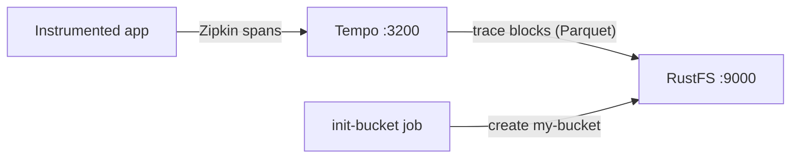

This guide runs [Grafana Tempo](https://github.com/grafana/tempo) — the distributed tracing backend from Grafana Labs — with **RustFS** as its trace storage. You will start a single-binary Tempo with Docker Compose, push a trace through the Zipkin-compatible receiver, query it through the search API, and verify that the trace block is stored as a Parquet object in RustFS. The workflow was verified with `grafana/tempo:2.9.5` and `rustfs/rustfs-x86-musl:v2.3.1`.

You need Docker with the Compose plugin. This deployment is intended for local integration testing, not production.

## Architecture



Tempo accepts spans from a Zipkin-compatible endpoint, buffers them in an in-memory block, and flushes completed blocks to object storage as Parquet files. Searches scan the block index and read the block data from object storage, so every trace survives a Tempo restart.

## 1. Create the project files

Create a working directory:

```bash
mkdir rustfs-tempo
cd rustfs-tempo
```

Create an environment file and replace both credential placeholders:

```ini title=".env"
RUSTFS_ACCESS_KEY=<your-access-key>
RUSTFS_SECRET_KEY=<your-secret-key>
```

Use dedicated credentials for the bucket. Do not commit `.env` to source control.

Create the Tempo configuration — a single-binary setup with the S3 backend pointed at RustFS and a short block duration so a verification run does not have to wait the default 30 minutes:

```yaml title="tempo.yml"
server:
  http_listen_port: 3200

distributor:
  receivers:
    zipkin:
      endpoint: 0.0.0.0:9411

ingester:
  max_block_duration: 1m

compactor:
  compaction:
    block_retention: 24h

storage:
  trace:
    backend: s3
    s3:
      endpoint: rustfs:9000
      bucket: my-bucket
      access_key: <your-access-key>
      secret_key: <your-secret-key>
      insecure: true
      forcepathstyle: true
    wal:
      path: /var/tempo/wal
    blocklist_poll: 30s
```

`forcepathstyle: true` and `insecure: true` select path-style addressing over plain HTTP, which is what RustFS expects for the container-network endpoint. `max_block_duration: 1m` and `blocklist_poll: 30s` accelerate the flush and discovery cycle for testing.

Create the Compose file:

```yaml title="compose.yaml"
services:
  rustfs:
    image: rustfs/rustfs-x86-musl:v2.3.1
    environment:
      RUSTFS_ACCESS_KEY: ${RUSTFS_ACCESS_KEY}
      RUSTFS_SECRET_KEY: ${RUSTFS_SECRET_KEY}
      RUSTFS_VOLUMES: /data
      RUSTFS_ADDRESS: ":9000"
      RUSTFS_CONSOLE_ADDRESS: ":9001"
      RUSTFS_CONSOLE_ENABLE: "true"
    volumes:
      - rustfs-data:/data
    ports:
      - "9000:9000"
      - "9001:9001"
    healthcheck:
      test: ["CMD", "curl", "-sf", "http://127.0.0.1:9000/health"]
      interval: 10s
      timeout: 5s
      retries: 6
      start_period: 10s
    networks:
      - tempo

  create-bucket:
    image: rustfs/rc:latest
    depends_on:
      rustfs:
        condition: service_healthy
    environment:
      RUSTFS_ACCESS_KEY: ${RUSTFS_ACCESS_KEY}
      RUSTFS_SECRET_KEY: ${RUSTFS_SECRET_KEY}
    entrypoint:
      - /bin/sh
      - -c
      - |
        until /usr/bin/rc alias set rustfs http://rustfs:9000 "$${RUSTFS_ACCESS_KEY}" "$${RUSTFS_SECRET_KEY}"; do
          echo "Waiting for RustFS..."
          sleep 2
        done
        /usr/bin/rc ls rustfs/my-bucket >/dev/null 2>&1 || /usr/bin/rc mb rustfs/my-bucket
    networks:
      - tempo

  tempo:
    image: grafana/tempo:2.9.5
    command: -config.file=/tempo-local.yaml
    volumes:
      - ./tempo.yml:/tempo-local.yaml:ro
    ports:
      - "3200:3200"
      - "9411:9411"
    depends_on:
      create-bucket:
        condition: service_completed_successfully
    networks:
      - tempo

networks:
  tempo:

volumes:
  rustfs-data:
```

## 2. Start the deployment

Resolve the Compose file before starting containers:

```bash
docker compose config
```

Start the services and wait for the bucket initializer to finish:

```bash
docker compose up -d
docker compose ps -a
```

Tempo is up when the status endpoint answers:

```bash
curl -s http://localhost:3200/status | head -c 120
```

## 3. Push a trace

Post a small Zipkin trace with five spans to the Zipkin-compatible receiver:

```bash
python3 - <<'PY'
import json, time, urllib.request, random

now_us = int(time.time() * 1e6)
trace_id = "".join(random.choice("0123456789abcdef") for _ in range(32))
span_id = "".join(random.choice("0123456789abcdef") for _ in range(16))

spans = []
for i in range(5):
    spans.append({
        "traceId": trace_id,
        "id": "".join(random.choice("0123456789abcdef") for _ in range(16)),
        "name": f"rustfs-tempo-span-{i}",
        "timestamp": now_us - i * 1000,
        "duration": 1000 + i * 500,
        "localEndpoint": {"serviceName": "rustfs-tempo-demo"},
        "tags": {"job": "rustfs-integration"},
    })
spans[0]["parent_id"] = ""
for s in spans[1:]:
    s["parent_id"] = span_id

req = urllib.request.Request(
    "http://localhost:9411/api/v2/spans",
    data=json.dumps(spans).encode(),
    headers={"Content-Type": "application/json"},
    method="POST",
)
with urllib.request.urlopen(req, timeout=30) as r:
    print("push:", r.status)
print("trace_id:", trace_id)
PY
```

```text
push: 202
```

## 4. Search and read the trace

After roughly one minute the ingester flushes the completed block to RustFS and the compactor discovers it. Search by tag:

```bash
curl -s "http://localhost:3200/api/search?tags=job=rustfs-integration"
```

```text
{"traces":[{"traceID":"5354809288c0d1a3de0e09ce74d06987","rootServiceName":"rustfs-tempo-demo","rootTraceName":"rustfs-tempo-span-0",...}]}
```

Fetch the trace by its ID with the trace ID printed by the push script:

```bash
curl -s "http://localhost:3200/api/traces/<your-trace-id>" -o /dev/null -w "%{http_code}\n"
```

```text
200
```

## 5. Verify the trace block in RustFS

List the tenant prefix through the bucket-initializer image:

```bash
docker compose run --rm --entrypoint /bin/sh create-bucket -c \
  '/usr/bin/rc alias set rustfs http://rustfs:9000 "$RUSTFS_ACCESS_KEY" "$RUSTFS_SECRET_KEY" >/dev/null && /usr/bin/rc ls rustfs/my-bucket/single-tenant --recursive'
```

`single-tenant` is the tenant Tempo uses when `multitenancy_enabled` is `false`. Each completed trace block is a Parquet object:

```text
[2026-09-20 15:03:54]  25.16 KiB single-tenant/619118dc-a512-4ca6-90f5-e8b15bc9013f/data.parquet
```

You can also browse the prefix in the RustFS Console:


Because the block lives in RustFS, the trace stays queryable across Tempo restarts — restart the container and repeat the search to confirm.

## 6. Stop or reset the stack

Stop the containers while keeping the RustFS data volume:

```bash
docker compose down
```

To delete the stored traces and start from an empty RustFS volume, explicitly include `--volumes`:

```bash
docker compose down --volumes
```

## Troubleshooting

### The config file is rejected with "field ingester not found"

Tempo 3.x changed the configuration layout. This guide pins `grafana/tempo:2.9.5`, whose configuration matches the classic `ingester`/`compactor` blocks shown above.

### The search returns no traces right after the push

The ingester flushes a completed block after `max_block_duration` (one minute in this guide), and the querier discovers new blocks on every `blocklist_poll` (30 seconds). Wait for the flush and search again, then check the Tempo logs:

```bash
docker compose logs tempo
```

### AccessDenied or 403 responses

Confirm the credentials in `tempo.yml` match the RustFS credentials and that the `create-bucket` service completed successfully:

```bash
docker compose logs create-bucket
```

### Connection or certificate errors

`endpoint` takes no scheme; `insecure: true` selects plain HTTP and `forcepathstyle: true` selects path-style addressing for the container-network endpoint. Inside the Compose network use `rustfs:9000`; from the host use `localhost:9000`.

## Next steps

- Review [S3 compatibility notes](/administration/protocols/s3) before adopting additional S3 operations.
- Create dedicated production credentials with [Access Key Management](/security-compliance/iam/access-token).
- Follow the [Grafana Tempo documentation](https://grafana.com/docs/tempo/latest/) to connect the OpenTelemetry Collector or instrumented applications as trace producers.
