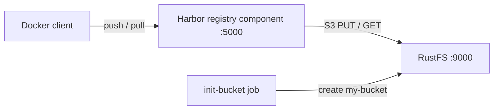
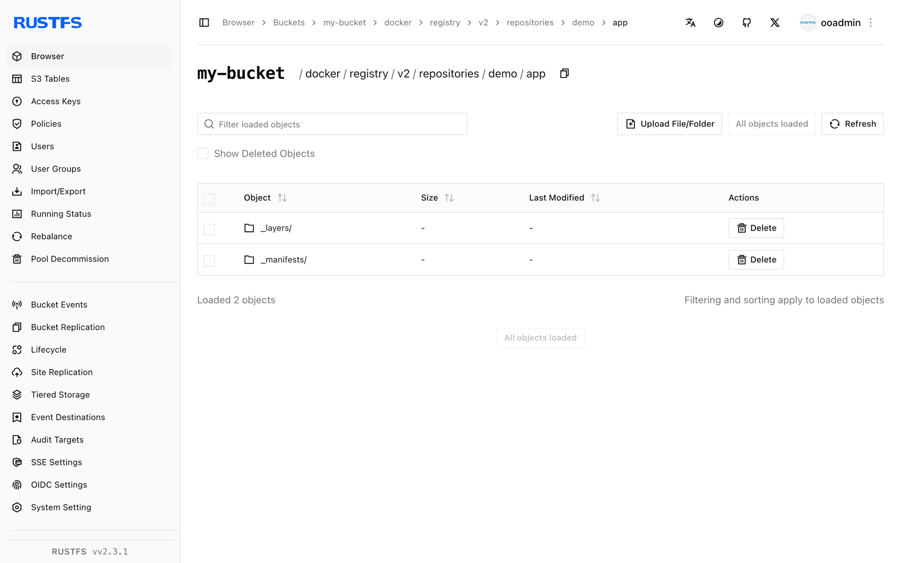

This guide connects [Harbor](https://github.com/goharbor/harbor) — the CNCF graduated cloud native registry — to **RustFS**. Harbor persists image layers, manifests, and other OCI artifacts through its embedded registry component, which implements the S3 storage driver of the [distribution](https://distribution.github.io/distribution/) project. You will run that registry component against RustFS with Docker Compose, push an image, pull it back, and verify the objects in RustFS. The same storage settings apply to a full Harbor deployment. The workflow was verified with `goharbor/registry-photon:v2.12.2` and `rustfs/rustfs-x86-musl:v2.3.1`.

You need Docker with the Compose plugin. This deployment is intended for local integration testing, not production.

## Architecture



The registry stores every blob, manifest, and repository link under `docker/registry/v2/` in the bucket through the S3 storage driver. The driver settings `regionendpoint`, `secure: false`, and `skipverify: true` point the AWS S3 client used by the driver at the RustFS endpoint with path-style addressing over plain HTTP.

## 1. Create the project files

Create a working directory:

```bash
mkdir rustfs-harbor
cd rustfs-harbor
```

Create an environment file and replace both credential placeholders:

```ini title=".env"
RUSTFS_ACCESS_KEY=<your-access-key>
RUSTFS_SECRET_KEY=<your-secret-key>
```

Use dedicated credentials for the bucket. Do not commit `.env` to source control.

Create the registry configuration that Harbor uses for its registry component:

```yaml title="config.yml"
version: 0.1
log:
  level: info
storage:
  s3:
    accesskey: <your-access-key>
    secretkey: <your-secret-key>
    region: us-east-1
    regionendpoint: http://rustfs:9000
    bucket: my-bucket
    secure: false
    skipverify: true
  delete:
    enabled: true
  redirect:
    disable: true
http:
  addr: 0.0.0.0:5000
health:
  storagedriver:
    enabled: true
    interval: 10s
    threshold: 3
```

`regionendpoint` routes the driver to RustFS instead of AWS, `secure: false` selects plain HTTP inside the Compose network, and `redirect.disable: true` makes the registry serve blobs itself — Harbor sets the same option for backends without redirect support.

Create the Compose file:

```yaml title="compose.yaml"
services:
  rustfs:
    image: rustfs/rustfs-x86-musl:v2.3.1
    environment:
      RUSTFS_ACCESS_KEY: ${RUSTFS_ACCESS_KEY}
      RUSTFS_SECRET_KEY: ${RUSTFS_SECRET_KEY}
      RUSTFS_VOLUMES: /data
      RUSTFS_ADDRESS: ":9000"
      RUSTFS_CONSOLE_ADDRESS: ":9001"
      RUSTFS_CONSOLE_ENABLE: "true"
    volumes:
      - rustfs-data:/data
    ports:
      - "9000:9000"
      - "9001:9001"
    healthcheck:
      test: ["CMD", "curl", "-sf", "http://127.0.0.1:9000/health"]
      interval: 10s
      timeout: 5s
      retries: 6
      start_period: 10s
    networks:
      - registry

  create-bucket:
    image: rustfs/rc:latest
    depends_on:
      rustfs:
        condition: service_healthy
    environment:
      RUSTFS_ACCESS_KEY: ${RUSTFS_ACCESS_KEY}
      RUSTFS_SECRET_KEY: ${RUSTFS_SECRET_KEY}
    entrypoint:
      - /bin/sh
      - -c
      - |
        until /usr/bin/rc alias set rustfs http://rustfs:9000 "$${RUSTFS_ACCESS_KEY}" "$${RUSTFS_SECRET_KEY}"; do
          echo "Waiting for RustFS..."
          sleep 2
        done
        /usr/bin/rc ls rustfs/my-bucket >/dev/null 2>&1 || /usr/bin/rc mb rustfs/my-bucket
    networks:
      - registry

  registry:
    image: goharbor/registry-photon:v2.12.2
    volumes:
      - ./config.yml:/etc/registry/config.yml:ro
    ports:
      - "5000:5000"
    depends_on:
      create-bucket:
        condition: service_completed_successfully
    networks:
      - registry

networks:
  registry:

volumes:
  rustfs-data:
```

The [`rc` image](https://github.com/rustfs/cli) provides the official RustFS command-line client. The initializer checks for `my-bucket` before creating it, so repeated starts do not delete existing artifacts.

## 2. Start the deployment

Resolve the Compose file before starting containers:

```bash
docker compose config
```

Start the services and wait for the bucket initializer to finish:

```bash
docker compose up -d
docker compose ps -a
```

The registry API should answer with an empty catalog:

```bash
curl -s http://localhost:5000/v2/_catalog
```

```text
{"repositories":[]}
```

## 3. Push an image

Pull a small image, retag it for the local registry, and push it:

```bash
docker pull busybox:latest
docker tag busybox:latest localhost:5000/demo/app:v1
docker push localhost:5000/demo/app:v1
```

```text
v1: digest: sha256:1cfa4e2b09e127b9c4ed43578d3f3c18e7d44ea47b9ea98475c0cbe9086525f8 size: 527
```

## 4. Pull the image back

Remove the local tags and pull the image from the registry — the layers now come from RustFS:

```bash
docker rmi localhost:5000/demo/app:v1
docker pull localhost:5000/demo/app:v1
```

```text
localhost:5000/demo/app:v1
```

## 5. Verify objects in RustFS

List the repository prefix through the bucket-initializer image:

```bash
docker compose run --rm --entrypoint /bin/sh create-bucket -c \
  '/usr/bin/rc alias set rustfs http://rustfs:9000 "$RUSTFS_ACCESS_KEY" "$RUSTFS_SECRET_KEY" >/dev/null && /usr/bin/rc ls rustfs/my-bucket/docker/registry/v2/repositories/demo --recursive'
```

```text
[2026-09-20 12:11:25]       71 B docker/registry/v2/repositories/demo/app/_layers/sha256/b05093807bb0294152bb9cf86d64da722732dddaf7f8882fa1f120477dbc4db3/link
[2026-09-20 12:11:25]       71 B docker/registry/v2/repositories/demo/app/_layers/sha256/c6348fa86ba0fb2108c9334f5fe913ddc6d853313e655891f133a0127c30099f/link
[2026-09-20 12:11:25]       71 B docker/registry/v2/repositories/demo/app/_manifests/revisions/sha256/1cfa4e2b09e127b9c4ed43578d3f3c18e7d44ea47b9ea98475c0cbe9086525f8/link
[2026-09-20 12:11:25]       71 B docker/registry/v2/repositories/demo/app/_manifests/tags/v1/current/link
[2026-09-20 12:11:25]       71 B docker/registry/v2/repositories/demo/app/_manifests/tags/v1/index/sha256/1cfa4e2b09e127b9c4ed43578d3f3c18e7d44ea47b9ea98475c0cbe9086525f8/link
```

The blob payloads themselves live under `docker/registry/v2/blobs/`. You can also browse the prefix in the RustFS Console at `http://localhost:9001/rustfs/console/`:



## 6. Use RustFS in a full Harbor deployment

The registry component verified above is the same component a full Harbor deployment runs, so the storage settings carry over directly.

For the Helm chart, set the S3 options under `persistence.imageChartStorage`:

```yaml title="values.yaml"
persistence:
  imageChartStorage:
    type: s3
    disableredirect: true
    s3:
      region: us-east-1
      bucket: my-bucket
      accesskey: <your-access-key>
      secretkey: <your-secret-key>
      regionendpoint: http://rustfs:9000
      secure: false
      skipverify: true
```

For the Harbor installer behind a `harbor.yml` file, place the same driver keys under `storage_service.s3`. Both files accept the storage driver options documented by the [distribution project](https://distribution.github.io/distribution/about/configuration/), which is the configuration surface verified in this guide.

## 7. Stop or reset the stack

Stop the containers while keeping the RustFS data volume:

```bash
docker compose down
```

To delete the stored artifacts and start from an empty RustFS volume, explicitly include `--volumes`:

```bash
docker compose down --volumes
```

## Troubleshooting

### The registry fails to start or reports a storage error

Check the registry logs for the S3 driver message:

```bash
docker compose logs registry
```

`regionendpoint` must be reachable from the registry container. Inside the Compose network use `http://rustfs:9000`; from a process on the host, use `http://localhost:9000`.

### TLS or certificate errors with a plain-HTTP endpoint

`secure: false` selects plain HTTP for the RustFS endpoint. Without it, the driver attempts HTTPS and fails with a connection or certificate error. For a TLS endpoint with a self-signed certificate, keep `secure: true`, set `skipverify: true`, and provide the CA bundle through the `ca_bundle` option that Harbor exposes in `harbor.yml`.

### AccessDenied or 403 responses

Confirm the credentials in `config.yml` match the RustFS credentials and that the `create-bucket` service completed successfully:

```bash
docker compose logs create-bucket
```

### The push succeeds but objects do not appear in the expected prefix

The driver writes below `docker/registry/v2/` inside the bucket. List the whole bucket recursively to locate the repository tree before assuming a configuration problem.

## Next steps

- Review [S3 compatibility notes](/administration/protocols/s3) before adopting additional S3 operations.
- Create dedicated production credentials with [Access Key Management](/security-compliance/iam/access-token).
- Follow the [Harbor documentation](https://goharbor.io/docs/) to configure a full Harbor deployment with replication, vulnerability scanning, and RBAC.
