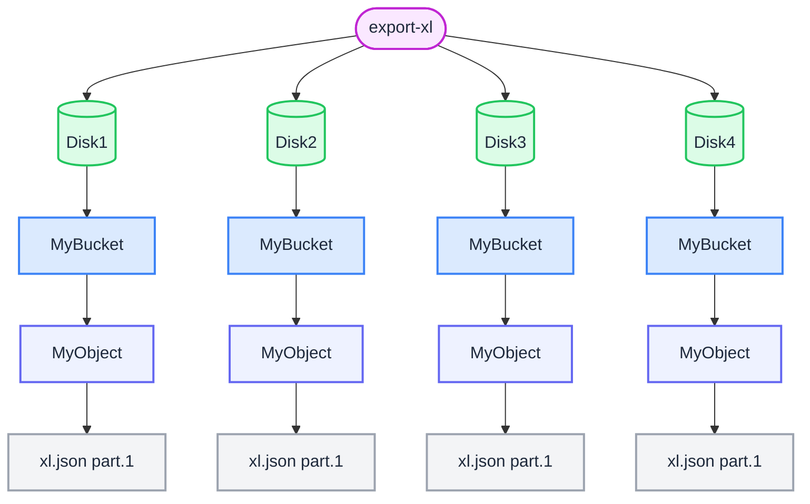
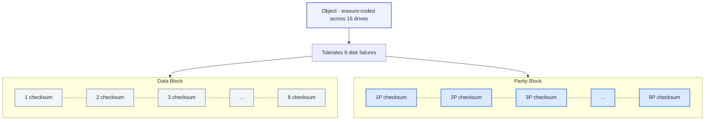
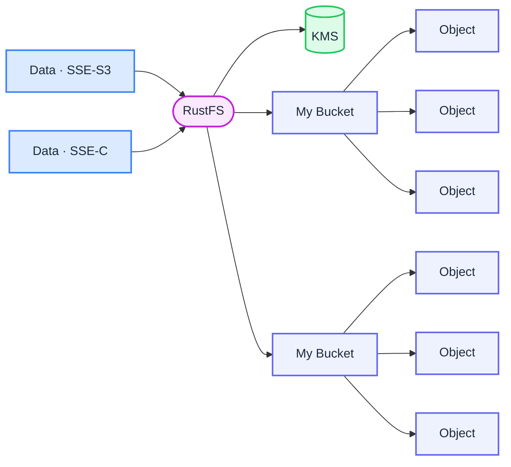

Open source, S3-compatible, and enterprise-hardened.

RustFS is a high-performance distributed object storage system. It is software-defined, runs on industry-standard hardware, and is 100% open source (Apache V2.0).

RustFS is designed for private/hybrid cloud object storage. Its single-layer architecture achieves all necessary functionality without compromising performance. RustFS is high-performance, scalable, and lightweight.

RustFS supports traditional use cases (secondary storage, disaster recovery, archiving) and modern workloads (machine learning, analytics, cloud-native applications).

## Core Features

### Erasure Coding

RustFS uses inline erasure coding to protect data while providing high performance. RustFS uses Reed-Solomon codes to stripe objects into data and parity blocks with user-configurable redundancy levels.

With maximum parity of N/2, RustFS can ensure uninterrupted read and write operations using only ((N/2)+1) operational drives. For example, in a 12-drive setup (6 data + 6 parity), RustFS can reliably write new objects or rebuild existing objects with only 7 drives remaining.

### Bitrot Protection

Bitrot (silent data corruption) is a serious problem for disk drives. RustFS uses HighwayHash to detect and repair corrupted data. By calculating hashes on READ and verifying them on WRITE, it ensures end-to-end integrity. The implementation achieves hash speeds exceeding 10 GB/s on a single core.

### Server-Side Encryption

RustFS supports multiple server-side encryption schemes to protect data at rest. RustFS ensures confidentiality, integrity, and authenticity with negligible performance overhead. Supported algorithms include AES-256-GCM, ChaCha20-Poly1305, and AES-CBC.

Encrypted objects are tamper-proof using AEAD server-side encryption. RustFS is compatible with common key management solutions (e.g., HashiCorp Vault) and uses KMS to support SSE-S3.

If a client requests SSE-S3 or auto-encryption is enabled, the RustFS server encrypts each object with a unique object key protected by a master key managed by KMS.

### WORM (Write Once Read Many)

#### Identity Management

RustFS supports advanced identity management standards and integrates with OpenID Connect providers and major external IDP vendors. Access is centralized, and passwords are temporary and rotated. Access policies are fine-grained and highly configurable.

#### Continuous Replication

The challenge with traditional replication methods is that they don't scale effectively beyond a few hundred TiB. That said, everyone needs a replication strategy to support disaster recovery, and that strategy needs to span geographic locations, data centers, and clouds.

RustFS's continuous replication is designed for large-scale, cross-data center deployments. By leveraging Lambda compute notifications and object metadata, it can efficiently and quickly calculate increments. Lambda notifications ensure immediate propagation of changes rather than traditional batch modes.

Continuous replication means that in case of failure, data loss remains minimal - even in the face of highly dynamic datasets. Finally, like other RustFS features, continuous replication is multi-vendor, meaning your backup location can be anywhere from NAS to public cloud.

#### Global Federation

Modern enterprise data is everywhere. RustFS allows these disparate instances to be combined to form a unified global namespace. Specifically, any number of RustFS servers can be combined into a distributed mode set, and multiple distributed mode sets can be combined into a RustFS server federation. Each RustFS server federation provides unified administration and namespace.

RustFS federated servers support unlimited numbers of distributed mode sets. The impact of this approach is that object storage can scale massively for large enterprises with geographically dispersed locations while retaining the ability to accommodate various applications (Splunk, Teradata, Spark, Hive, Presto, TensorFlow, H20) from a single console.

#### Multi-Cloud Gateway

All enterprises are adopting multi-cloud strategies. This includes private clouds as well. Therefore, your bare metal virtualized containers and public cloud services (including non-S3 providers like Google, Microsoft, and Alibaba) must look the same. While modern applications are highly portable, the data supporting these applications is not.

Providing access to this data regardless of where it resides is the primary challenge RustFS solves. RustFS runs on bare metal, network-attached storage, and every public cloud. More importantly, RustFS ensures that from an application and management perspective, the view of that data looks exactly the same through the Amazon S3 API.

RustFS can go further, making your existing storage infrastructure Amazon S3 compatible. The implications are profound. Now organizations can truly unify their data infrastructure - from file to block, all data appears as objects accessible through the Amazon S3 API without migration.

When WORM is enabled, RustFS disables all APIs that might alter object data and metadata. This means data becomes tamper-proof once written. This has practical applications in many different regulatory requirements.

```mermaid
flowchart LR
    APP[Applications] --> S3API(["S3 API"])

    subgraph DIST["Distributed RustFS"]
        direction TB
        subgraph N1["Node 1"]
            direction LR
            S3a[S3]
            subgraph OL1["Object Layer"]
                direction TB
                C1[Cache]
                K1[Compression]
                E1[Encryption]
                B1["Erasure Code · Bitrot"]
            end
            SL1["Storage Layer"]
            J1[("JBOD / FS disks")]
            S3a -->|Object API| OL1
            OL1 -->|Storage API| SL1
            SL1 <--> J1
        end
        subgraph N2["Node 2"]
            direction LR
            S3b[S3]
            subgraph OL2["Object Layer"]
                direction TB
                C2[Cache]
                K2[Compression]
                E2[Encryption]
                B2["Erasure Code · Bitrot"]
            end
            SL2["Storage Layer"]
            J2[("JBOD / FS disks")]
            S3b -->|Object API| OL2
            OL2 -->|Storage API| SL2
            SL2 <--> J2
        end
        NN["Node n ..."]
        N1 <-->|Internal RESTful API| N2
        N2 <-->|Internal RESTful API| NN
    end

    S3API --> N1
    S3API --> N2
    S3API --> NN

    classDef server fill:#dbeafe,stroke:#3b82f6,stroke-width:2px,color:#1e293b;
    classDef store fill:#dcfce7,stroke:#22c55e,stroke-width:2px,color:#1e293b;
    classDef svc fill:#eef2ff,stroke:#6366f1,stroke-width:2px,color:#1e293b;
    classDef muted fill:#f3f4f6,stroke:#9ca3af,stroke-width:2px,color:#1e293b;
    classDef accent fill:#fae8ff,stroke:#c026d3,stroke-width:2px,color:#1e293b;
    class APP,NN muted
    class S3API accent
    class S3a,S3b,SL1,SL2 server
    class C1,K1,E1,B1,C2,K2,E2,B2 svc
    class J1,J2 store
```

## System Architecture

RustFS is designed to be cloud-native and can run as lightweight containers managed by external orchestration services like Kubernetes. The application is compiled into a single static binary (~100 MB) that efficiently uses CPU and memory resources even under high load. As a result, you can co-host a large number of tenants on shared hardware.

RustFS runs on commodity servers with locally attached drives (JBOD/JBOF). All servers in the cluster are functionally equal (completely symmetric architecture). There are no name nodes or metadata servers.

RustFS writes data and metadata together as objects, requiring no metadata database. Additionally, RustFS performs all functions (erasure coding, bitrot checking, encryption) as inline, strictly consistent operations. The result is that RustFS has extraordinary resilience.

Each RustFS cluster is a collection of distributed RustFS servers with one process per node. RustFS runs as a single process in user space and uses lightweight coroutines to achieve high concurrency. Drives are grouped into erasure sets (16 drives per set by default) and objects are placed on these sets using deterministic hashing algorithms.

RustFS is designed for large-scale, multi-data center cloud storage services. Each tenant runs their own RustFS cluster, completely isolated from other tenants, enabling them to protect against any disruptions from upgrades, updates, and security events. Each tenant scales independently by federating clusters across geographic locations.
