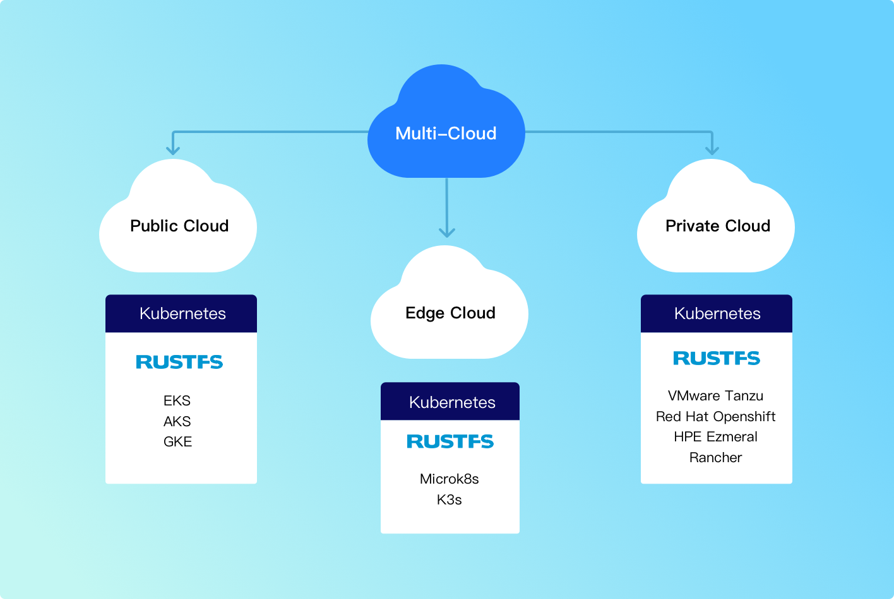

Hybrid/multi-cloud architecture enables consistent performance, security, and economics.

## Multi-Cloud Storage Strategies

### Public Cloud

Public cloud providers include AWS, Azure, GCP, IBM, Alibaba, Tencent, and government clouds. Hybrid/multi-cloud storage software must run wherever the application stack runs. RustFS provides consistent storage across public cloud providers, avoiding the need to rewrite applications when expanding to new clouds.

### Private Cloud

Kubernetes is the primary software architecture for modern private clouds (VMware Tanzu, RedHat OpenShift, Rancher, etc.). Multi-cloud Kubernetes requires software-defined, cloud-native object storage.

### Edge

Edge computing moves computation to where data is generated. Edge storage solutions must be lightweight, powerful, cloud-native, and resilient.

## Multi-Cloud Architecture with RustFS

## Properties of Hybrid/Multi-Cloud Storage

Multi-cloud storage adopts public cloud patterns. New applications are typically written for the AWS S3 API. To scale and perform like cloud-native technologies, applications should be compatible with the S3 API and refactored into microservices.

### Kubernetes-Native

Kubernetes-native storage must be deployable and manageable through standard Kubernetes primitives — declarative configuration, services, and persistent volumes. RustFS is designed for Kubernetes and ships an official Helm chart for deployment, upgrades, and scaling. The lightweight RustFS binary allows multiple deployments to be densely co-located in separate namespaces without exhausting resources.

### Consistent

Hybrid/multi-cloud storage must be consistent in API compatibility, performance, security, and compliance. RustFS enables non-disruptive updates across public, private, and edge environments, maintaining a consistent experience. RustFS abstracts differences in key management, identity management, access policies, and hardware/OS.

### Performance

Object storage must deliver performance at scale for workloads ranging from mobile/web applications to AI/ML. RustFS delivers high throughput on both NVMe and HDD hardware; for representative figures, see [RustFS vs other storage products](/concepts/comparison).

### Scalable

Many people think scale only refers to how large a system can become. However, this thinking ignores the importance of operational efficiency as environments evolve. Multi-cloud object storage solutions must scale efficiently and transparently regardless of underlying environment, with minimal human interaction and maximum automation. This can only be achieved through API-driven platforms built on simple architectures.

RustFS's relentless focus on simplicity means large-scale, multi-petabyte data infrastructure can be managed with minimal human resources. This is a function of APIs and automation, creating an environment on which scalable multi-cloud storage can be built.

### Software-Defined

The only way to succeed in multi-cloud is with software-defined storage. The reason is straightforward. Hardware appliances don't run on public clouds or Kubernetes. Public cloud storage service offerings aren't designed to run on other public clouds, private clouds, or Kubernetes platforms. Even if they did, bandwidth costs would exceed storage costs because they weren't developed for cross-network replication. Admittedly, software-defined storage can run on public clouds, private clouds, and edge.

RustFS was born in software and is portable across various operating systems and hardware architectures, running on AWS, GCP, Azure, and on-premises infrastructure alike.
