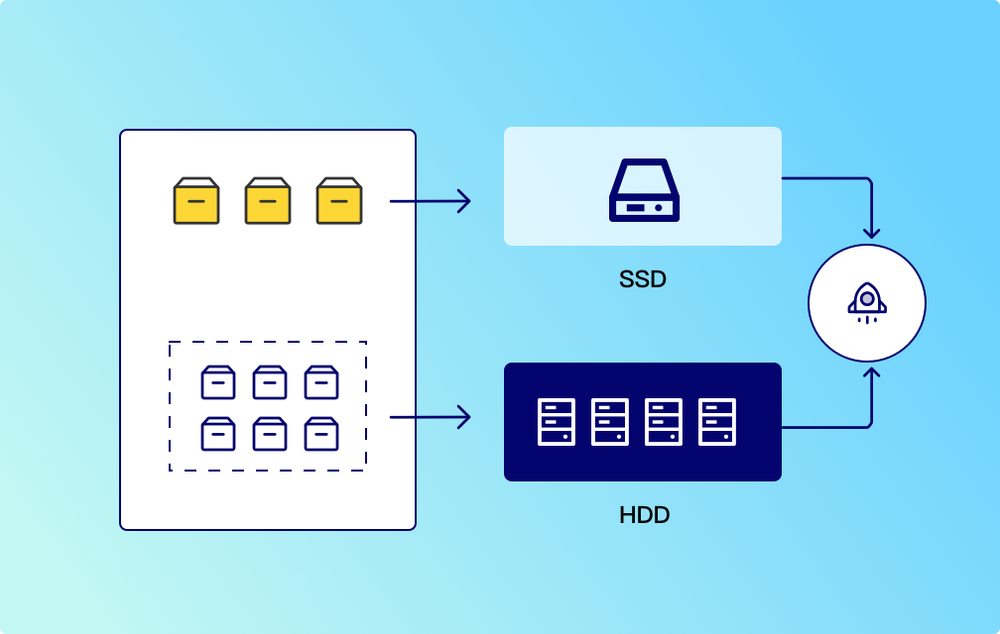
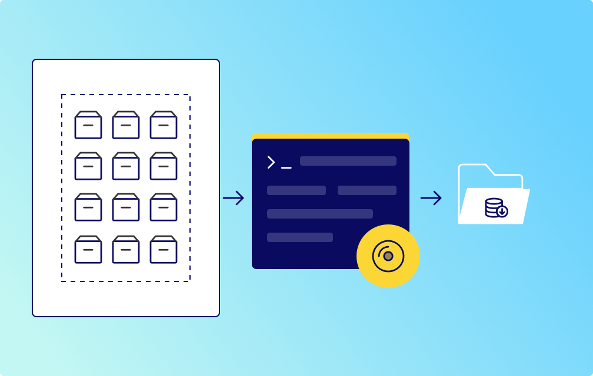
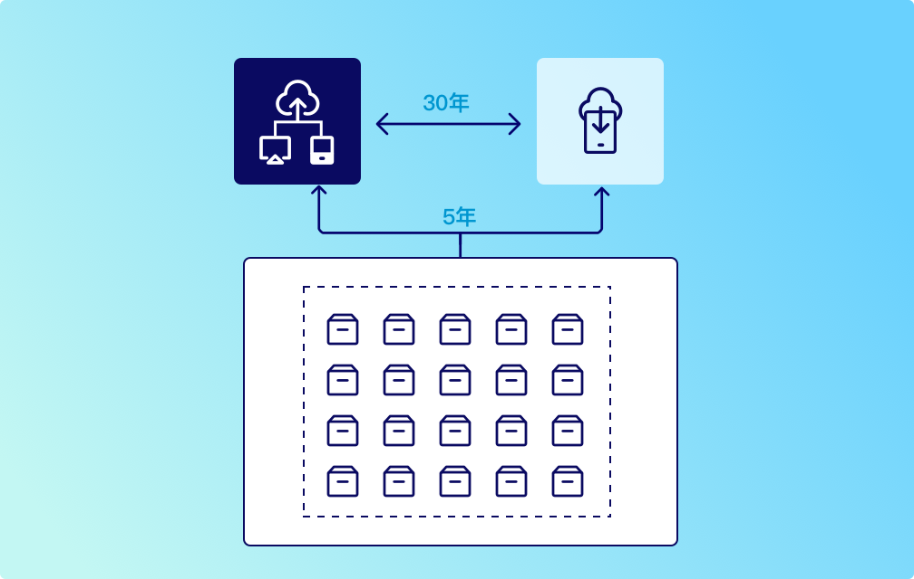
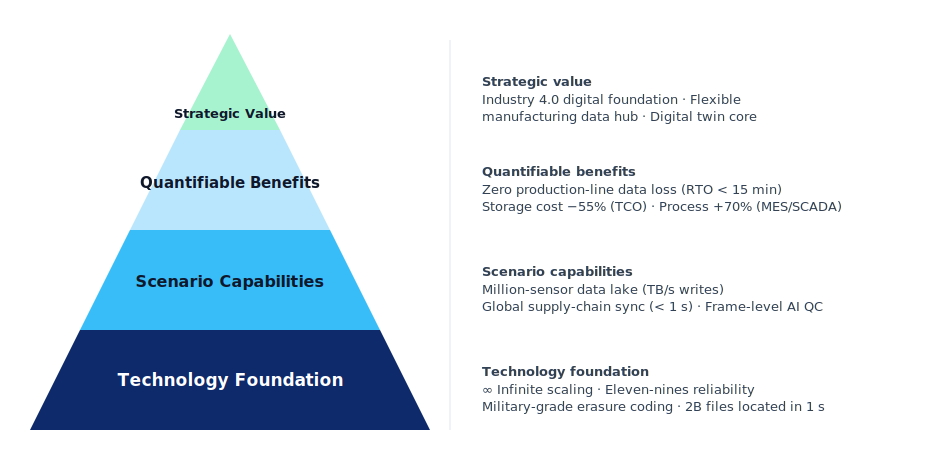

Storage, quality inspection, tracking and long-term preservation of massive data in industrial production, reducing costs and increasing efficiency

## Four Core Pain Points in Industrial Production

| Pain Point | Specific Scenarios/Challenges | User Requirements |
|------------|------------------------------|-------------------|
| **Massive Data Storage and Scalability** | Industrial production generates PB-level data from sensors and equipment, traditional storage is difficult to expand and costly. | Elastic storage capacity expansion, support dynamic growth, reduce hardware investment and maintenance costs. |
| **Real-time Processing and Low Latency** | Real-time monitoring, predictive maintenance scenarios require millisecond-level data read/write, traditional storage has high latency affecting decision efficiency. | High concurrent read/write capability, support real-time data analysis and edge computing, reduce response time. |
| **Data Security and Compliance** | Industrial data involves core process parameters, must meet GDPR, ISO 27001 regulations, prevent leakage and tampering. | End-to-end encryption, fine-grained permission control, audit logs, ensure data lifecycle compliance. |
| **Multi-source Heterogeneous Data Integration** | Industrial environments have multiple protocols/formats like S3, NFS, databases, scattered storage leads to complex management and low utilization. | Unified storage platform compatible with multi-protocol access, centralized data management and seamless cross-system calls. |

## Solutions

### SSD and HDD Tiered Storage Cost Reduction

SSDs provide fast read/write speeds suitable for applications requiring high I/O performance, while HDDs are lower cost and suitable for large-capacity storage. By storing frequently accessed data on SSDs and infrequently accessed data on HDDs, costs can be reduced without sacrificing performance.

#### Core Advantages of Tiered Storage

- **No Performance Compromise**: Achieve SSD acceleration for business needs
- **Cost Cut in Half**: HDD usage for 70% performance data
- **Automated Operations**: AI predicts data lifecycle
- **Elastic Scaling**: On-demand expansion + comprehensive cloud access
- **Risk Distribution**: Media backup + data mirroring
- **Green Low Carbon**: Energy saving + low carbon utilization

#### Use SSD for performance, HDD for cost reduction, optimizing resources where they matter most for storage spending through intelligent tiering

#### SSD+HDD Tiered Storage vs Single Storage Solution Cost Comparison

| Comparison Item | Pure SSD Solution | Pure HDD Solution | Tiered Storage Solution |
|-----------------|-------------------|-------------------|------------------------|
| **Storage Media Cost** | High | Low | Mixed (SSD only stores hot data) |
| **Performance** | Sub-millisecond latency | Millisecond-level latency | Hot data on SSD, cold data read on demand |
| **Energy Consumption** | High (always-on flash) | High (all spindles active) | Lower (small SSD tier plus HDD sleep) |
| **Capacity Expansion Cost** | Full expansion required | Performance bottleneck | Tier-by-tier expansion (e.g., HDD tier only) |
| **Total Cost of Ownership** | Highest | Low, but slow | Balanced: near-HDD cost with near-SSD hot-data performance |
| **Applicable Scenarios** | Real-time trading, high-frequency read/write | Archive, backup | Most enterprise mixed workloads (database/file services) |

### Cold Backup Storage Cost Reduction

Compared to traditional tape storage, Blu-ray discs have lower storage costs, especially for large-scale storage. The cost-effectiveness of Blu-ray technology makes it an ideal choice for large-scale data archiving.

Blu-ray storage devices consume far less energy during operation than hard disk drives (HDDs) or solid-state drives (SSDs), meaning lower energy costs.

#### Core Advantages of Cold Backup Storage

- **Lower Cost**: Optical media cost per GB is a fraction of hard-disk solutions
- **Long-term Reliability**: No need for regular data migration
- **Compliance Security**: Enterprise-grade encryption protection

Cold backup storage substantially reduces low-frequency industrial data archiving costs through intelligent tiering and elastic scaling, balancing security compliance with efficient resource utilization.

#### Media Comparison

| Media | Relative Cost | Energy Consumption | Typical Lifespan |
|-------|------------|-------------------|----------|
| **Blu-ray Storage** | Low | Lowest | 50+ years |
| **Tape** | Medium | Low | ~30 years |
| **HDD Series** | High | Highest | ~5 years |

### Multi-Cloud Transformation Cost Reduction

Cloud storage achieves cost reduction and efficiency improvement through integrated dynamic scheduling of data resources, allocating hot and cold data storage networks on demand, calculating based on each cloud vendor's solution, utilizing standardized interfaces to select optimal paths nearby, completing combined reserved/elastic instance cost optimization.

Simultaneously supports industrial IoT data, service images, and other unstructured data across cloud and edge computing, reducing storage costs while preserving business continuity.

#### Core Advantages of Multi-Cloud Transformation

- **Cross-Cloud Scheduling**: Critical business data accelerated on elastic SSD tiers
- **Cost Reduction Through Tiering**: HDD carries the bulk of low-frequency data
- **Lifecycle Automation**: Access-pattern-driven policies move data to the right tier

### Technology Value Pyramid

Based on highly reliable, horizontally scalable distributed object storage technology, protect the industrial data chain end to end, support AI quality inspection and real-time global supply chain collaboration, and help manufacturing enterprises move toward agile Industry 4.0 operations.
