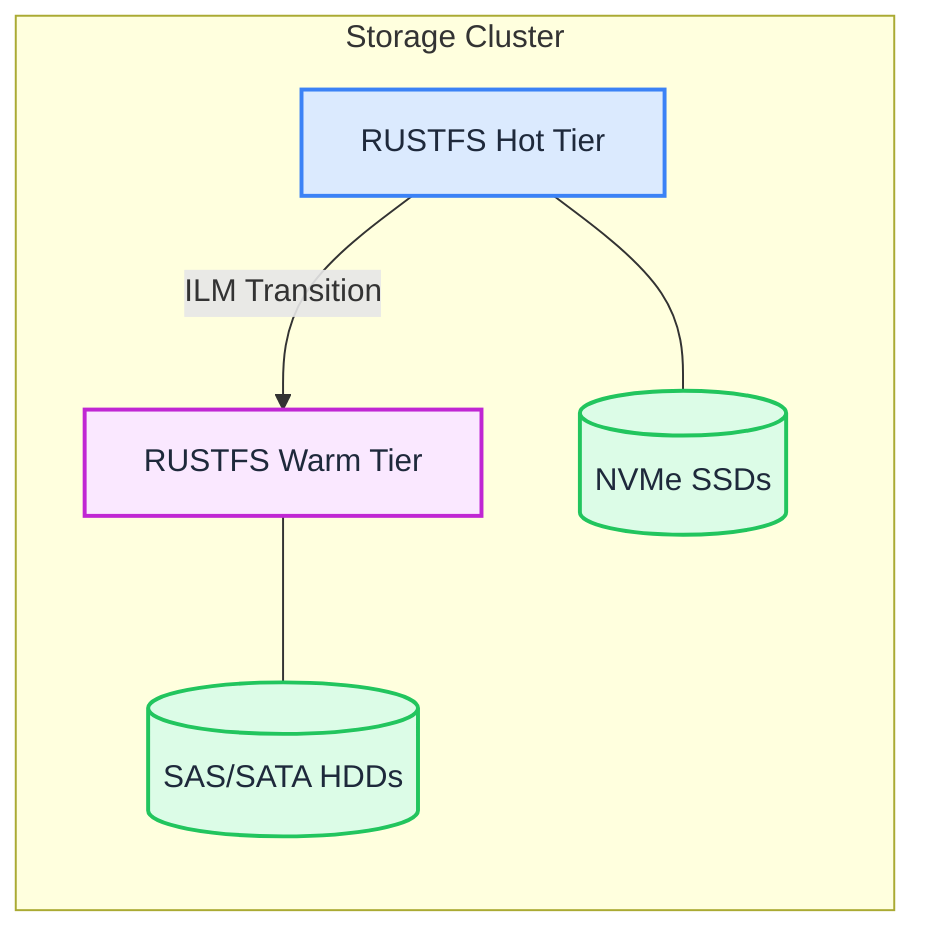
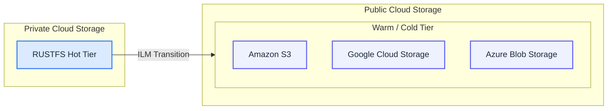
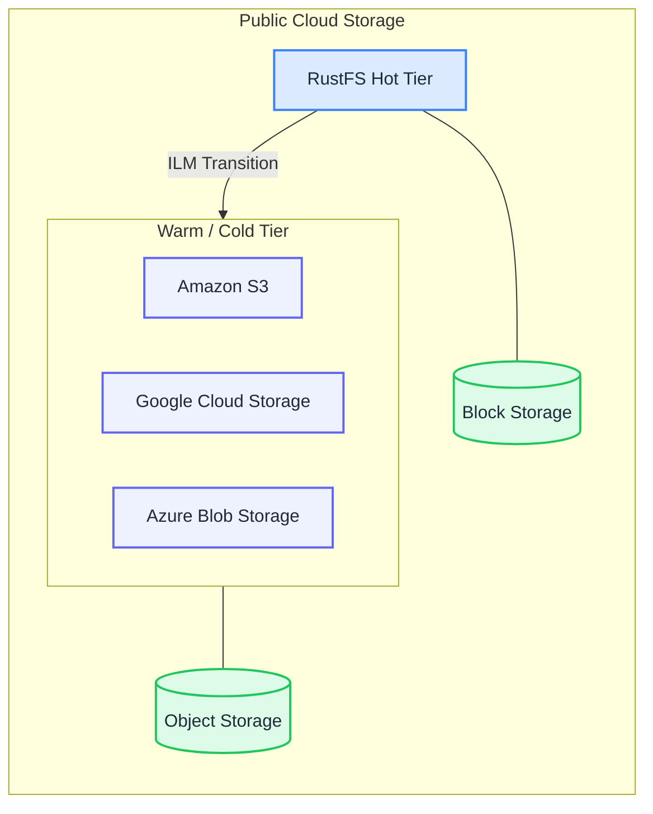

Data growth requires efficient lifecycle management for access, security, and economics. RustFS provides features to protect data within and between clouds, including versioning, object locking, and lifecycle management.

## Object Expiration

Data Retention: RustFS lifecycle management tools allow you to define how long data remains on disk before deletion. Define retention periods as a specific date or number of days.

Lifecycle management rules are created per bucket and can be constructed using any combination of object and tag filters. Omitting filters applies the expiration rule to the entire bucket.

RustFS object expiration rules also apply to versioned buckets. For example, you can specify expiration rules only for non-current versions to minimize storage costs.

Bucket expiration rules comply with RustFS WORM locking and legal holds. Objects in a locked state remain on disk until the lock expires or is explicitly released.

RustFS object expiration lifecycle management rules are compatible with AWS Lifecycle Management. RustFS supports importing existing rules in JSON format.

## Policy-Based Object Tiering

RustFS can be programmatically configured for object storage tiering. Objects transition from one state or class to another based on variables like time and frequency of access. Tiering allows users to optimize storage costs or functionality.

## Cross-Media Tiering

RustFS abstracts the underlying media to optimize for performance and cost. For example, performance workloads might use NVMe or SSD, while older data is tiered to HDD.

## Hybrid Cloud Tiering

Public cloud storage can serve as a tier for private clouds. Performance-oriented workloads run on private cloud media. As data ages, enterprises can use public cloud cold storage to optimize costs.

RustFS runs on both private and public clouds. Using replication, RustFS moves data to public cloud options and protects it. The public cloud serves as a storage tier.

## In Public Clouds

RustFS typically serves as the primary application storage tier in public clouds. RustFS determines which data belongs where based on management parameters.

RustFS combines different storage tiering layers and determines appropriate media to provide better economics without compromising performance. Applications address objects through RustFS, while RustFS transparently applies policies to move objects between tiers.

