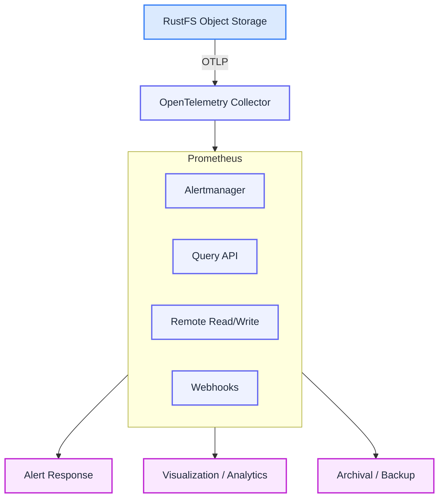

Metrics and logging are crucial for system health. RustFS provides robust monitoring and observability through detailed storage performance monitoring, metrics, and logging.

## Features

### Monitoring Metrics

Provides complete system monitoring and performance metrics collection.

### Logging

Records detailed log information for every operation, supporting audit trails.

## Metrics Monitoring

RustFS collects a wide range of fine-grained hardware and software metrics and exports them over OTLP (the OpenTelemetry Protocol, configured via `RUSTFS_OBS_ENDPOINT`). Deploy an OpenTelemetry Collector to forward these metrics to Prometheus, Grafana, or any OTLP-compatible backend. The upstream [`docker-compose.yml`](https://github.com/rustfs/rustfs/blob/main/docker-compose.yml) ships a ready-made observability profile with OpenTelemetry Collector, Prometheus, Grafana, and Jaeger.

RustFS also provides health check endpoints (`/health` and `/health/ready`) for probing node and cluster liveness.

## Audit Logs

Audit logging generates logs for every cluster operation. Each operation generates an audit log containing a unique ID and detailed information about the client, object, bucket, and metadata. RustFS writes audit data to configured targets such as HTTP/HTTPS webhook endpoints and Kafka (`RUSTFS_AUDIT_*` environment variables).

RustFS event notifications provide additional logging support: bucket and object events can be pushed automatically to third-party systems (for example RabbitMQ via AMQP, Kafka, or a webhook) for event-driven processing.

## Architecture

RustFS does not natively expose metrics via Prometheus-compatible HTTP(S) endpoints for direct scraping. To integrate with Prometheus, deploy an OpenTelemetry Collector to gather metrics from RustFS and forward them to your Prometheus backend.

RustFS event notifications automatically push bucket and object events to supported target services. Administrators can define bucket-level notification rules.

```mermaid
flowchart LR
  subgraph Clients["Client Applications"]
    IOT["Internet of Things"]
    WEB["Web Applications"]
    BK["Backup / Archival"]
    BS["Block Storage"]
  end
  TENANT["RustFS Cluster"]
  subgraph Targets["Notification Targets"]
    WH[Webhooks]
    KAFKA[Kafka]
    AMQP[AMQP]
    MQTT[MQTT]
    RED[Redis]
    NATS[NATS]
    PULSAR[Pulsar]
    MYSQL[MySQL]
    PG[PostgreSQL]
  end
  Clients <-->|S3 operations| TENANT
  TENANT -->|events| Targets
  classDef server fill:#dbeafe,stroke:#3b82f6,stroke-width:2px,color:#1e293b;
  classDef svc fill:#eef2ff,stroke:#6366f1,stroke-width:2px,color:#1e293b;
  classDef accent fill:#fae8ff,stroke:#c026d3,stroke-width:2px,color:#1e293b;
  class IOT,WEB,BK,BS server
  class TENANT svc
  class WH,KAFKA,AMQP,MQTT,RED,NATS,PULSAR,MYSQL,PG accent
```

## Requirements

### For Metrics

Deploy an OpenTelemetry Collector and point `RUSTFS_OBS_ENDPOINT` at it; visualize with Prometheus and Grafana (see the upstream observability compose profile).

### For Audit Logs

Configure one or more audit targets (webhook, Kafka) via `RUSTFS_AUDIT_*` environment variables.

### For Event Notifications

Configure bucket notification rules toward the supported targets: webhook, Kafka, AMQP, MQTT, Redis, NATS, Pulsar, MySQL, or PostgreSQL.
