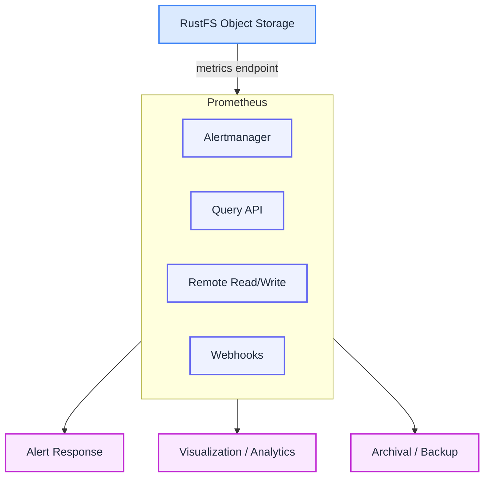

Metrics and logging are crucial for system health. RustFS provides robust monitoring and observability through detailed storage performance monitoring, metrics, and logging.

## Features

### Monitoring Metrics

Provides complete system monitoring and performance metrics collection.

### Logging

Records detailed log information for every operation, supporting audit trails.

## Metrics Monitoring

RustFS exports a wide range of fine-grained hardware and software metrics through Prometheus-compatible metrics endpoints. RustFS includes a storage monitoring dashboard that uses Grafana to visualize collected metrics.

The RustFS Kubernetes Operator can automatically deploy, configure, and manage Prometheus deployments and metrics collection for each tenant. Organizations can also point their own Prometheus systems to each tenant for centralized monitoring.

RustFS also provides a health check endpoint for probing node and cluster liveness.

## Audit Logs

Audit logging generates logs for every cluster operation. Each operation generates an audit log containing a unique ID and detailed information about the client, object, bucket, and metadata. RustFS writes log data to configured HTTP/HTTPS webhook endpoints.

RustFS supports configuring audit logs through the RustFS Console UI and the `mc` command-line tool. For Kubernetes environments, the RustFS Operator automatically configures the console with LogSearch integration.

RustFS Lambda notifications provide additional logging support. RustFS can automatically send bucket and object events to third-party applications (RabbitMQ, Kafka, Elasticsearch) for event-driven processing.

RustFS also supports real-time tracing of HTTP/S operations through the RustFS Console and `mc admin trace`.

## Architecture

RustFS does not natively expose metrics via Prometheus-compatible HTTP(S) endpoints for direct scraping. To integrate with Prometheus, please deploy an OpenTelemetry Collector to gather metrics from RustFS and forward them to your Prometheus backend. The RustFS Kubernetes Operator deploys an independent Prometheus service for each pre-configured RustFS tenant.

RustFS Lambda notifications automatically push event notifications to supported target services. Administrators can define bucket-level notification rules.

```mermaid
flowchart LR
  subgraph Clients["Client Applications"]
    IOT["Internet of Things"]
    WEB["Web Applications"]
    BK["Backup / Archival"]
    BS["Block Storage"]
  end
  TENANT["RustFS Tenant"]
  subgraph Targets["Notification Targets"]
    ES[ElasticSearch]
    PG[PostgreSQL]
    KAFKA[Kafka]
    AMQP[AMQP]
    MQTT[MQTT]
    RED[Redis]
    NATS[NATS]
    MYSQL[MySQL]
    WH[Webhooks]
    NSQ[NSQ]
  end
  Clients <-->|S3 operations| TENANT
  TENANT -->|events| Targets
  classDef server fill:#dbeafe,stroke:#3b82f6,stroke-width:2px,color:#1e293b;
  classDef svc fill:#eef2ff,stroke:#6366f1,stroke-width:2px,color:#1e293b;
  classDef accent fill:#fae8ff,stroke:#c026d3,stroke-width:2px,color:#1e293b;
  class IOT,WEB,BK,BS server
  class TENANT svc
  class ES,PG,KAFKA,AMQP,MQTT,RED,NATS,MYSQL,WH,NSQ accent
```

## Requirements

### For Metrics

Use Prometheus or the Kubernetes Operator to automatically deploy/configure for each tenant.

### For Log Search

BYO PostgreSQL *or* use Kubernetes Operator to automatically deploy/configure for each tenant.

### For Logs

Support for third-party notification targets.
