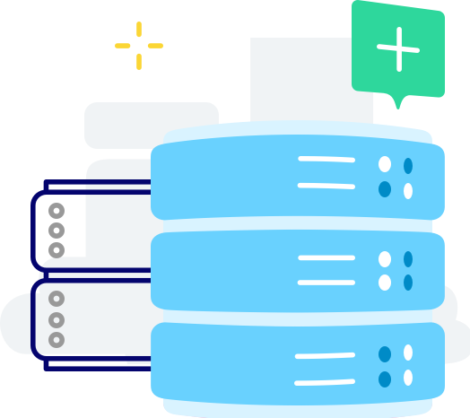
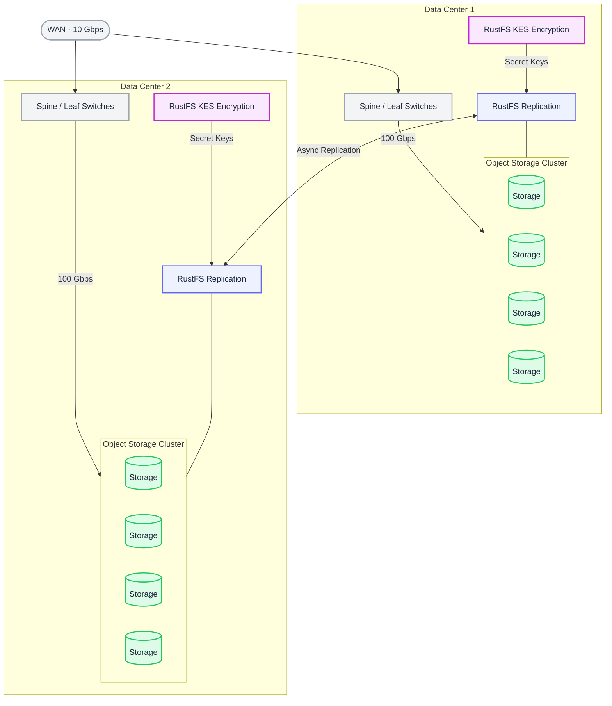

## Active Replication for Object Storage

Active replication ensures data availability. RustFS supports active-active replication. It operates at the bucket level.

RustFS supports synchronous and near-synchronous replication, depending on architectural choices and data change rates. Replication aims for strict consistency within data centers and eventual consistency between data centers.

## Resilience Features

- **Encrypted/Unencrypted Objects**: Replicates objects and metadata.
- **Object Versions**: Preserves version history.
- **Object Tags**: Replicates tags.
- **S3 Object Lock**: Maintains retention information.

## Core Features

### Identical Bucket Naming

Enables transparent failover to remote sites without interruption.

### Object Lock Replication

Ensures data integrity and compliance requirements are maintained during replication.

### Near-Synchronous Replication

Updates objects immediately after mutation.

### Notifications

Pushes replication failure events for operations teams.

## Implementation Considerations

Key factors include:

### Infrastructure

RustFS recommends using the same hardware at both ends of the replication endpoints to simplify troubleshooting.

### Bandwidth

Bandwidth is critical for synchronization. If bandwidth is insufficient to handle peaks, changes will queue to the remote site.

### Latency

After bandwidth, latency is the most important consideration when designing an active-active model. Latency represents the round-trip time (RTT) between two RustFS clusters. The goal is to reduce latency to the smallest possible number within the budget constraints imposed by bandwidth. RustFS recommends RTT thresholds not exceeding 20 milliseconds for Ethernet links and networks, with packet loss rates not exceeding 0.01%.

### Architecture

Currently, RustFS only recommends replication across two data centers. Replication across multiple data centers is possible, however, the complexity involved and the trade-offs required make this quite difficult.

## Large-Scale Deployment Architecture

RustFS supports very large deployments in each data center, including source and target, with the above considerations determining scale.

## Frequently Asked Questions

### What happens when the replication target fails?

If the target goes down, the source will cache changes and begin synchronizing after the replication target recovers. There may be some delay in reaching full synchronization, depending on the duration, number of changes, bandwidth, and latency.

### What are the parameters for immutability?

Immutability is supported. Key concepts can be found in this article. In active-active replication mode, immutability can only be guaranteed when objects are versioned. Versioning cannot be disabled on the source. If versioning is suspended on the target, RustFS will begin failing replication.

### What other impacts are there if versioning is suspended or there's a mismatch?

In these cases, replication may fail. For example, if you try to disable versioning on the source bucket, an error will be returned. You must first remove the replication configuration before you can disable versioning on the source bucket. Additionally, if versioning is disabled on the target bucket, replication will fail.

### How is it handled if object locking is not enabled on both ends?

Object locking must be enabled on both source and target. There's an edge case where after setting up bucket replication, the target bucket can be deleted and recreated but without object locking enabled, and replication may fail. If object locking settings are not configured on both ends, inconsistent situations may occur. In this case, RustFS will fail silently.
