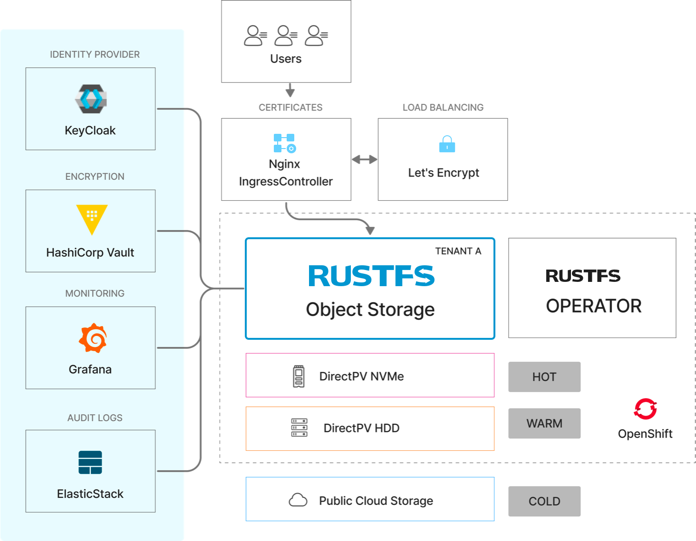

VMware Tanzu is an enterprise Kubernetes container platform for building, running, and managing containerized applications across vSphere, public clouds, and edge environments.

Three reasons customers run RustFS on Tanzu:

- RustFS serves as a consistent storage layer in hybrid cloud or multi-cloud deployment scenarios.
- RustFS is a Kubernetes-native, high-performance product that delivers predictable performance across public cloud, private cloud, and edge environments.
- Running RustFS on Tanzu gives you control over the software stack and the flexibility to avoid cloud lock-in.

RustFS deploys on Tanzu Kubernetes clusters with the official Helm chart, making it easier to operate your own large-scale, multi-tenant object storage as a service. Because RustFS is S3-compatible from the start, applications built for the S3 API run against RustFS on Tanzu without changes.

## Prerequisites

Before deploying RustFS on Tanzu, you need:

- A Tanzu Kubernetes cluster with worker nodes sized for your storage workload
- A block-storage `StorageClass` backed by the vSphere CSI driver (or your infrastructure's CSI driver) for RustFS persistent volumes
- A load balancer for external access, for example NSX Advanced Load Balancer or an ingress controller such as NGINX
- `kubectl` and Helm configured against your cluster

## Deploy RustFS on Tanzu

RustFS is deployed with its official Helm chart; no Operator or CRDs are required. Follow the [cloud-native installation guide](/installation/cloud-native) for the deployment steps.

## Common Capabilities

Storage tiering, external load balancing, encryption and built-in KMS, identity management, TLS certificates, OpenTelemetry-based monitoring, and audit logging work the same on every Kubernetes platform. See [RustFS on Kubernetes: Common Capabilities](/features/kubernetes-common).
