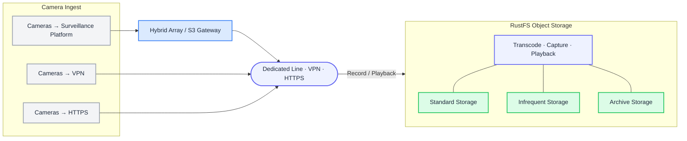

Achieve dramatic cost reductions in video storage through object storage and hybrid cloud approaches.

## Core Pain Points of Video Storage

### Challenges with Traditional Solutions

- Linear storage architecture causes read/write speeds to decline as capacity increases.
- Original videos occupy space; cold data occupies high-performance storage long-term.
- Single replica storage + periodic backup mechanism.
- Storage expansion requires downtime maintenance and lacks intelligent management tools.

### Business Impact

- Key frame retrieval delays exceed 5 seconds; emergency response efficiency reduced by 30%.
- Storage costs increase 47% annually; 80% of storage resources are occupied by low-frequency access videos.
- Hardware failures lead to 72-hour data recovery cycles and risk of critical evidence loss.
- Manual operations cost $3.2/TB/month; system availability is below 99%.

## Five Core Cost Reduction Capabilities

### Reduce Storage Costs by 68%

- Original video frame-level compression algorithm (VFC-3 patent technology).
- Intelligent hot-cold separation: automatically identifies videos not accessed for 30 days and transfers them to glacier storage.
- Supports EB-level storage expansion; single TB cost as low as $0.015/month.

### Instant Data Access

- Global deployment of 128 edge nodes; transmission speed improved 5x.
- Supports 2000+ device concurrent writing; read/write latency less than 300ms.
- Intelligent preloading technology: high-frequency access videos automatically cached to edge nodes.

### Enterprise-Grade Data Protection

- Three-replica storage + remote disaster recovery (compliant with ISO 27001).
- Blockchain evidence storage: key videos generate timestamp hashes, judicial-level trusted evidence.
- Version rollback: video recovery at any time point within 120 days.

### Seamless Integration

- Compatible with 14 protocols including ONVIF/RTSP/GB28181.
- Provides SDK/API/RESTful access methods.
- One-click migration tool for existing data (supports NAS/SAN/Ceph).

### Intelligent Operations Dashboard

- Real-time monitoring of storage health, cost distribution, and access hotspots.
- Capacity prediction algorithm: 3-day advance warning of storage bottlenecks.
- Automatically generates monthly optimization recommendation reports.

## Solutions

Video feeds can be uploaded to the cloud through three methods:

### Hybrid Cloud Tiered Storage

Applicable scenarios: Large parks, smart cities (1000+ cameras).

#### Core Capabilities

- Intelligent tiering: hot data stored locally on SSD (response <100ms), full data automatically synced to cloud.
- Direct cost reduction: cloud storage cost $0.021/GB-month, bandwidth usage reduced 80%.
- Seamless disaster recovery: real-time active-active between local and cloud data.

### Direct Cloud Storage

Applicable scenarios: Shops, communities, homes (50-200 cameras).

#### Core Advantages

- Rapid 5-minute deployment: scan-to-connect, automatically adapts H.265 compression.
- Intelligent management: motion detection automatically generates 30-second event clips.
- Zero maintenance: fully managed cloud storage, data durability 99.9999999%.

### Server Relay Storage

Applicable scenarios: Educational parks, cross-regional enterprises.

#### Key Technologies

- Edge preprocessing: video frame extraction analysis (saves 90% traffic).
- Intelligent routing: automatically switches TCP/UDP protocols to ensure transmission.
- Tiered archiving: original videos stored 30 days, low-bitrate copies stored 180 days.

## Why Choose Us

### Controllable Costs

EB-level elastic expansion, cold data storage cost as low as $0.015/GB·month.

### Ultra-Fast Response

Global 128 edge nodes, video transmission speed improved 5x.

### Automatic Video Upload Encryption

Automatic video encryption ensures upload storage security, prevents data leakage and illegal distribution, while helping platforms meet privacy protection regulations and reduce legal risks

### Version Protection

Platform-provided original video automatic encryption service effectively prevents piracy and tampering, protects intellectual property, while improving user trust and satisfaction

## Technical Parameter Comparison Table

| Metric | Traditional Solution | RustFS Solution | Improvement |
| --- | --- | --- | --- |
| Storage density | 1.2× raw size | ✓ 0.6× (lossless compression) | 2× ↑ |
| Concurrent writes | ≤ 500 streams | ✓ 2000+ streams | 4× ↑ |
| Storage availability | 99% | ✓ 99.999% | 100× reliability |
| TCO (5 years) | $580K | ✓ $190K | 76% cost savings |
