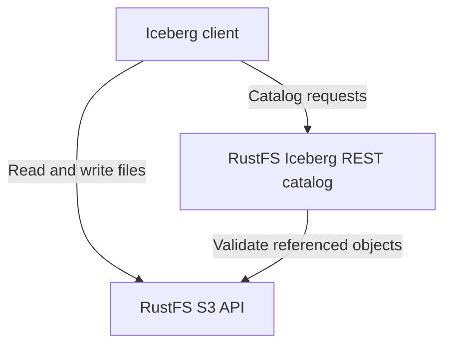

RustFS S3 Tables gère les tables **Apache Iceberg** au moyen d’un catalogue REST intégré. Les données des tables, les manifestes et les métadonnées Iceberg restent stockés sous forme d’objets S3 dans RustFS. Ce guide explique comment activer un compartiment de tables dédié, connecter les clients et prendre en compte les autorisations et les limites de maintenance.

:::note[Préversion et versions concernées]

S3 Tables est une fonctionnalité en préversion ; la compatibilité des clients se limite aux workflows indiqués ci-dessous. Cette page s’appuie sur le commit RustFS [`7e0c6711`](https://github.com/rustfs/rustfs/commit/7e0c67111b97703d47e23719b0264a739c8acea8), vérifié le 8 septembre 2026. Consultez la [matrice de prise en charge](https://github.com/rustfs/rustfs/blob/7e0c67111b97703d47e23719b0264a739c8acea8/docs/architecture/s3-tables-support-matrix.md) et votre version avant d’utiliser d’autres opérations de catalogue ou clients.

:::

## Fonctionnement

Un client Iceberg utilise le catalogue REST pour découvrir les tables et valider les modifications de métadonnées. Il utilise l’API S3 pour lire et écrire les fichiers des tables. RustFS expose les deux interfaces sur le port de l’API S3.



| Ressource | Rôle |
| --- | --- |
| Compartiment de tables | Un compartiment S3 existant activé pour le catalogue ; son nom correspond au paramètre `warehouse` du client. |
| Espace de noms | Un groupe logique de tables au sein de cet entrepôt. |
| Table | Un schéma Iceberg, des instantanés et un emplacement courant des métadonnées géré par le catalogue. |

L’activation d’un compartiment de tables n’enregistre pas automatiquement les fichiers Parquet existants comme tables Iceberg. Créez ou enregistrez les tables avec un client Iceberg. Sans `location` explicite, RustFS attribue un emplacement de stockage ; un emplacement personnalisé doit se trouver dans le même compartiment. Les clients devraient utiliser l’emplacement renvoyé.

Le backend de catalogue par défaut, `object`, conserve durablement l’état du catalogue dans le stockage objet RustFS. Un commit de table vérifie les métadonnées de départ et les objets référencés avant de mettre à jour, sous condition, le pointeur vers les métadonnées courantes. En cas de conflit d’écriture, le client doit recharger la table et résoudre le conflit. La transaction porte sur une seule table.

## Prérequis

- Démarrez un déploiement RustFS disposant des points de terminaison S3 Tables décrits ci-dessus. Consultez [Installation](/installation).
- Installez l’[AWS CLI](/developer/examples/aws-cli) et `curl` 7.76 ou une version ultérieure, avec prise en charge de `--aws-sigv4` et `--fail-with-body`.
- Créez un compartiment dédié à ce tutoriel. L’exemple utilise `my-bucket`.
- Utilisez un compte d’administration existant autorisé à effectuer les opérations de catalogue et à accéder aux objets S3. La politique intégrée `consoleAdmin` couvre ce tutoriel ; configurez des politiques plus restreintes pour les applications.

Les exemples utilisent `http://localhost:9000`. Remplacez cette adresse par le point de terminaison de votre serveur et utilisez [TLS](/integration/tls-configured) avec vérification des certificats en dehors d’un environnement de test local.

:::warning[Cycle de vie des compartiments de tables]

Les compartiments de tables sont exclus du traitement d’expiration habituel du cycle de vie des compartiments. Activer ce mode sur un compartiment existant modifie l’application de ses règles d’expiration. Utilisez une maintenance de catalogue qui tient compte des références Iceberg pour faire expirer les instantanés et nettoyer les fichiers des tables.

:::

## 1. Créer un compartiment

Définissez le point de terminaison et les informations d’identification des clients d’exemple :

```bash
export RUSTFS_ENDPOINT="http://localhost:9000"
export AWS_ACCESS_KEY_ID="<your-access-key>"
export AWS_SECRET_ACCESS_KEY="<your-secret-key>"
export AWS_DEFAULT_REGION="us-east-1"
```

Créez le compartiment dédié :

```bash
aws --endpoint-url "$RUSTFS_ENDPOINT" s3api create-bucket --bucket my-bucket
```

Ces exemples utilisent une clé d’accès et une clé d’accès secrète, sans jeton de session temporaire. Conservez le même environnement shell pour les requêtes suivantes et le guide PyIceberg.

## 2. Activer le compartiment de tables

Envoyez une requête au corps vide, signée avec SigV4, au point de terminaison du compartiment de tables :

```bash
curl --fail-with-body --silent --show-error \
	--aws-sigv4 "aws:amz:us-east-1:s3" \
	--user "$AWS_ACCESS_KEY_ID:$AWS_SECRET_ACCESS_KEY" \
	--header "x-amz-content-sha256: e3b0c44298fc1c149afbf4c8996fb92427ae41e4649b934ca495991b7852b855" \
	--request PUT "$RUSTFS_ENDPOINT/iceberg/v1/buckets/my-bucket"
```

Relisez son état avec les mêmes informations d’identification :

```bash
curl --fail-with-body --silent --show-error \
	--aws-sigv4 "aws:amz:us-east-1:s3" \
	--user "$AWS_ACCESS_KEY_ID:$AWS_SECRET_ACCESS_KEY" \
	--header "x-amz-content-sha256: e3b0c44298fc1c149afbf4c8996fb92427ae41e4649b934ca495991b7852b855" \
	"$RUSTFS_ENDPOINT/iceberg/v1/buckets/my-bucket"
```

Les deux requêtes renvoient HTTP `200` en cas de réussite. Vérifiez que la réponse contient les valeurs suivantes :

```json
{
	"table-bucket": "my-bucket",
	"enabled": true,
	"catalog-type": "iceberg-rest",
	"warehouse": "my-bucket",
	"catalog-entry-present": true
}
```

Il s’agit d’un extrait de réponse. La valeur `catalog-uri` renvoyée est une route propre au compartiment ; utilisez l’URI de base de la section suivante pour configurer un client REST Iceberg.

## 3. Connecter un client Iceberg

Utilisez les paramètres suivants pour le point de terminaison RustFS de l’exemple :

| Paramètre | Valeur |
| --- | --- |
| URI du catalogue REST | `http://localhost:9000/iceberg` |
| Entrepôt et préfixe | `my-bucket` |
| Authentification REST | AWS Signature Version 4, nom du service de signature `s3` |
| Région | `us-east-1` |
| Point de terminaison des fichiers S3 | `http://localhost:9000` avec adressage de type chemin |

Le client ajoute `/v1` à l’URI du catalogue. L’entrepôt est un nom de compartiment, et non un URI S3 ou un ARN AWS S3 Tables. Configurez la signature des requêtes REST et l’accès aux fichiers S3, même si les deux utilisent le même compte.

Si vous exploitez déjà un catalogue REST Iceberg séparé, consultez l’[intégration Apache Iceberg](/developer/integration/big-data/iceberg) pour le modèle de déploiement avec catalogue externe.

## Autorisations et informations d’identification

L’activation d’un compartiment de tables nécessite `admin:SetTableBucket` ; la consultation de son état nécessite `admin:GetTableBucket`. La découverte du catalogue utilise `admin:GetTableCatalog`. Les opérations sur les espaces de noms et les tables possèdent leurs propres actions d’administration RustFS, notamment `admin:SetTableNamespace`, `admin:CreateTable`, `admin:GetTableMetadata` et `admin:CommitTable`.

La lecture et l’écriture des fichiers de tables nécessitent aussi les autorisations S3 ordinaires. RustFS vérifie les autorisations de table sur les chemins des objets de l’entrepôt : les lectures nécessitent l’autorisation `admin:GetTableMetadata` correspondante, et les écritures `admin:SetTableMetadata`. Une autorisation de commit de catalogue ne suffit pas à autoriser les écritures de fichiers S3 qui le précèdent. Configurez les [politiques IAM](/security-compliance/iam/policies) pour les deux interfaces.

La fourniture d’informations d’identification par le catalogue est désactivée par défaut. Lorsqu’elle est activée, un client compatible doit négocier `X-Iceberg-Access-Delegation: vended-credentials`, et l’appelant doit être autorisé à demander des informations d’identification de table. L’accès initial au catalogue nécessite toujours une identité autorisée. Le tutoriel PyIceberg associé utilise des informations d’identification configurées explicitement.

## Maintenance et protection des données

La suppression des métadonnées et la maintenance en arrière-plan sont désactivées par défaut. RustFS expose des opérations explicites de planification, d’exécution de l’ordonnanceur et d’exécution des workers ; il n’exécute pas d’ordonnanceur intégré de maintenance périodique. Examinez le plan de maintenance et les références qu’il conserve avant d’activer la suppression.

Supprimer une table retire son entrée du catalogue tout en conservant les objets sous-jacents. Effectuez les opérations de maintenance nécessaires avant de retirer la table du catalogue ; ensuite, elles ne pourront plus la trouver. Le nettoyage des objets conservés exige un plan distinct tenant compte de toutes les références restantes. Ne supprimez pas récursivement des chemins S3 que des instantanés ou d’autres métadonnées pourraient encore référencer.

Conservez le backend de catalogue par défaut pour ce tutoriel. Le passage d’un déploiement existant à `durable-strong` nécessite la [procédure de bascule du catalogue](https://github.com/rustfs/rustfs/blob/7e0c67111b97703d47e23719b0264a739c8acea8/docs/operations/s3-tables-cutover-runbook.md), notamment les vérifications préalables à la migration et le blocage coordonné des clients en écriture.

## Compatibilité des clients et limites

Le dépôt source maintient le périmètre de validation suivant :

| Client | Périmètre de validation |
| --- | --- |
| PyIceberg | Vérifications automatisées de création, d’ajout, de rechargement, de lecture des lignes et d’opérations de catalogue. |
| DuckDB Iceberg 1.5.5 | Vérifications automatisées du catalogue REST générique pour la lecture, l’écriture et les modifications de schéma sur une seule table. |
| Spark | Un banc de test sur service actif, à activer explicitement ; validez les versions exactes de Spark et d’Iceberg que vous déployez. |
| Trino | Un test manuel en lecture seule ; la compatibilité en écriture n’est pas revendiquée. |

Les formats Iceberg v1 et v2 sont pris en charge, avec v2 par défaut. La création de tables en mode différé, la purge lors de la suppression et le format Iceberg v3 ne sont pas pris en charge.

RustFS S3 Tables ne fournit ni moteur d’exécution SQL, ni transactions atomiques sur plusieurs tables, ni écritures actives-actives indépendantes entre régions. Il ne revendique pas une compatibilité complète avec le plan de contrôle AWS S3 Tables. Consultez la [matrice de prise en charge](https://github.com/rustfs/rustfs/blob/7e0c67111b97703d47e23719b0264a739c8acea8/docs/architecture/s3-tables-support-matrix.md) avant d’utiliser un autre moteur ou un profil propre à un fournisseur.

## Étapes suivantes

- Exécutez le [tutoriel PyIceberg](/developer/integration/big-data/pyiceberg).
- Consultez les [politiques IAM](/security-compliance/iam/policies) avant d’autoriser les applications.
- Validez d’autres versions de clients avec les [vérifications de conformité des clients](https://github.com/rustfs/rustfs/blob/7e0c67111b97703d47e23719b0264a739c8acea8/scripts/table-catalog/README.md) du dépôt.
