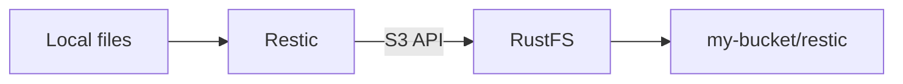

Restic est un outil de sauvegarde en ligne de commande qui stocke les snapshots dans un dépôt. Cette page montre comment pointer Restic vers RustFS, sauvegarder un répertoire local, restaurer un snapshot et vérifier les objets stockés dans RustFS.

Vous avez besoin d'une instance RustFS en cours d'exécution, d'un compartiment comme `my-bucket`, de Restic installé, de clés d'accès pour le compartiment et d'un mot de passe pour le dépôt Restic.

:::note[Adressage de type chemin]

Le backend S3 de Restic doit utiliser l'adressage de type chemin avec RustFS. Cette page définit `-o s3.bucket-lookup=path` et utilise le nom du compartiment dans l'URL du dépôt.

:::

## Architecture



Restic écrit les métadonnées du dépôt et les snapshots de sauvegarde dans RustFS via l'API S3. Le préfixe du dépôt dans cette page est `restic`, et le compartiment est `my-bucket`.

## 1. Préparer le compartiment

Ouvrez la Console RustFS à l'adresse `http://localhost:9001` et créez `my-bucket`, ou choisissez un compartiment existant dédié aux sauvegardes.


Utilisez un compartiment dédié pour chaque tâche de sauvegarde. La capture d'écran montre la Console en anglais et en thème clair.

## 2. Initialiser le dépôt Restic

Définissez les identifiants, la région, le mot de passe du dépôt et l'emplacement du dépôt :

```bash
export AWS_ACCESS_KEY_ID=<your-access-key>
export AWS_SECRET_ACCESS_KEY=<your-secret-key>
export AWS_DEFAULT_REGION=us-east-1
export RESTIC_PASSWORD=<your-restic-password>
export RESTIC_REPOSITORY=s3:http://localhost:9000/my-bucket/restic
```

Exécutez `restic init` avec la sélection de compartiment en mode chemin :

```bash
restic -o s3.bucket-lookup=path init
```

Le mot de passe du dépôt protège les données des snapshots. Conservez-le séparément des clés d'accès RustFS.

## 3. Sauvegarder des données

Créez un petit répertoire de test et sauvegardez-le :

```bash
mkdir -p ~/Documents/restic-demo
printf 'hello from RustFS\n' > ~/Documents/restic-demo/hello.txt
restic -o s3.bucket-lookup=path backup ~/Documents/restic-demo
```

Restic affiche l'ID du snapshot une fois la sauvegarde terminée. Relancez la commande après avoir modifié un fichier pour créer un second snapshot.

## 4. Restaurer un snapshot

Restaurez le snapshot le plus récent dans un répertoire séparé :

```bash
mkdir -p ~/Documents/restic-restore
restic -o s3.bucket-lookup=path restore latest --target ~/Documents/restic-restore
```

Vous pouvez aussi restaurer un ID de snapshot précis si vous devez récupérer une version antérieure.

## 5. Vérifier le dépôt dans RustFS

Ouvrez `my-bucket` dans la Console RustFS et vérifiez que Restic a créé des objets de dépôt sous le préfixe `restic/`.

Vous pouvez aussi lancer une vérification du dépôt :

```bash
restic -o s3.bucket-lookup=path check
```

## Étapes suivantes

- [CLI Client (rc)](/operations/rc) pour créer des compartiments et inspecter les objets depuis la ligne de commande.
- [Configuration TLS](/integration/tls-configured) si vous exposez RustFS hors d'un réseau de confiance.