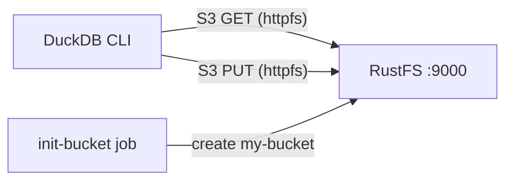
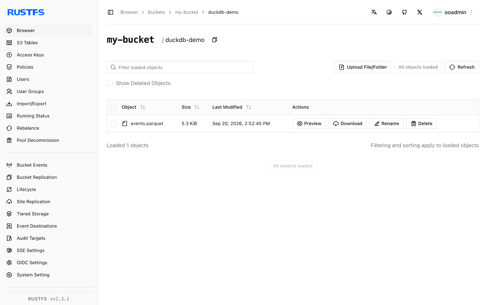

Ce guide exécute **DuckDB** avec **RustFS** comme stockage compatible S3. Vous allez démarrer les deux services avec Docker Compose, configurer l'extension `httpfs` de DuckDB pour le point de terminaison RustFS, écrire des résultats de requête dans le bucket au format Parquet, les relire, puis vérifier les objets dans RustFS. Le flux a été validé avec l'image `duckdb/duckdb:latest` (v1.5.5) et `rustfs/rustfs-x86-musl:v2.3.1`.

Vous avez besoin de Docker avec le plugin Compose. Ce déploiement est destiné aux tests d'intégration locaux, pas à la production.

## Architecture



DuckDB lit et écrit les objets via son [extension `httpfs`](https://duckdb.org/docs/stable/extensions/httpfs/overview), qui implémente l'API S3. Un secret S3 contient le point de terminaison RustFS, les identifiants, l'adressage path-style et le réglage HTTP simple ; les fichiers Parquet se chargent alors depuis et vers des chemins `s3://my-bucket/...` comme des fichiers locaux.

## 1. Créer les fichiers du projet

Créez un répertoire de travail :

```bash
mkdir rustfs-duckdb
cd rustfs-duckdb
```

Créez un fichier d'environnement et remplacez les deux espaces réservés d'identifiants :

```ini title=".env"
RUSTFS_ACCESS_KEY=<your-access-key>
RUSTFS_SECRET_KEY=<your-secret-key>
```

Utilisez des identifiants dédiés pour le bucket. Ne commettez pas `.env` dans le contrôle de version.

Créez le fichier Compose :

```yaml title="compose.yaml"
services:
  rustfs:
    image: rustfs/rustfs-x86-musl:v2.3.1
    environment:
      RUSTFS_ACCESS_KEY: ${RUSTFS_ACCESS_KEY}
      RUSTFS_SECRET_KEY: ${RUSTFS_SECRET_KEY}
      RUSTFS_VOLUMES: /data
      RUSTFS_ADDRESS: ":9000"
      RUSTFS_CONSOLE_ADDRESS: ":9001"
      RUSTFS_CONSOLE_ENABLE: "true"
    volumes:
      - rustfs-data:/data
    ports:
      - "9000:9000"
      - "9001:9001"
    healthcheck:
      test: ["CMD", "curl", "-sf", "http://127.0.0.1:9000/health"]
      interval: 10s
      timeout: 5s
      retries: 6
      start_period: 10s
    networks:
      - warehouse

  create-bucket:
    image: rustfs/rc:latest
    depends_on:
      rustfs:
        condition: service_healthy
    environment:
      RUSTFS_ACCESS_KEY: ${RUSTFS_ACCESS_KEY}
      RUSTFS_SECRET_KEY: ${RUSTFS_SECRET_KEY}
    entrypoint:
      - /bin/sh
      - -c
      - |
        until /usr/bin/rc alias set rustfs http://rustfs:9000 "$${RUSTFS_ACCESS_KEY}" "$${RUSTFS_SECRET_KEY}"; do
          echo "Waiting for RustFS..."
          sleep 2
        done
        /usr/bin/rc ls rustfs/my-bucket >/dev/null 2>&1 || /usr/bin/rc mb rustfs/my-bucket
    networks:
      - warehouse

  duckdb:
    image: duckdb/duckdb:latest
    entrypoint: ["/duckdb"]
    depends_on:
      create-bucket:
        condition: service_completed_successfully
    networks:
      - warehouse

networks:
  warehouse:

volumes:
  rustfs-data:
```

L'[image `rc`](https://github.com/rustfs/cli) fournit le client en ligne de commande officiel de RustFS. L'initialiseur vérifie l'existence de `my-bucket` avant de le créer, afin que des redémarrages répétés ne suppriment pas les données existantes. L'image `duckdb/duckdb` ne contient que le binaire `/duckdb`, sans shell ; le service définit donc `entrypoint: ["/duckdb"]`.

## 2. Démarrer le déploiement

Vérifiez le fichier Compose avant de démarrer les conteneurs :

```bash
docker compose config
```

Démarrez les services et attendez la fin de l'initialisation du bucket :

```bash
docker compose up -d
docker compose ps -a
```

Le service `create-bucket` doit afficher un code de sortie `0`. La console RustFS est disponible à l'adresse `http://localhost:9001/rustfs/console/` pour inspecter le bucket à tout moment.

## 3. Configurer le secret S3 dans DuckDB

Démarrez une session DuckDB interactive :

```bash
docker compose run --rm duckdb
```

Installez l'extension et enregistrez le point de terminaison RustFS :

```sql
INSTALL httpfs;
LOAD httpfs;

CREATE SECRET rustfs (
    TYPE S3,
    KEY_ID '<your-access-key>',
    SECRET '<your-secret-key>',
    ENDPOINT 'rustfs:9000',
    USE_SSL FALSE,
    URL_STYLE 'path'
);
```

Le point de terminaison est donné sous la forme `host:port` sans schéma. `USE_SSL FALSE` sélectionne HTTP simple à l'intérieur du réseau Compose, et `URL_STYLE 'path'` sélectionne l'adressage path-style, attendu par RustFS. Les secrets ne vivent que le temps de la session — recréez le secret à chaque nouvelle session.

## 4. Écrire des résultats de requête dans RustFS

Écrivez une petite table au format Parquet dans le bucket :

```sql
COPY
    (SELECT i AS id, 'rustfs-duckdb-demo' AS source FROM range(1000) t(i))
    TO 's3://my-bucket/duckdb-demo/events.parquet'
    (FORMAT PARQUET);
```

```text
┌─────────┐
│ Success │
│ boolean │
├─────────┤
│   true  │
└─────────┘
```

## 5. Relire le Parquet depuis RustFS

Interrogez l'objet que vous venez d'écrire comme s'il s'agissait d'un fichier local :

```sql
SELECT count(*) AS rows, min(id) AS min_id, max(id) AS max_id
FROM read_parquet('s3://my-bucket/duckdb-demo/events.parquet');
```

```text
┌───────┬────────┬────────┐
│ rows  │ min_id │ max_id │
│ int64 │ int64  │ int64  │
├───────┼────────┼────────┤
│  1000 │      0 │    999 │
└───────┴────────┴────────┘
```

Tout objet Parquet du bucket peut être interrogé de cette manière, y compris les fichiers écrits par d'autres systèmes comme OpenObserve, Spark ou Iceberg.

## 6. Vérifier les objets dans RustFS

Listez le préfixe via l'image d'initialisation du bucket :

```bash
docker compose run --rm --entrypoint /bin/sh create-bucket -c \
  '/usr/bin/rc alias set rustfs http://rustfs:9000 "$RUSTFS_ACCESS_KEY" "$RUSTFS_SECRET_KEY" >/dev/null && /usr/bin/rc ls rustfs/my-bucket/duckdb-demo --recursive'
```

```text
[2026-09-20 06:52:45]   5.32 KiB duckdb-demo/events.parquet
```

Vous pouvez également inspecter le préfixe `duckdb-demo` dans la console RustFS :



## 7. Arrêter ou réinitialiser la pile

Arrêtez les conteneurs en conservant le volume de données RustFS :

```bash
docker compose down
```

Pour supprimer les objets locaux et repartir d'un volume RustFS vide, ajoutez explicitement `--volumes` :

```bash
docker compose down --volumes
```

## Dépannage

### DuckDB n'atteint pas RustFS

À l'intérieur du réseau Compose, le point de terminaison est `rustfs:9000`. Pour un processus DuckDB exécuté sur l'hôte, utilisez `localhost:9000` et publiez le port `9000` comme dans le fichier Compose.

### Erreurs SSL ou de connexion avec un point de terminaison HTTP simple

`ENDPOINT` ne prend pas de schéma. Si RustFS fonctionne sans TLS, `USE_SSL FALSE` doit être défini dans le secret ; sinon `httpfs` tente HTTPS et échoue avec une erreur de connexion ou de certificat.

### Réponses AccessDenied

Vérifiez que les identifiants du secret correspondent aux identifiants RustFS et que l'initialisation du bucket s'est terminée avec succès :

```bash
docker compose logs create-bucket
```

### Requêtes virtual-host style

`URL_STYLE 'path'` est requis pour le point de terminaison du réseau de conteneurs. Les requêtes virtual-host nécessitent une configuration de domaine RustFS (`RUSTFS_SERVER_DOMAINS`) et des enregistrements DNS correspondants, et ne sont pas nécessaires ici.

## Prochaines étapes

- Consultez les [notes de compatibilité S3](/administration/protocols/s3) avant d'adopter d'autres opérations S3.
- Créez des identifiants de production dédiés avec la [gestion des clés d'accès](/security-compliance/iam/access-token).
- Suivez la [documentation httpfs de DuckDB](https://duckdb.org/docs/stable/extensions/httpfs/overview) pour les options avancées telles que les remplacements de région et les limites de connexion.
