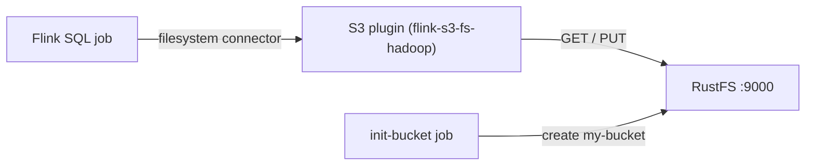

Ce guide connecte [Apache Flink](https://github.com/apache/flink) à **RustFS** via le plugin S3 filesystem de Flink (`flink-s3-fs-hadoop`). Vous allez démarrer un cluster de session avec Docker Compose, écrire un résultat borné dans le bucket en mode batch, puis le relire via Flink SQL. Le flux a été validé avec `flink:1.20` et `rustfs/rustfs-x86-musl:v2.3.1`.

Vous avez besoin de Docker avec le plugin Compose. Ce déploiement est destiné aux tests d'intégration locaux, pas à la production.

## Architecture



Le plugin `flink-s3-fs-hadoop` enregistre le schéma `s3://` pour le connecteur filesystem de Flink. Le point de terminaison, l'adressage path-style, HTTP simple et les identifiants sont configurés via les propriétés `s3.*` de `flink-conf.yaml` (passées par `FLINK_PROPERTIES`).

## 1. Créer les fichiers du projet

Créez un répertoire de travail :

```bash
mkdir rustfs-flink
cd rustfs-flink
```

Créez un fichier d'environnement et remplacez les deux espaces réservés d'identifiants :

```ini title=".env"
RUSTFS_ACCESS_KEY=<your-access-key>
RUSTFS_SECRET_KEY=<your-secret-key>
```

Utilisez des identifiants dédiés pour le bucket. Ne commettez pas `.env` dans le contrôle de version.

Le plugin S3 est embarqué dans l'image sous `/opt/flink/opt/` et doit être copié vers `/opt/flink/plugins/s3fs/` pour être chargé. Préparez un répertoire local :

```bash
mkdir -p s3fs
docker create --name flink-tmp flink:1.20
docker cp flink-tmp:/opt/flink/opt/flink-s3-fs-hadoop-1.20.5.jar s3fs/
docker rm flink-tmp
```

Créez le fichier Compose :

```yaml title="compose.yaml"
services:
  rustfs:
    image: rustfs/rustfs-x86-musl:v2.3.1
    environment:
      RUSTFS_ACCESS_KEY: ${RUSTFS_ACCESS_KEY}
      RUSTFS_SECRET_KEY: ${RUSTFS_SECRET_KEY}
      RUSTFS_VOLUMES: /data
      RUSTFS_ADDRESS: ":9000"
      RUSTFS_CONSOLE_ADDRESS: ":9001"
      RUSTFS_CONSOLE_ENABLE: "true"
    volumes:
      - rustfs-data:/data
    ports:
      - "9000:9000"
      - "9001:9001"
    healthcheck:
      test: ["CMD", "curl", "-sf", "http://127.0.0.1:9000/health"]
      interval: 10s
      timeout: 5s
      retries: 6
      start_period: 10s
    networks:
      - flink

  create-bucket:
    image: rustfs/rc:latest
    depends_on:
      rustfs:
        condition: service_healthy
    environment:
      RUSTFS_ACCESS_KEY: ${RUSTFS_ACCESS_KEY}
      RUSTFS_SECRET_KEY: ${RUSTFS_SECRET_KEY}
    entrypoint:
      - /bin/sh
      - -c
      - |
        until /usr/bin/rc alias set rustfs http://rustfs:9000 "$${RUSTFS_ACCESS_KEY}" "$${RUSTFS_SECRET_KEY}"; do
          echo "Waiting for RustFS..."
          sleep 2
        done
        /usr/bin/rc ls rustfs/my-bucket >/dev/null 2>&1 || /usr/bin/rc mb rustfs/my-bucket
    networks:
      - flink

  jobmanager:
    image: flink:1.20
    command: jobmanager
    environment:
      FLINK_PROPERTIES: |
        jobmanager.rpc.address: jobmanager
        rest.address: jobmanager
        rest.bind-address: 0.0.0.0
        s3.access-key: ${RUSTFS_ACCESS_KEY}
        s3.secret-key: ${RUSTFS_SECRET_KEY}
        s3.endpoint: http://rustfs:9000
        s3.path-style-access: true
    volumes:
      - ./s3fs:/opt/flink/plugins/s3fs:ro
    ports:
      - "8081:8081"
    depends_on:
      create-bucket:
        condition: service_completed_successfully
    networks:
      - flink

  taskmanager:
    image: flink:1.20
    command: taskmanager
    environment:
      FLINK_PROPERTIES: |
        jobmanager.rpc.address: jobmanager
        taskmanager.host: taskmanager
        s3.access-key: ${RUSTFS_ACCESS_KEY}
        s3.secret-key: ${RUSTFS_SECRET_KEY}
        s3.endpoint: http://rustfs:9000
        s3.path-style-access: true
    volumes:
      - ./s3fs:/opt/flink/plugins/s3fs:ro
    depends_on:
      jobmanager:
        condition: service_started
    networks:
      - flink

networks:
  flink:

volumes:
  rustfs-data:
```

Les propriétés `s3.access-key`, `s3.secret-key`, `s3.endpoint` et `s3.path-style-access` configurent le plugin S3 sur le JobManager et le TaskManager.

## 2. Démarrer le déploiement

Vérifiez le fichier Compose avant de démarrer les conteneurs :

```bash
docker compose config
```

Démarrez les services et attendez la fin de l'initialisation du bucket :

```bash
docker compose up -d
docker compose ps -a
```

## 3. Écrire un résultat dans RustFS

Créez le job SQL — mode batch avec le sink filesystem :

```yaml title="batch.sql"
SET 'execution.runtime-mode' = 'batch';

CREATE TABLE sink (
  id INT,
  payload STRING
) WITH (
  'connector' = 'filesystem',
  'path' = 's3://my-bucket/flink-out/',
  'format' = 'csv'
);

INSERT INTO sink
  VALUES (1, 'alpha'), (2, 'bravo'), (3, 'charlie'), (4, 'delta'), (5, 'echo');
```

Soumettez-le via le client SQL dans le JobManager :

```bash
docker compose exec jobmanager bash -c "/opt/flink/bin/sql-client.sh embedded -f /dev/stdin" < batch.sql
```

Le job se termine une fois toutes les lignes écrites.

## 4. Relire les données

Créez la requête de lecture — le connecteur filesystem scanne le préfixe :

```yaml title="read.sql"
CREATE TABLE readings (
  id INT,
  payload STRING
) WITH (
  'connector' = 'filesystem',
  'path' = 's3://my-bucket/flink-out/',
  'format' = 'csv'
);

SET 'sql-client.execution.result-mode' = 'TABLEAU';

SELECT * FROM readings;
```

```bash
docker compose exec jobmanager bash -c "/opt/flink/bin/sql-client.sh embedded -f /dev/stdin" < read.sql
```

```text
+----+-------------+--------------------------------+
| op |          id |                         payload |
+----+-------------+--------------------------------+
| +I |           1 |                           alpha |
| +I |           2 |                           bravo |
| +I |           3 |                         charlie |
| +I |           4 |                           delta |
| +I |           5 |                            echo |
+----+-------------+--------------------------------+
```

## 5. Vérifier les objets dans RustFS

Listez le préfixe via l'image d'initialisation du bucket :

```bash
docker compose run --rm --entrypoint /bin/sh create-bucket -c \
  '/usr/bin/rc alias set rustfs http://rustfs:9000 "$RUSTFS_ACCESS_KEY" "$RUSTFS_SECRET_KEY" >/dev/null && /usr/bin/rc ls rustfs/my-bucket/flink-out --recursive'
```

```text
[2026-09-21 01:34:52]       41 B flink-out/part-f759f9e8-3d1b-46a1-a92e-53e9b727e831-task-0-file-0
```

Vous pouvez également parcourir le préfixe dans la console RustFS :


## 6. Utiliser RustFS S3 Tables

RustFS S3 Tables fournit un catalogue REST Apache Iceberg intégré, permettant à Flink de traiter un table bucket comme un entrepôt Iceberg géré tandis que les données restent dans RustFS. Activez un table bucket et orientez le catalogue REST du connecteur Iceberg de Flink vers RustFS comme décrit dans [S3 Tables](/administration/data/s3-tables) : l'URI du catalogue REST est `http://<rustfs-host>:9000/iceberg`, le warehouse est le nom du bucket, et les requêtes de catalogue (AWS Signature Version 4, nom de signature `s3`) comme l'accès aux fichiers S3 utilisent l'adressage path-style.

Selon la matrice de support S3 Tables, validez les versions exactes de Flink et d'Iceberg que vous déployez par rapport au catalogue avant d'adopter ce chemin en production.

## 7. Arrêter ou réinitialiser la pile

Arrêtez les conteneurs en conservant le volume de données RustFS :

```bash
docker compose down
```

Pour supprimer les fichiers stockés et repartir d'un volume RustFS vide, ajoutez explicitement `--volumes` :

```bash
docker compose down --volumes
```

## Dépannage

### No AWS Credentials provided / AccessDenied lors des écritures

Le plugin S3 lit ses identifiants depuis les propriétés `s3.*` de `flink-conf.yaml`. Vérifiez que `s3.access-key`, `s3.secret-key`, `s3.endpoint` et `s3.path-style-access` sont présents dans `FLINK_PROPERTIES` pour **le** JobManager **et le** TaskManager, et que le jar du plugin existe dans `/opt/flink/plugins/s3fs/` sur chacun.

### Le TaskManager ne résout pas le nom `rustfs`

Tous les conteneurs Flink et RustFS doivent partager un réseau Compose. Si RustFS est attaché à un réseau externe, connectez également les conteneurs Flink à ce réseau avant de soumettre le job.

### Une écriture streaming échoue avec "Stream closed" après un échec

La reprise d'un upload S3 en cours après un échec peut laisser le writer dans un état irrécupérable. Supprimez le préfixe de sortie du job dans le bucket et soumettez à nouveau, ou utilisez le mode batch comme dans ce guide pour les écritures ponctuelles.

## Prochaines étapes

- Consultez les [notes de compatibilité S3](/administration/protocols/s3) avant d'adopter d'autres opérations S3.
- Créez des identifiants de production dédiés avec la [gestion des clés d'accès](/security-compliance/iam/access-token).
- Suivez la [documentation Apache Flink](https://nightlies.apache.org/flink/flink-docs-stable/) pour les options du connecteur filesystem telles que le partitionnement et la compaction.
