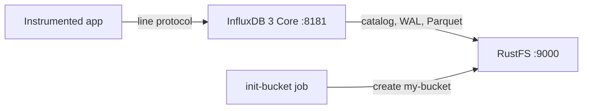
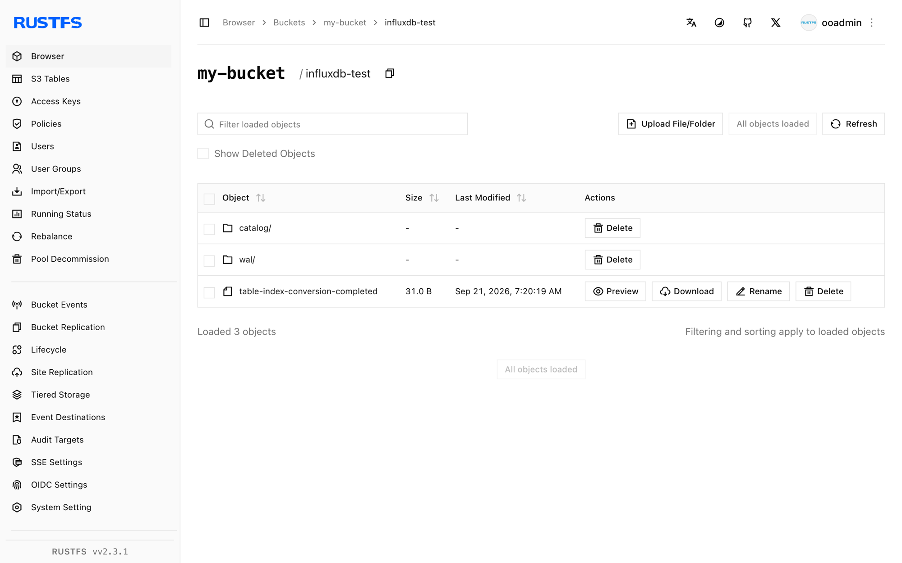

Ce guide exécute [InfluxDB](https://github.com/influxdata/influxdb) — plus précisément **InfluxDB 3 Core**, la base de données temporelle écrite en Rust avec un moteur de stockage Parquet — avec **RustFS** comme magasin d'objets. Vous allez démarrer InfluxDB avec Docker Compose, écrire du line protocol via l'API HTTP, l'interroger en SQL, vérifier les objets persistés dans RustFS et confirmer que les données survivent à un redémarrage d'InfluxDB. Le flux a été validé avec `influxdb:3-core` (v3.11.5) et `rustfs/rustfs-x86-musl:v2.3.1`.

Vous avez besoin de Docker avec le plugin Compose. Ce déploiement est destiné aux tests d'intégration locaux, pas à la production.

## Architecture



InfluxDB 3 Core conserve son catalogue, son journal d'écriture anticipée (WAL) et ses fichiers de données Parquet dans le magasin d'objets configuré. Les écritures arrivent d'abord dans le WAL et sont persistées vers RustFS, de sorte que chaque écriture survit à un redémarrage avant même que la compaction ne produise des fichiers Parquet. Le serveur utilise par défaut un adressage path-style vers le point de terminaison configuré.

## 1. Créer les fichiers du projet

Créez un répertoire de travail :

```bash
mkdir rustfs-influxdb
cd rustfs-influxdb
```

Créez un fichier d'environnement et remplacez les deux espaces réservés d'identifiants :

```ini title=".env"
RUSTFS_ACCESS_KEY=<your-access-key>
RUSTFS_SECRET_KEY=<your-secret-key>
```

Utilisez des identifiants dédiés pour le bucket. Ne commettez pas `.env` dans le contrôle de version.

Créez le fichier Compose :

```yaml title="compose.yaml"
services:
  rustfs:
    image: rustfs/rustfs-x86-musl:v2.3.1
    environment:
      RUSTFS_ACCESS_KEY: ${RUSTFS_ACCESS_KEY}
      RUSTFS_SECRET_KEY: ${RUSTFS_SECRET_KEY}
      RUSTFS_VOLUMES: /data
      RUSTFS_ADDRESS: ":9000"
      RUSTFS_CONSOLE_ADDRESS: ":9001"
      RUSTFS_CONSOLE_ENABLE: "true"
    volumes:
      - rustfs-data:/data
    ports:
      - "9000:9000"
      - "9001:9001"
    healthcheck:
      test: ["CMD", "curl", "-sf", "http://127.0.0.1:9000/health"]
      interval: 10s
      timeout: 5s
      retries: 6
      start_period: 10s
    networks:
      - influxdb

  create-bucket:
    image: rustfs/rc:latest
    depends_on:
      rustfs:
        condition: service_healthy
    environment:
      RUSTFS_ACCESS_KEY: ${RUSTFS_ACCESS_KEY}
      RUSTFS_SECRET_KEY: ${RUSTFS_SECRET_KEY}
    entrypoint:
      - /bin/sh
      - -c
      - |
        until /usr/bin/rc alias set rustfs http://rustfs:9000 "$${RUSTFS_ACCESS_KEY}" "$${RUSTFS_SECRET_KEY}"; do
          echo "Waiting for RustFS..."
          sleep 2
        done
        /usr/bin/rc ls rustfs/my-bucket >/dev/null 2>&1 || /usr/bin/rc mb rustfs/my-bucket
    networks:
      - influxdb

  influxdb:
    image: influxdb:3-core
    command:
      - serve
      - --node-id
      - influxdb-demo
      - --object-store
      - s3
      - --bucket
      - my-bucket
      - --aws-endpoint
      - http://rustfs:9000
      - --aws-access-key-id
      - ${RUSTFS_ACCESS_KEY}
      - --aws-secret-access-key
      - ${RUSTFS_SECRET_KEY}
      - --aws-allow-http
    ports:
      - "8181:8181"
    depends_on:
      create-bucket:
        condition: service_completed_successfully
    networks:
      - influxdb

networks:
  influxdb:

volumes:
  rustfs-data:
```

`--object-store s3` avec `--aws-endpoint` route toutes les écritures de catalogue, de WAL et de Parquet vers RustFS. InfluxDB utilise par défaut un adressage path-style vers le point de terminaison, et `--aws-allow-http` autorise HTTP simple à l'intérieur du réseau Compose.

## 2. Démarrer le déploiement

Vérifiez le fichier Compose avant de démarrer les conteneurs :

```bash
docker compose config
```

Démarrez les services et attendez la fin de l'initialisation du bucket :

```bash
docker compose up -d
docker compose ps -a
```

## 3. Créer le token d'administration

InfluxDB 3 Core protège chaque requête API avec un token porteur. Créez le token d'administration une fois après le premier démarrage et conservez la valeur affichée :

```bash
docker compose exec influxdb3 influxdb3 create token --admin
```

```text
Token: <your-admin-token>
```

:::note[Création du token]

La valeur du token n'est affichée qu'une seule fois et ne peut pas être récupérée ultérieurement. Si le nom du token existe déjà (HTTP 409), le nœud possède des métadonnées — repartez d'un préfixe de bucket neuf ou supprimez le préfixe du nœud dans le bucket avant de réessayer.

:::

## 4. Écrire du line protocol

Envoyez un lot de mesures CPU en line protocol vers la base `rustfs_demo` :

```bash
python3 - <<'PY'
import time, urllib.request

token = "<your-admin-token>"
now_ns = int(time.time() * 1e9)
lines = []
for i in range(30):
    ts = now_ns - i * 1_000_000_000
    lines.append(f"cpu_usage,host=az-server,region=us-east-1 usage={60 + i % 30}.{i % 10} {ts}")

req = urllib.request.Request(
    "http://localhost:8181/api/v3/write_lp?db=rustfs_demo",
    data="\n".join(lines).encode(),
    headers={"Content-Type": "text/plain", "Authorization": f"Bearer {token}"},
    method="POST",
)
with urllib.request.urlopen(req, timeout=30) as r:
    print("write:", r.status)
PY
```

```text
write: 204
```

## 5. Interroger en SQL

Interrogez la mesure via l'API SQL :

```bash
curl -sG "http://localhost:8181/api/v3/query_sql" \
  --data-urlencode "db=rustfs_demo" \
  --data-urlencode "format=json" \
  --data-urlencode "q=SELECT count(*) AS cnt FROM cpu_usage" \
  -H "Authorization: Bearer <your-admin-token>"
```

```text
[{"cnt":30}]
```

## 6. Vérifier les objets dans RustFS

Listez le préfixe du nœud via l'image d'initialisation du bucket :

```bash
docker compose run --rm --entrypoint /bin/sh create-bucket -c \
  '/usr/bin/rc alias set rustfs http://rustfs:9000 "$RUSTFS_ACCESS_KEY" "$RUSTFS_SECRET_KEY" >/dev/null && /usr/bin/rc ls rustfs/my-bucket/influxdb-demo --recursive'
```

Le catalogue, le WAL et ensuite les fichiers de données Parquet résident sous le préfixe identifiant le nœud :

```text
[2026-09-20 23:18:28]      105 B influxdb-demo/catalog/v3/snapshot
[2026-09-20 23:20:54]     1.45 KiB influxdb-demo/wal/00000000001.wal
[2026-09-20 23:20:19]       31 B influxdb-demo/table-index-conversion-completed
```

Vous pouvez également parcourir le préfixe dans la console RustFS :



## 7. Confirmer la persistance après un redémarrage

Redémarrez InfluxDB et répétez la requête SQL :

```bash
docker compose restart influxdb
curl -sG "http://localhost:8181/api/v3/query_sql" \
  --data-urlencode "db=rustfs_demo" \
  --data-urlencode "format=json" \
  --data-urlencode "q=SELECT count(*) AS cnt FROM cpu_usage" \
  -H "Authorization: Bearer <your-admin-token>"
```

```text
[{"cnt":30}]
```

Le compteur est inchangé car le catalogue et le WAL ont été rejoués depuis RustFS — le magasin d'objets est la couche de persistance, exactement comme dans les topologies de production.

## 8. Arrêter ou réinitialiser la pile

Arrêtez les conteneurs en conservant le volume de données RustFS :

```bash
docker compose down
```

Pour supprimer les données stockées et repartir d'un volume RustFS vide, ajoutez explicitement `--volumes` :

```bash
docker compose down --volumes
```

## Dépannage

### "the request was not authenticated" sur chaque requête

InfluxDB 3 Core exige le token porteur d'administration sur les requêtes API. Créez-le une fois avec `influxdb3 create token --admin` et envoyez-le sous la forme `Authorization: Bearer <token>`.

### "token name already exists" lors de la création du token d'administration

Le nœud possède déjà un token d'administration, et la valeur ne peut pas être récupérée. Supprimez le préfixe du nœud dans le bucket (par exemple `influxdb-demo/`) pendant que le conteneur est arrêté, redémarrez-le, puis créez un nouveau token.

### Réponses AccessDenied ou 403

Vérifiez que les identifiants du fichier Compose correspondent aux identifiants RustFS et que la tâche `create-bucket` s'est terminée avec succès :

```bash
docker compose logs create-bucket
```

### Erreurs de connexion ou de certificat

`--aws-endpoint` prend une URL complète ; `--aws-allow-http` autorise HTTP simple pour le point de terminaison du réseau de conteneurs. À l'intérieur du réseau Compose, utilisez `http://rustfs:9000` ; depuis l'hôte, `http://localhost:9000`.

## Prochaines étapes

- Consultez les [notes de compatibilité S3](/administration/protocols/s3) avant d'adopter d'autres opérations S3.
- Créez des identifiants de production dédiés avec la [gestion des clés d'accès](/security-compliance/iam/access-token).
- Suivez la [documentation InfluxDB 3 Core](https://docs.influxdata.com/influxdb3/core/) pour connecter telegraf ou les API d'écriture comme producteurs de données.
