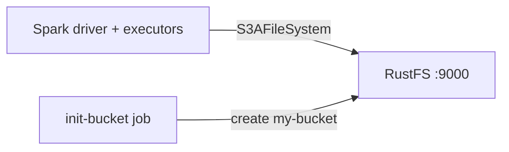
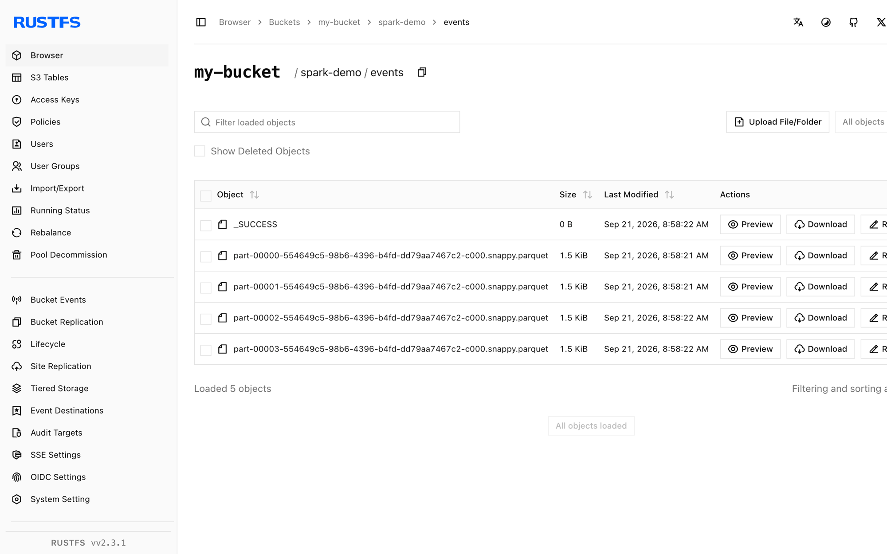

Ce guide connecte [Apache Spark](https://github.com/apache/spark) à **RustFS** via le connecteur `s3a`. Vous allez démarrer RustFS avec Docker Compose, exécuter un job Spark qui écrit un dataset Parquet dans le bucket, le relire, puis vérifier les objets dans RustFS. Le flux a été validé avec `apache/spark:3.5.6` (Hadoop 3.3.4 via `hadoop-aws`) et `rustfs/rustfs-x86-musl:v2.3.1`.

Vous avez besoin de Docker avec le plugin Compose. Ce déploiement est destiné aux tests d'intégration locaux, pas à la production.

## Architecture



Spark communique avec RustFS via le système de fichiers S3A de `hadoop-aws`. Les réglages du connecteur — point de terminaison, adressage path-style, HTTP simple et identifiants — sont passés en propriétés `spark.hadoop.fs.s3a.*`.

## 1. Créer les fichiers du projet

Créez un répertoire de travail :

```bash
mkdir rustfs-spark
cd rustfs-spark
```

Créez un fichier d'environnement et remplacez les deux espaces réservés d'identifiants :

```ini title=".env"
RUSTFS_ACCESS_KEY=<your-access-key>
RUSTFS_SECRET_KEY=<your-secret-key>
```

Utilisez des identifiants dédiés pour le bucket. Ne commettez pas `.env` dans le contrôle de version.

Créez le job Spark :

```python title="job.py"
from pyspark.sql import SparkSession

spark = SparkSession.builder.appName("rustfs-spark-demo").getOrCreate()
spark.sparkContext.setLogLevel("WARN")

spark.range(1000).withColumnRenamed("id", "num") \
    .write.mode("overwrite").parquet("s3a://my-bucket/spark-demo/events")

back = spark.read.parquet("s3a://my-bucket/spark-demo/events")
print("ROWS_READ_BACK:", back.count())
spark.stop()
```

Créez le fichier Compose :

```yaml title="compose.yaml"
services:
  rustfs:
    image: rustfs/rustfs-x86-musl:v2.3.1
    environment:
      RUSTFS_ACCESS_KEY: ${RUSTFS_ACCESS_KEY}
      RUSTFS_SECRET_KEY: ${RUSTFS_SECRET_KEY}
      RUSTFS_VOLUMES: /data
      RUSTFS_ADDRESS: ":9000"
      RUSTFS_CONSOLE_ADDRESS: ":9001"
      RUSTFS_CONSOLE_ENABLE: "true"
    volumes:
      - rustfs-data:/data
    ports:
      - "9000:9000"
      - "9001:9001"
    healthcheck:
      test: ["CMD", "curl", "-sf", "http://127.0.0.1:9000/health"]
      interval: 10s
      timeout: 5s
      retries: 6
      start_period: 10s
    networks:
      - warehouse

  create-bucket:
    image: rustfs/rc:latest
    depends_on:
      rustfs:
        condition: service_healthy
    environment:
      RUSTFS_ACCESS_KEY: ${RUSTFS_ACCESS_KEY}
      RUSTFS_SECRET_KEY: ${RUSTFS_SECRET_KEY}
    entrypoint:
      - /bin/sh
      - -c
      - |
        until /usr/bin/rc alias set rustfs http://rustfs:9000 "$${RUSTFS_ACCESS_KEY}" "$${RUSTFS_SECRET_KEY}"; do
          echo "Waiting for RustFS..."
          sleep 2
        done
        /usr/bin/rc ls rustfs/my-bucket >/dev/null 2>&1 || /usr/bin/rc mb rustfs/my-bucket
    networks:
      - warehouse

  spark:
    image: apache/spark:3.5.6
    entrypoint: ["/opt/spark/bin/spark-submit"]
    volumes:
      - ./job.py:/job.py:ro
    command:
      - --conf
      - spark.jars.ivy=/tmp/.ivy2
      - --packages
      - org.apache.hadoop:hadoop-aws:3.3.4
      - --conf
      - spark.hadoop.fs.s3a.endpoint=http://rustfs:9000
      - --conf
      - spark.hadoop.fs.s3a.access.key=${RUSTFS_ACCESS_KEY}
      - --conf
      - spark.hadoop.fs.s3a.secret.key=${RUSTFS_SECRET_KEY}
      - --conf
      - spark.hadoop.fs.s3a.path.style.access=true
      - --conf
      - spark.hadoop.fs.s3a.connection.ssl.enabled=false
      - --conf
      - spark.hadoop.fs.s3a.impl=org.apache.hadoop.fs.s3a.S3AFileSystem
      - /job.py
    depends_on:
      create-bucket:
        condition: service_completed_successfully
    networks:
      - warehouse

networks:
  warehouse:

volumes:
  rustfs-data:
```

`--packages org.apache.hadoop:hadoop-aws:3.3.4` télécharge le connecteur S3 au lancement ; il doit correspondre à la version de Hadoop embarquée dans l'image Spark. `spark.jars.ivy=/tmp/.ivy2` déplace le cache de téléchargement vers un répertoire inscriptible.

## 2. Démarrer le stockage et exécuter le job

Démarrez les services de stockage :

```bash
docker compose up -d
docker compose ps -a
```

Exécutez le job Spark :

```bash
docker compose run --rm spark
```

```text
ROWS_READ_BACK: 1000
```

## 3. Vérifier les objets dans RustFS

Listez le dataset via l'image d'initialisation du bucket :

```bash
docker compose run --rm --entrypoint /bin/sh create-bucket -c \
  '/usr/bin/rc alias set rustfs http://rustfs:9000 "$RUSTFS_ACCESS_KEY" "$RUSTFS_SECRET_KEY" >/dev/null && /usr/bin/rc ls rustfs/my-bucket/spark-demo --recursive'
```

```text
[2026-09-21 00:58:22]        0 B spark-demo/events/_SUCCESS
[2026-09-21 00:58:21]   1.46 KiB spark-demo/events/part-00000-...-c000.snappy.parquet
[2026-09-21 00:58:21]   1.46 KiB spark-demo/events/part-00001-...-c000.snappy.parquet
[2026-09-21 00:58:21]   1.46 KiB spark-demo/events/part-00002-...-c000.snappy.parquet
```

Vous pouvez également parcourir le préfixe dans la console RustFS :



## 4. Utiliser RustFS S3 Tables

RustFS S3 Tables fournit un catalogue REST Apache Iceberg intégré, permettant à Spark de traiter un table bucket comme un entrepôt Iceberg géré tandis que les données restent dans RustFS. Activez un table bucket et connectez le catalogue REST Iceberg de Spark comme décrit dans [S3 Tables](/administration/data/s3-tables) : l'URI du catalogue REST est `http://<rustfs-host>:9000/iceberg`, le warehouse est le nom du bucket, et les requêtes de catalogue (AWS Signature Version 4, nom de signature `s3`) comme l'accès aux fichiers S3 utilisent l'adressage path-style.

Selon la matrice de support S3 Tables, validez les versions exactes de Spark et d'Iceberg que vous déployez par rapport au catalogue avant d'adopter ce chemin en production.

## 5. Arrêter ou réinitialiser la pile

Arrêtez les conteneurs en conservant le volume de données RustFS :

```bash
docker compose down
```

Pour supprimer le dataset et repartir d'un volume RustFS vide, ajoutez explicitement `--volumes` :

```bash
docker compose down --volumes
```

## Dépannage

### NumberFormatException: For input string: "60s"

La version de `hadoop-aws` ne correspond pas à la version de Hadoop embarquée dans l'image Spark. Les images Spark 4.x nécessitent `hadoop-aws` 3.4.x ; ce guide épingle `apache/spark:3.5.6` avec `hadoop-aws:3.3.4`.

### Échecs de connexion à `rustfs:9000`

`fs.s3a.endpoint` est résolu à l'intérieur du réseau Compose. Pour un processus Spark exécuté sur l'hôte, utilisez `http://localhost:9000`.

### Réponses AccessDenied ou 403

Vérifiez que les réglages du connecteur correspondent aux identifiants RustFS et que la tâche `create-bucket` s'est terminée avec succès :

```bash
docker compose logs create-bucket
```

## Prochaines étapes

- Consultez les [notes de compatibilité S3](/administration/protocols/s3) avant d'adopter d'autres opérations S3.
- Créez des identifiants de production dédiés avec la [gestion des clés d'accès](/security-compliance/iam/access-token).
- Suivez la [documentation Spark](https://spark.apache.org/docs/latest/) pour le structured streaming et les options de sources de données.
