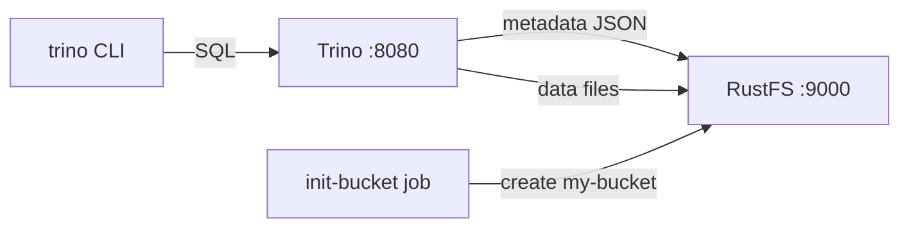

Ce guide connecte [Trino](https://github.com/trinodb/trino) — le moteur de requêtes SQL distribué — à **RustFS** via le connecteur hive avec son metastore basé sur les fichiers et le système de fichiers S3 natif. Vous allez créer un schéma et une table, insérer des lignes, les relire, puis vérifier les objets dans RustFS. Les métadonnées et les fichiers de données résident tous deux dans RustFS. Le flux a été validé avec `trinodb/trino:435` et `rustfs/rustfs-x86-musl:v2.3.1`.

Vous avez besoin de Docker avec le plugin Compose. Ce déploiement est destiné aux tests d'intégration locaux, pas à la production.

## Architecture



Le connecteur hive avec `hive.metastore=file` conserve les métadonnées de schémas et de tables sous forme d'objets JSON sous le répertoire du catalogue, et le système de fichiers S3 natif (`fs.s3.enabled`) stocke les métadonnées et les données dans RustFS avec un adressage path-style en HTTP simple.

## 1. Créer les fichiers du projet

Créez un répertoire de travail :

```bash
mkdir rustfs-trino
cd rustfs-trino
```

Créez un fichier d'environnement et remplacez les deux espaces réservés d'identifiants :

```ini title=".env"
RUSTFS_ACCESS_KEY=<your-access-key>
RUSTFS_SECRET_KEY=<your-secret-key>
```

Utilisez des identifiants dédiés pour le bucket. Ne commettez pas `.env` dans le contrôle de version.

Créez la configuration du catalogue pour Trino :

```ini title="hive.properties"
connector.name=hive
hive.metastore=file
hive.metastore.catalog.dir=s3://my-bucket/trino-metastore
fs.s3.enabled=true
s3.endpoint=http://rustfs:9000
s3.region=us-east-1
s3.path-style-access=true
s3.aws-access-key=<your-access-key>
s3.aws-secret-key=<your-secret-key>
```

`hive.metastore.catalog.dir` pointe le file metastore dans le bucket : métadonnées et données résident donc dans RustFS. `fs.s3.enabled` active le système de fichiers S3 natif ; `s3.path-style-access` est requis pour le point de terminaison du réseau de conteneurs.

Créez le fichier Compose :

```yaml title="compose.yaml"
services:
  rustfs:
    image: rustfs/rustfs-x86-musl:v2.3.1
    environment:
      RUSTFS_ACCESS_KEY: ${RUSTFS_ACCESS_KEY}
      RUSTFS_SECRET_KEY: ${RUSTFS_SECRET_KEY}
      RUSTFS_VOLUMES: /data
      RUSTFS_ADDRESS: ":9000"
      RUSTFS_CONSOLE_ADDRESS: ":9001"
      RUSTFS_CONSOLE_ENABLE: "true"
    volumes:
      - rustfs-data:/data
    ports:
      - "9000:9000"
      - "9001:9001"
    healthcheck:
      test: ["CMD", "curl", "-sf", "http://127.0.0.1:9000/health"]
      interval: 10s
      timeout: 5s
      retries: 6
      start_period: 10s
    networks:
      - warehouse

  create-bucket:
    image: rustfs/rc:latest
    depends_on:
      rustfs:
        condition: service_healthy
    environment:
      RUSTFS_ACCESS_KEY: ${RUSTFS_ACCESS_KEY}
      RUSTFS_SECRET_KEY: ${RUSTFS_SECRET_KEY}
    entrypoint:
      - /bin/sh
      - -c
      - |
        until /usr/bin/rc alias set rustfs http://rustfs:9000 "$${RUSTFS_ACCESS_KEY}" "$${RUSTFS_SECRET_KEY}"; do
          echo "Waiting for RustFS..."
          sleep 2
        done
        /usr/bin/rc ls rustfs/my-bucket >/dev/null 2>&1 || /usr/bin/rc mb rustfs/my-bucket
    networks:
      - warehouse

  trino:
    image: trinodb/trino:435
    volumes:
      - ./hive.properties:/etc/trino/catalog/hive.properties:ro
      - metastore-data:/data/metastore
    depends_on:
      create-bucket:
        condition: service_completed_successfully
    networks:
      - warehouse

networks:
  warehouse:

volumes:
  rustfs-data:
  metastore-data:
```

## 2. Démarrer le déploiement

Vérifiez le fichier Compose avant de démarrer les conteneurs :

```bash
docker compose config
```

Démarrez les services et attendez la fin de l'initialisation du bucket :

```bash
docker compose up -d
docker compose ps -a
```

Trino est démarré quand le journal du serveur indique `SERVER STARTED`. Le conteneur s'exécute sous l'utilisateur `trino` (uid 1000) ; assurez-vous que le volume du metastore est inscriptible :

```bash
docker compose exec trino id
docker compose exec trino ls -la /data/metastore
```

## 3. Créer un schéma et une table

Créez le schéma sans location explicite — Trino le place sous le répertoire du catalogue dans RustFS :

```bash
docker compose exec trino trino --execute \
  "CREATE SCHEMA hive.demo"
```

Créez une table et insérez cinq lignes :

```bash
docker compose exec trino trino --execute \
  "CREATE TABLE hive.demo.events (id bigint, label varchar) WITH (format = 'parquet')"

docker compose exec trino trino --execute \
  "INSERT INTO hive.demo.events VALUES (1,'alpha'),(2,'bravo'),(3,'charlie'),(4,'delta'),(5,'echo')"
```

```text
INSERT: 5 rows
```

## 4. Interroger les données

Relisez les lignes :

```bash
docker compose exec trino trino --execute \
  "SELECT * FROM hive.demo.events ORDER BY id"
```

```text
"1","alpha"
"2","bravo"
"3","charlie"
"4","delta"
"5","echo"
```

## 5. Vérifier les objets dans RustFS

Listez le préfixe du metastore via l'image d'initialisation du bucket :

```bash
docker compose run --rm --entrypoint /bin/sh create-bucket -c \
  '/usr/bin/rc alias set rustfs http://rustfs:9000 "$RUSTFS_ACCESS_KEY" "$RUSTFS_SECRET_KEY" >/dev/null && /usr/bin/rc ls rustfs/my-bucket/trino-metastore --recursive'
```

```text
[2026-09-21 01:55:16]      155 B trino-metastore/.demo.trinoSchema
[2026-09-21 01:55:19]      474 B trino-metastore/demo/events/.trinoPermissions/user_trino
[2026-09-21 01:55:25]     1007 B trino-metastore/demo/events/.trinoSchema
[2026-09-21 01:55:25]      432 B trino-metastore/demo/events/20260921_..._cb761cec-...parquet
```

Vous pouvez également parcourir le préfixe dans la console RustFS :


## 6. Utiliser RustFS S3 Tables

RustFS S3 Tables fournit un catalogue REST Apache Iceberg intégré, permettant à Trino de traiter un table bucket comme un entrepôt Iceberg géré tandis que les données restent dans RustFS. Activez un table bucket et connectez le connecteur Iceberg de Trino au catalogue REST comme décrit dans [S3 Tables](/administration/data/s3-tables) : l'URI du catalogue REST est `http://<rustfs-host>:9000/iceberg`, le warehouse est le nom du bucket, et les requêtes de catalogue (AWS Signature Version 4, nom de signature `s3`) comme l'accès aux fichiers S3 utilisent l'adressage path-style.

Selon la matrice de support S3 Tables, Trino a fait l'objet d'une sonde en lecture seule contre le catalogue ; validez la compatibilité en écriture et la version exacte de Trino que vous déployez avant d'adopter ce chemin en production.

## 7. Arrêter ou réinitialiser la pile

Arrêtez les conteneurs en conservant le volume de données RustFS :

```bash
docker compose down
```

Pour supprimer les métadonnées et données stockées et repartir d'un volume RustFS vide, ajoutez explicitement `--volumes` :

```bash
docker compose down --volumes
```

## Dépannage

### Erreurs de configuration pour `fs.native-s3.enabled` ou `fs.s3.enabled`

Le nom de la propriété du système de fichiers S3 natif a changé selon les versions de Trino : Trino 435 utilise `fs.native-s3.enabled`, les versions plus récentes `fs.s3.enabled`. Ce guide épingle `trinodb/trino:435`, utilisez donc `fs.native-s3.enabled`.

### "Table directory must be ..." lors de la création d'une table

Avec le file metastore, les locations de tables doivent rester sous `hive.metastore.catalog.dir`. Créez le schéma sans location explicite, ou pointez la location du schéma vers un répertoire du même préfixe de bucket.

### Hive CSV storage format only supports VARCHAR

Le format CSV rejette les colonnes non textuelles. Utilisez `format = 'parquet'` pour les tables typées, comme dans ce guide.

### Réponses AccessDenied ou 403

Vérifiez que les identifiants de `hive.properties` correspondent aux identifiants RustFS et que la tâche `create-bucket` s'est terminée avec succès :

```bash
docker compose logs create-bucket
```

## Prochaines étapes

- Consultez les [notes de compatibilité S3](/administration/protocols/s3) avant d'adopter d'autres opérations S3.
- Créez des identifiants de production dédiés avec la [gestion des clés d'accès](/security-compliance/iam/access-token).
- Suivez la [documentation Trino](https://trino.io/docs/current/) pour connecter des outils BI et ajouter des catalogues de stockage objet.
