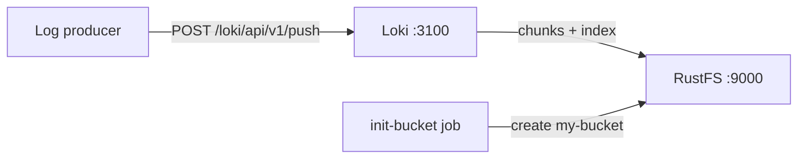

Ce guide exécute [Grafana Loki](https://github.com/grafana/loki) — le système d'agrégation de journaux de Grafana Labs — avec **RustFS** comme backend de stockage objet. Vous allez démarrer un Loki single-binary avec Docker Compose, pousser des flux de journaux via l'API HTTP, les interroger, puis vérifier que les chunks de journaux sont stockés comme objets dans RustFS. Le flux a été validé avec `grafana/loki:latest` (v3.7.8) et `rustfs/rustfs-x86-musl:v2.3.1`.

Vous avez besoin de Docker avec le plugin Compose. Ce déploiement est destiné aux tests d'intégration locaux, pas à la production.

## Architecture



Loki ingère les flux de journaux dans un chunk en mémoire et un journal d'écriture anticipée, transfère les chunks compressés vers le stockage objet dès qu'un flux devient inactif, et envoie les fichiers d'index TSDB vers le même bucket. Les requêtes localisent les chunks via l'index et les lisent depuis le stockage objet.

## 1. Créer les fichiers du projet

Créez un répertoire de travail :

```bash
mkdir rustfs-loki
cd rustfs-loki
```

Créez un fichier d'environnement et remplacez les deux espaces réservés d'identifiants :

```ini title=".env"
RUSTFS_ACCESS_KEY=<your-access-key>
RUSTFS_SECRET_KEY=<your-secret-key>
```

Utilisez des identifiants dédiés pour le bucket. Ne commettez pas `.env` dans le contrôle de version.

Créez la configuration Loki — un déploiement single-binary avec le schéma TSDB et le backend S3 pointant vers RustFS :

```yaml title="loki.yml"
auth_enabled: false

server:
  http_listen_port: 3100

common:
  instance_addr: 127.0.0.1
  path_prefix: /loki
  storage:
    s3:
      endpoint: rustfs:9000
      insecure: true
      bucketnames: my-bucket
      access_key_id: ${RUSTFS_ACCESS_KEY}
      secret_access_key: ${RUSTFS_SECRET_KEY}
      s3forcepathstyle: true
  replication_factor: 1
  ring:
    kvstore:
      store: inmemory

schema_config:
  configs:
    - from: 2020-10-24
      store: tsdb
      object_store: s3
      schema: v13
      index:
        prefix: index_
        period: 24h

ingester:
  chunk_idle_period: 30s
  max_chunk_age: 1m

ruler:
  alertmanager_url: http://localhost:9093
```

`s3forcepathstyle: true` et `insecure: true` sélectionnent l'adressage path-style en HTTP simple, attendu par RustFS pour le point de terminaison du réseau de conteneurs. `chunk_idle_period` et `max_chunk_age` sont réduits pour qu'une exécution de vérification n'attende pas les 30 minutes par défaut avant le transfert des chunks.

Créez le fichier Compose :

```yaml title="compose.yaml"
services:
  rustfs:
    image: rustfs/rustfs-x86-musl:v2.3.1
    environment:
      RUSTFS_ACCESS_KEY: ${RUSTFS_ACCESS_KEY}
      RUSTFS_SECRET_KEY: ${RUSTFS_SECRET_KEY}
      RUSTFS_VOLUMES: /data
      RUSTFS_ADDRESS: ":9000"
      RUSTFS_CONSOLE_ADDRESS: ":9001"
      RUSTFS_CONSOLE_ENABLE: "true"
    volumes:
      - rustfs-data:/data
    ports:
      - "9000:9000"
      - "9001:9001"
    healthcheck:
      test: ["CMD", "curl", "-sf", "http://127.0.0.1:9000/health"]
      interval: 10s
      timeout: 5s
      retries: 6
      start_period: 10s
    networks:
      - loki

  create-bucket:
    image: rustfs/rc:latest
    depends_on:
      rustfs:
        condition: service_healthy
    environment:
      RUSTFS_ACCESS_KEY: ${RUSTFS_ACCESS_KEY}
      RUSTFS_SECRET_KEY: ${RUSTFS_SECRET_KEY}
    entrypoint:
      - /bin/sh
      - -c
      - |
        until /usr/bin/rc alias set rustfs http://rustfs:9000 "$${RUSTFS_ACCESS_KEY}" "$${RUSTFS_SECRET_KEY}"; do
          echo "Waiting for RustFS..."
          sleep 2
        done
        /usr/bin/rc ls rustfs/my-bucket >/dev/null 2>&1 || /usr/bin/rc mb rustfs/my-bucket
    networks:
      - loki

  loki:
    image: grafana/loki:latest
    command: -config.file=/etc/loki/loki-config.yml
    volumes:
      - ./loki.yml:/etc/loki/loki-config.yml:ro
    ports:
      - "3100:3100"
    depends_on:
      create-bucket:
        condition: service_completed_successfully
    networks:
      - loki

networks:
  loki:

volumes:
  rustfs-data:
```

## 2. Démarrer le déploiement

Vérifiez le fichier Compose avant de démarrer les conteneurs :

```bash
docker compose config
```

Démarrez les services et attendez la fin de l'initialisation du bucket :

```bash
docker compose up -d
docker compose ps -a
```

Loki est prêt quand le point de terminaison de readiness répond :

```bash
curl -s http://localhost:3100/ready
```

```text
ready
```

## 3. Pousser des flux de journaux

Envoyez un lot d'entrées de journaux via l'API de push :

```bash
python3 - <<'PY'
import json, time, urllib.request

values = []
base_ns = int(time.time() * 1e9)
for i in range(20):
    values.append([
        str(base_ns - i * 1_000_000_000),
        f"[rustfs-loki-integration] log line {i} stored in RustFS object storage",
    ])

payload = {
    "streams": [{
        "stream": {"job": "rustfs-demo", "service": "loki-integration"},
        "values": values,
    }]
}

req = urllib.request.Request(
    "http://localhost:3100/loki/api/v1/push",
    data=json.dumps(payload).encode(),
    headers={"Content-Type": "application/json"},
    method="POST",
)
with urllib.request.urlopen(req, timeout=30) as r:
    print("push:", r.status)
PY
```

```text
push: 204
```

## 4. Interroger les journaux

Interrogez le flux via l'API de requête par plage :

```bash
curl -sG "http://localhost:3100/loki/api/v1/query_range" \
  --data-urlencode 'query={job="rustfs-demo"}' \
  --data-urlencode "start=$(($(date +%s) - 3600))000000000" \
  --data-urlencode "end=$(($(date +%s) + 60))000000000" \
  | python3 -m json.tool | head -20
```

La réponse contient les lignes poussées :

```text
"values": [
    [
      "1789916564000000000",
      "[rustfs-loki-integration] log line 0 stored in RustFS object storage"
    ],
```

## 5. Vérifier les chunks dans RustFS

Avec `chunk_idle_period: 30s`, l'ingester transfère le flux vers le stockage objet environ une minute après la dernière ligne. Listez le préfixe du tenant via l'image d'initialisation du bucket :

```bash
docker compose run --rm --entrypoint /bin/sh create-bucket -c \
  '/usr/bin/rc alias set rustfs http://rustfs:9000 "$RUSTFS_ACCESS_KEY" "$RUSTFS_SECRET_KEY" >/dev/null && /usr/bin/rc ls rustfs/my-bucket/fake --recursive'
```

`fake` est le tenant utilisé par Loki quand `auth_enabled` vaut `false` ; chaque objet est un chunk de journal compressé :

```text
[2026-09-20 14:48:57]      398 B fake/51610c9b43452db8/1a0bf49f028:1a0bf49f028:f0ed52f7
[2026-09-20 14:49:33]      670 B fake/cd916b27d004a688/1a0bf4a03ca:1a0bf4a4e03:1376b308
```

Vous pouvez également parcourir le préfixe dans la console RustFS :


## 6. Arrêter ou réinitialiser la pile

Arrêtez les conteneurs en conservant le volume de données RustFS :

```bash
docker compose down
```

Pour supprimer les journaux stockés et repartir d'un volume RustFS vide, ajoutez explicitement `--volumes` :

```bash
docker compose down --volumes
```

## Dépannage

### Loki bride les écritures et signale "disk usage exceeded threshold"

Loki surveille le disque qui héberge son journal d'écriture anticipée et bride l'ingester lorsque l'utilisation dépasse 90 pour cent. Assurez-vous que le volume derrière `path_prefix` dispose de suffisamment d'espace libre, ou exécutez le conteneur avec un tmpfs pour le WAL lorsque la machine est par ailleurs saine.

### L'anneau signale des erreurs de connexion au port 8500

Le magasin clé-valeur par défaut de l'anneau est Consul. Pour un single-binary, définissez `common.ring.kvstore.store: inmemory`, comme montré dans la configuration ci-dessus.

### Les requêtes de push échouent avec "Ingester is shutting down"

L'ingester n'a jamais atteint un état en cours d'exécution — généralement un conteneur restant d'un démarrage antérieur en échec. Supprimez le conteneur avec `docker compose down` et redémarrez-le, ou consultez les journaux pour identifier l'erreur de stockage sous-jacente.

### Réponses AccessDenied ou 403

Vérifiez que les identifiants de `loki.yml` correspondent aux identifiants RustFS et que la tâche `create-bucket` s'est terminée avec succès :

```bash
docker compose logs create-bucket
```

## Prochaines étapes

- Consultez les [notes de compatibilité S3](/administration/protocols/s3) avant d'adopter d'autres opérations S3.
- Créez des identifiants de production dédiés avec la [gestion des clés d'accès](/security-compliance/iam/access-token).
- Suivez la [documentation Grafana Loki](https://grafana.com/docs/loki/latest/) pour connecter Promtail, Alloy ou l'OpenTelemetry Collector comme producteurs de journaux.
