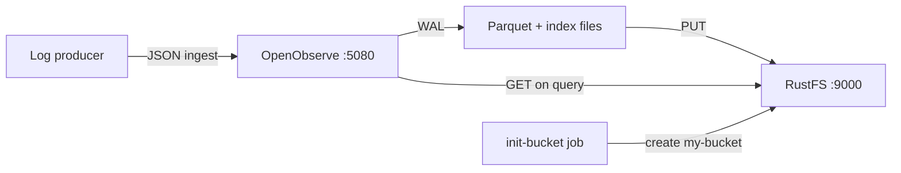
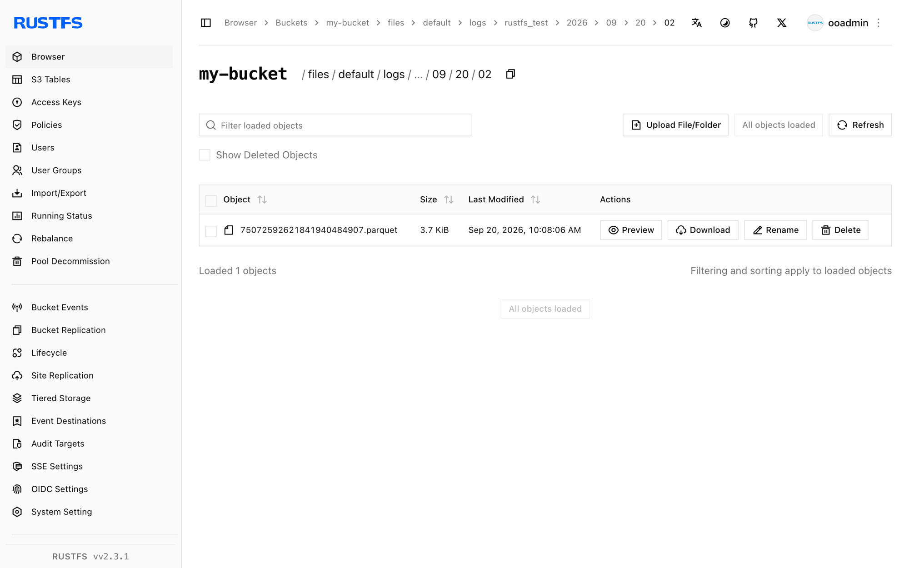

Ce guide exécute **OpenObserve** avec **RustFS** comme backend de stockage objet. Vous allez démarrer les deux services avec Docker Compose, ingérer des enregistrements de journaux dans OpenObserve, les transférer vers le stockage objet, vérifier les fichiers Parquet résultants dans RustFS, puis les interroger à nouveau via l'interface OpenObserve et l'API de recherche.

Vous avez besoin de Docker avec le plugin Compose et d'une machine capable d'exécuter trois conteneurs. Ce déploiement est destiné aux tests d'intégration locaux, pas à la production.

## Présentation du produit

### OpenObserve

[OpenObserve](https://openobserve.ai/) est une plateforme d'observabilité open source pour les journaux, les métriques, les traces et le suivi des utilisateurs réels. Elle sépare le stockage du calcul : les données ingérées arrivent d'abord dans un journal d'écriture anticipée (WAL) local, puis sont converties en fichiers Parquet avec index plein texte et téléversées vers le stockage objet, qui constitue la seule couche de données persistante. Les requêtes localisent les fichiers Parquet distants via les métadonnées de liste de fichiers et les téléchargent à la demande dans un cache local.

OpenObserve accède au stockage objet via le client Rust `object_store`. Par défaut, il utilise des requêtes **path-style** avec signature SigV4, de sorte que tout point de terminaison compatible S3 fonctionne — y compris RustFS — dès lors que vous fournissez l'URL du point de terminaison, la région, les identifiants et le nom du bucket.

### RustFS

RustFS est un système de stockage objet distribué écrit en Rust. Il implémente l'API Amazon S3, y compris la signature SigV4, l'adressage path-style et virtual-host, ainsi que les téléversements en plusieurs parties, et il est livré avec une console web et un IAM multi-locataires. RustFS fonctionne d'un nœud unique jusqu'à des clusters multi-nœuds et couvre les opérations S3 dont OpenObserve a besoin pour ses données de télémétrie.

### Fonctionnement de l'intégration



- **Chemin d'écriture** : lorsque les données atteignent un seuil de taille ou `ZO_MAX_FILE_RETENTION_TIME` (600 secondes par défaut), OpenObserve fusionne les enregistrements du WAL en fichiers Parquet, les téléverse sous le préfixe `files/` du bucket et les enregistre dans sa liste de fichiers.
- **Chemin de requête** : l'API de recherche résout les fichiers pour la plage de temps demandée, les télécharge depuis RustFS dans le cache local, puis exécute la requête.

## Étapes d'intégration

### 1. Créer les fichiers du projet

Créez un répertoire de travail :

```bash
mkdir rustfs-openobserve
cd rustfs-openobserve
```

Créez un fichier d'environnement et remplacez les espaces réservés d'identifiants :

```ini title=".env"
RUSTFS_ACCESS_KEY=<your-access-key>
RUSTFS_SECRET_KEY=<your-secret-key>
RUSTFS_BUCKET_NAME=my-bucket
ZO_ROOT_USER_EMAIL=root@example.com
ZO_ROOT_USER_PASSWORD=Complexpass#123
```

:::note[Identifiants OpenObserve d'exemple]

`root@example.com` et `Complexpass#123` sont les valeurs d'exemple de la documentation OpenObserve. OpenObserve v1.0.x applique une politique de mot de passe de 8 à 128 caractères avec majuscules, minuscules, chiffres et caractères spéciaux. Modifiez ces deux valeurs pour tout déploiement réel et ne commettez pas `.env` dans le contrôle de version.

:::

Créez le fichier Compose :

```yaml title="compose.yaml"
services:
  rustfs:
    image: rustfs/rustfs-x86-musl:v2.3.1
    environment:
      RUSTFS_ACCESS_KEY: ${RUSTFS_ACCESS_KEY}
      RUSTFS_SECRET_KEY: ${RUSTFS_SECRET_KEY}
      RUSTFS_VOLUMES: /data
      RUSTFS_ADDRESS: ":9000"
      RUSTFS_CONSOLE_ADDRESS: ":9001"
      RUSTFS_CONSOLE_ENABLE: "true"
    volumes:
      - rustfs-data:/data
    ports:
      - "9000:9000"
      - "9001:9001"
    healthcheck:
      test: ["CMD", "curl", "-sf", "http://127.0.0.1:9000/health"]
      interval: 10s
      timeout: 5s
      retries: 6
      start_period: 10s
    networks:
      - observability

  init-bucket:
    image: rustfs/rc:latest
    depends_on:
      rustfs:
        condition: service_healthy
    environment:
      RUSTFS_ACCESS_KEY: ${RUSTFS_ACCESS_KEY}
      RUSTFS_SECRET_KEY: ${RUSTFS_SECRET_KEY}
    entrypoint:
      - /bin/sh
      - -c
      - |
        until /usr/bin/rc alias set rustfs http://rustfs:9000 "$${RUSTFS_ACCESS_KEY}" "$${RUSTFS_SECRET_KEY}"; do
          echo "Waiting for RustFS..."
          sleep 2
        done
        /usr/bin/rc ls rustfs/my-bucket >/dev/null 2>&1 || /usr/bin/rc mb rustfs/my-bucket
    networks:
      - observability

  openobserve:
    image: openobserve/openobserve:v1.0.3
    depends_on:
      rustfs:
        condition: service_healthy
      init-bucket:
        condition: service_completed_successfully
    environment:
      ZO_ROOT_USER_EMAIL: ${ZO_ROOT_USER_EMAIL}
      ZO_ROOT_USER_PASSWORD: ${ZO_ROOT_USER_PASSWORD}
      ZO_LOCAL_MODE: "true"
      ZO_LOCAL_MODE_STORAGE: "s3"
      ZO_DATA_DIR: /data
      ZO_HTTP_PORT: "5080"
      RUST_LOG: INFO
      ZO_S3_PROVIDER: s3
      ZO_S3_SERVER_URL: http://rustfs:9000
      ZO_S3_REGION_NAME: us-east-1
      ZO_S3_ACCESS_KEY: ${RUSTFS_ACCESS_KEY}
      ZO_S3_SECRET_KEY: ${RUSTFS_SECRET_KEY}
      ZO_S3_BUCKET_NAME: ${RUSTFS_BUCKET_NAME}
      # Upload Parquet files after 60 seconds instead of the default 600.
      # Keep the default for production-like setups.
      ZO_MAX_FILE_RETENTION_TIME: "60"
    volumes:
      - oo-data:/data
    ports:
      - "5080:5080"
    networks:
      - observability

networks:
  observability:

volumes:
  rustfs-data:
  oo-data:
```

`ZO_LOCAL_MODE_STORAGE=s3` est obligatoire : en mode nœud unique, OpenObserve stocke sinon les fichiers Parquet sur le disque local et ignore les variables `ZO_S3_*`. La tâche `init-bucket` utilise l'[image `rc`](https://github.com/rustfs/cli) pour créer `my-bucket` une fois que RustFS réussit son healthcheck, et elle ignore la création si le bucket existe déjà.

### 2. Démarrer le déploiement

Vérifiez puis démarrez la pile Compose :

```bash
docker compose config
docker compose up -d
docker compose ps
```

Le service `init-bucket` doit se terminer avec le code de sortie `0` après avoir créé le bucket :

```text
✓ Bucket 'rustfs/my-bucket' created successfully.
```

Ouvrez l'interface OpenObserve à l'adresse `http://localhost:5080` et connectez-vous avec les valeurs `ZO_ROOT_USER_EMAIL` et `ZO_ROOT_USER_PASSWORD` de `.env`. La console RustFS est disponible à l'adresse `http://localhost:9001/rustfs/console/`.

### 3. Confirmer la connexion entre OpenObserve et RustFS

Consultez le journal de démarrage d'OpenObserve pour voir la configuration de stockage :

```bash
docker compose logs openobserve | grep "s3 init config"
```

```text
INFO infra::storage::remote: s3 init config: StorageConfig { name: "default", provider: "s3", server_url: "http://rustfs:9000", region_name: "us-east-1", access_key: "<your-access-key>", secret_key: "<your-secret-key>", bucket_name: "my-bucket", bucket_prefix: "" }
```

Au démarrage, OpenObserve exécute également une sonde de stockage : il écrit le fichier `o2_test/check.txt` dans le bucket puis le relit. Voir ce fichier dans RustFS confirme que le chemin d'écriture fonctionne.

### 4. Ingérer des enregistrements de journaux

Envoyez un lot d'enregistrements à l'API d'ingestion JSON de l'organisation `default` et du flux `rustfs_test` :

```bash
curl -u "root@example.com:Complexpass#123" \
  -X POST "http://localhost:5080/api/default/rustfs_test/_json" \
  -H "Content-Type: application/json" \
  -d '[
    {"level":"info","service":"rustfs-openobserve-demo","host":"host-1",
     "job":"integration-test","log":"[rustfs-integration] request 1 stored via RustFS S3 API","code":200},
    {"level":"error","service":"rustfs-openobserve-demo","host":"host-1",
     "job":"integration-test","log":"[rustfs-integration] request 2 stored via RustFS S3 API","code":200}
  ]'
```

```text
{"code":200,"status":[{"name":"rustfs_test","successful":2,"failed":0}]}
```

### 5. Transférer les données vers le stockage objet

Déclenchez le point de terminaison de flush au niveau du nœud pour que les enregistrements quittent le WAL :

```bash
curl -s -u "root@example.com:Complexpass#123" -X PUT "http://localhost:5080/node/flush"
```

L'ingester convertit les enregistrements du WAL en fichier Parquet et le téléverse vers RustFS en arrière-plan dès que le fichier est plus ancien que `ZO_MAX_FILE_RETENTION_TIME` (60 secondes dans ce fichier Compose, 600 secondes par défaut).

## Vérification

### Vérifier les objets dans RustFS

Listez le bucket via l'image d'initialisation du bucket :

```bash
docker compose run --rm --entrypoint /bin/sh init-bucket -c \
  '/usr/bin/rc alias set rustfs http://rustfs:9000 "$RUSTFS_ACCESS_KEY" "$RUSTFS_SECRET_KEY" >/dev/null && /usr/bin/rc ls rustfs/my-bucket --recursive'
```

La sortie doit inclure le fichier sonde et la sortie de l'ingester sous le préfixe `files/` :

```text
      19 B o2_test/check.txt
   3.7 KiB files/default/logs/rustfs_test/2026/09/20/02/75072592621841940484907.parquet
   6.5 KiB files/default/index/rustfs_test_logs/2026/09/20/02/75072592621841940484907.ttv
```

Vous pouvez également inspecter le bucket dans la console RustFS à l'adresse `http://localhost:9001/rustfs/console/` :


OpenObserve stocke les fichiers de données Parquet sous `files/<organization>/<stream type>/<stream>/<date partitions>` et les fichiers d'index plein texte sous `files/<organization>/index/` :



### Interroger les journaux dans OpenObserve

Dans l'interface OpenObserve, ouvrez **Logs**, sélectionnez le flux `rustfs_test` et exécutez une requête. Les enregistrements ingérés apparaissent dans le tableau de résultats :


La même requête via l'API de recherche. Notez que `start_time` et `end_time` sont en **microsecondes** :

```bash
curl -s -u "root@example.com:Complexpass#123" \
  -X POST "http://localhost:5080/api/default/_search?type=logs" \
  -H "Content-Type: application/json" \
  -d '{"query":{"sql":"SELECT count(*) AS cnt FROM \"rustfs_test\"","start_time":1789869600000000,"end_time":1789869960000000}}'
```

```text
"hits": [{"cnt": 200}]
```

### Consulter les statistiques du flux

La page **Data → Streams** affiche le nombre d'événements, les tailles ingérée et compressée, ainsi que la taille d'index pour `rustfs_test` :


### Vérifier que les données survivent sans cache local

Pour confirmer que RustFS est la couche persistante et non le disque local, supprimez le répertoire de cache d'OpenObserve, redémarrez le conteneur, puis interrogez à nouveau. L'image OpenObserve ne contient pas de shell ; utilisez donc `busybox` pour supprimer les fichiers :

```bash
docker compose stop openobserve
docker run --rm -v rustfs-openobserve_oo-data:/data busybox rm -rf /data/cache
docker compose start openobserve
```

Attendez que l'interface revienne, puis répétez la requête de recherche ci-dessus. Les mêmes enregistrements reviennent, car OpenObserve retélécharge les fichiers Parquet depuis RustFS. Le nom du répertoire du projet (`rustfs-openobserve`) devient le préfixe du nom du volume ; exécutez `docker volume ls` si vous avez utilisé un autre répertoire.

## Dépannage

### Les données sont écrites sur le disque local au lieu de RustFS

En mode nœud unique (`ZO_LOCAL_MODE=true`), le backend de stockage est `disk` par défaut. Sans `ZO_LOCAL_MODE_STORAGE=s3`, OpenObserve ignore les variables `ZO_S3_*` et conserve les fichiers Parquet sous `/data/wal/files/`.

### Aucun fichier Parquet n'apparaît dans le bucket après le flush

Le téléverseur s'exécute en arrière-plan et ne téléverse un fichier Parquet que lorsqu'il est plus ancien que `ZO_MAX_FILE_RETENTION_TIME` — 600 secondes par défaut. Ce guide fixe la valeur à 60 secondes. Si des fichiers manquent toujours, consultez les journaux de l'ingester :

```bash
docker compose logs openobserve | grep "INGESTER:JOB"
```

### L'API de recherche ne renvoie aucun résultat

`start_time` et `end_time` de l'API de recherche sont en microsecondes. Un horodatage en millisecondes comme `1789869600000` sélectionne une plage en 1970 ; multipliez-le par 1000.

### OpenObserve redémarre avec une erreur de mot de passe faible

OpenObserve v1.0.x rejette les valeurs de `ZO_ROOT_USER_PASSWORD` qui ne contiennent pas au moins une majuscule, une minuscule, un chiffre et un caractère spécial.

### La console RustFS ne s'ouvre pas

Dans RustFS v2.x, la console est servie sous le préfixe de chemin `/rustfs/console/`. Une requête vers le chemin racine du port `9001` renvoie une réponse XML de refus d'accès de type S3, ce qui est attendu.

### RustFS ne démarre pas avec une erreur d'autorisation

L'image RustFS s'exécute avec l'utilisateur et le groupe `10001`. Si vous montez un répertoire hôte au lieu du volume nommé de ce guide, exécutez d'abord `chown -R 10001:10001 <host-directory>`.

## Prochaines étapes

- Consultez les [notes de compatibilité S3](/administration/protocols/s3) avant d'adopter d'autres opérations S3.
- Créez des identifiants de production dédiés avec la [gestion des clés d'accès](/security-compliance/iam/access-token).
- Suivez la [documentation OpenObserve](https://openobserve.ai/docs/) pour connecter de vrais producteurs de journaux tels que Fluent Bit ou l'OpenTelemetry Collector.
