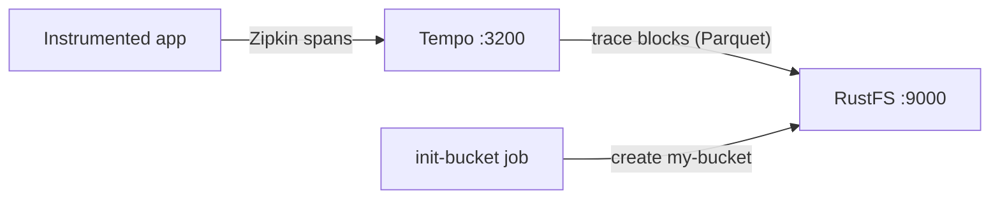

Ce guide exécute [Grafana Tempo](https://github.com/grafana/tempo) — le backend de traçage distribué de Grafana Labs — avec **RustFS** comme stockage de traces. Vous allez démarrer un Tempo single-binary avec Docker Compose, pousser une trace via le récepteur compatible Zipkin, l'interroger via l'API de recherche, puis vérifier que le bloc de trace est stocké comme objet Parquet dans RustFS. Le flux a été validé avec `grafana/tempo:2.9.5` et `rustfs/rustfs-x86-musl:v2.3.1`.

Vous avez besoin de Docker avec le plugin Compose. Ce déploiement est destiné aux tests d'intégration locaux, pas à la production.

## Architecture



Tempo accepte les spans depuis un point de terminaison compatible Zipkin, les met en mémoire tampon dans un bloc, puis transfère les blocs terminés vers le stockage objet sous forme de fichiers Parquet. Les recherches analysent l'index des blocs et lisent les données depuis le stockage objet, de sorte que chaque trace survit à un redémarrage de Tempo.

## 1. Créer les fichiers du projet

Créez un répertoire de travail :

```bash
mkdir rustfs-tempo
cd rustfs-tempo
```

Créez un fichier d'environnement et remplacez les deux espaces réservés d'identifiants :

```ini title=".env"
RUSTFS_ACCESS_KEY=<your-access-key>
RUSTFS_SECRET_KEY=<your-secret-key>
```

Utilisez des identifiants dédiés pour le bucket. Ne commettez pas `.env` dans le contrôle de version.

Créez la configuration Tempo — un déploiement single-binary avec le backend S3 pointant vers RustFS et une durée de bloc courte pour ne pas attendre les 30 minutes par défaut :

```yaml title="tempo.yml"
server:
  http_listen_port: 3200

distributor:
  receivers:
    zipkin:
      endpoint: 0.0.0.0:9411

ingester:
  max_block_duration: 1m

compactor:
  compaction:
    block_retention: 24h

storage:
  trace:
    backend: s3
    s3:
      endpoint: rustfs:9000
      bucket: my-bucket
      access_key: <your-access-key>
      secret_key: <your-secret-key>
      insecure: true
      forcepathstyle: true
    wal:
      path: /var/tempo/wal
    blocklist_poll: 30s
```

`forcepathstyle: true` et `insecure: true` sélectionnent l'adressage path-style en HTTP simple, attendu par RustFS pour le point de terminaison du réseau de conteneurs. `max_block_duration: 1m` et `blocklist_poll: 30s` accélèrent le cycle de transfert et de découverte pour les tests.

Créez le fichier Compose :

```yaml title="compose.yaml"
services:
  rustfs:
    image: rustfs/rustfs-x86-musl:v2.3.1
    environment:
      RUSTFS_ACCESS_KEY: ${RUSTFS_ACCESS_KEY}
      RUSTFS_SECRET_KEY: ${RUSTFS_SECRET_KEY}
      RUSTFS_VOLUMES: /data
      RUSTFS_ADDRESS: ":9000"
      RUSTFS_CONSOLE_ADDRESS: ":9001"
      RUSTFS_CONSOLE_ENABLE: "true"
    volumes:
      - rustfs-data:/data
    ports:
      - "9000:9000"
      - "9001:9001"
    healthcheck:
      test: ["CMD", "curl", "-sf", "http://127.0.0.1:9000/health"]
      interval: 10s
      timeout: 5s
      retries: 6
      start_period: 10s
    networks:
      - tempo

  create-bucket:
    image: rustfs/rc:latest
    depends_on:
      rustfs:
        condition: service_healthy
    environment:
      RUSTFS_ACCESS_KEY: ${RUSTFS_ACCESS_KEY}
      RUSTFS_SECRET_KEY: ${RUSTFS_SECRET_KEY}
    entrypoint:
      - /bin/sh
      - -c
      - |
        until /usr/bin/rc alias set rustfs http://rustfs:9000 "$${RUSTFS_ACCESS_KEY}" "$${RUSTFS_SECRET_KEY}"; do
          echo "Waiting for RustFS..."
          sleep 2
        done
        /usr/bin/rc ls rustfs/my-bucket >/dev/null 2>&1 || /usr/bin/rc mb rustfs/my-bucket
    networks:
      - tempo

  tempo:
    image: grafana/tempo:2.9.5
    command: -config.file=/tempo-local.yaml
    volumes:
      - ./tempo.yml:/tempo-local.yaml:ro
    ports:
      - "3200:3200"
      - "9411:9411"
    depends_on:
      create-bucket:
        condition: service_completed_successfully
    networks:
      - tempo

networks:
  tempo:

volumes:
  rustfs-data:
```

## 2. Démarrer le déploiement

Vérifiez le fichier Compose avant de démarrer les conteneurs :

```bash
docker compose config
```

Démarrez les services et attendez la fin de l'initialisation du bucket :

```bash
docker compose up -d
docker compose ps -a
```

Tempo est démarré quand le point de terminaison de statut répond :

```bash
curl -s http://localhost:3200/status | head -c 120
```

## 3. Pousser une trace

Publiez une petite trace Zipkin de cinq spans vers le récepteur compatible Zipkin :

```bash
python3 - <<'PY'
import json, time, urllib.request, random

now_us = int(time.time() * 1e6)
trace_id = "".join(random.choice("0123456789abcdef") for _ in range(32))
span_id = "".join(random.choice("0123456789abcdef") for _ in range(16))

spans = []
for i in range(5):
    spans.append({
        "traceId": trace_id,
        "id": "".join(random.choice("0123456789abcdef") for _ in range(16)),
        "name": f"rustfs-tempo-span-{i}",
        "timestamp": now_us - i * 1000,
        "duration": 1000 + i * 500,
        "localEndpoint": {"serviceName": "rustfs-tempo-demo"},
        "tags": {"job": "rustfs-integration"},
    })
spans[0]["parent_id"] = ""
for s in spans[1:]:
    s["parent_id"] = span_id

req = urllib.request.Request(
    "http://localhost:9411/api/v2/spans",
    data=json.dumps(spans).encode(),
    headers={"Content-Type": "application/json"},
    method="POST",
)
with urllib.request.urlopen(req, timeout=30) as r:
    print("push:", r.status)
print("trace_id:", trace_id)
PY
```

```text
push: 202
```

## 4. Rechercher et lire la trace

Après environ une minute, l'ingester transfère le bloc terminé vers RustFS et le compacteur le découvre. Recherchez par tag :

```bash
curl -s "http://localhost:3200/api/search?tags=job=rustfs-integration"
```

```text
{"traces":[{"traceID":"5354809288c0d1a3de0e09ce74d06987","rootServiceName":"rustfs-tempo-demo","rootTraceName":"rustfs-tempo-span-0",...}]}
```

Récupérez la trace par son ID avec l'ID affiché par le script de push :

```bash
curl -s "http://localhost:3200/api/traces/<your-trace-id>" -o /dev/null -w "%{http_code}\n"
```

```text
200
```

## 5. Vérifier le bloc de trace dans RustFS

Listez le préfixe du tenant via l'image d'initialisation du bucket :

```bash
docker compose run --rm --entrypoint /bin/sh create-bucket -c \
  '/usr/bin/rc alias set rustfs http://rustfs:9000 "$RUSTFS_ACCESS_KEY" "$RUSTFS_SECRET_KEY" >/dev/null && /usr/bin/rc ls rustfs/my-bucket/single-tenant --recursive'
```

`single-tenant` est le tenant utilisé par Tempo quand `multitenancy_enabled` vaut `false`. Chaque bloc de trace terminé est un objet Parquet :

```text
[2026-09-20 15:03:54]  25.16 KiB single-tenant/619118dc-a512-4ca6-90f5-e8b15bc9013f/data.parquet
```

Vous pouvez également parcourir le préfixe dans la console RustFS :


Le bloc résidant dans RustFS, la trace reste consultable après un redémarrage de Tempo — redémarrez le conteneur et répétez la recherche pour le confirmer.

## 6. Arrêter ou réinitialiser la pile

Arrêtez les conteneurs en conservant le volume de données RustFS :

```bash
docker compose down
```

Pour supprimer les traces stockées et repartir d'un volume RustFS vide, ajoutez explicitement `--volumes` :

```bash
docker compose down --volumes
```

## Dépannage

### Le fichier de configuration est rejeté avec "field ingester not found"

Tempo 3.x a modifié la structure de configuration. Ce guide épingle `grafana/tempo:2.9.5`, dont la configuration correspond aux blocs classiques `ingester`/`compactor` présentés ci-dessus.

### La recherche ne renvoie aucune trace juste après le push

L'ingester transfère un bloc terminé après `max_block_duration` (une minute dans ce guide), et le querier découvre les nouveaux blocs à chaque `blocklist_poll` (30 secondes). Attendez le transfert et recherchez à nouveau, puis consultez les journaux de Tempo :

```bash
docker compose logs tempo
```

### Réponses AccessDenied ou 403

Vérifiez que les identifiants de `tempo.yml` correspondent aux identifiants RustFS et que la tâche `create-bucket` s'est terminée avec succès :

```bash
docker compose logs create-bucket
```

### Erreurs de connexion ou de certificat

`endpoint` ne prend pas de schéma ; `insecure: true` sélectionne HTTP simple et `forcepathstyle: true` l'adressage path-style pour le point de terminaison du réseau de conteneurs. À l'intérieur du réseau Compose, utilisez `rustfs:9000` ; depuis l'hôte, `localhost:9000`.

## Prochaines étapes

- Consultez les [notes de compatibilité S3](/administration/protocols/s3) avant d'adopter d'autres opérations S3.
- Créez des identifiants de production dédiés avec la [gestion des clés d'accès](/security-compliance/iam/access-token).
- Suivez la [documentation Grafana Tempo](https://grafana.com/docs/tempo/latest/) pour connecter l'OpenTelemetry Collector ou des applications instrumentées comme producteurs de traces.
