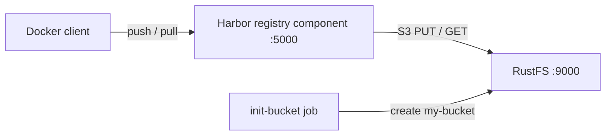

Ce guide connecte [Harbor](https://github.com/goharbor/harbor) — le registre cloud native gradué de la CNCF — à **RustFS**. Harbor persiste les couches d'images, les manifestes et les autres artefacts OCI via son composant de registry intégré, qui implémente le pilote de stockage S3 du projet [distribution](https://distribution.github.io/distribution/). Vous allez exécuter ce composant de registry contre RustFS avec Docker Compose, pousser une image, la retirer, puis vérifier les objets dans RustFS. Les mêmes réglages de stockage s'appliquent à un déploiement Harbor complet. Le flux a été validé avec `goharbor/registry-photon:v2.12.2` et `rustfs/rustfs-x86-musl:v2.3.1`.

Vous avez besoin de Docker avec le plugin Compose. Ce déploiement est destiné aux tests d'intégration locaux, pas à la production.

## Architecture



La registry stocke chaque blob, manifeste et lien de dépôt sous `docker/registry/v2/` dans le bucket via le pilote de stockage S3. Les réglages `regionendpoint`, `secure: false` et `skipverify: true` orientent le client AWS S3 utilisé par le pilote vers le point de terminaison RustFS, avec un adressage path-style en HTTP simple.

## 1. Créer les fichiers du projet

Créez un répertoire de travail :

```bash
mkdir rustfs-harbor
cd rustfs-harbor
```

Créez un fichier d'environnement et remplacez les deux espaces réservés d'identifiants :

```ini title=".env"
RUSTFS_ACCESS_KEY=<your-access-key>
RUSTFS_SECRET_KEY=<your-secret-key>
```

Utilisez des identifiants dédiés pour le bucket. Ne commettez pas `.env` dans le contrôle de version.

Créez la configuration de registry qu'Harbor utilise pour son composant de registry :

```yaml title="config.yml"
version: 0.1
log:
  level: info
storage:
  s3:
    accesskey: <your-access-key>
    secretkey: <your-secret-key>
    region: us-east-1
    regionendpoint: http://rustfs:9000
    bucket: my-bucket
    secure: false
    skipverify: true
  delete:
    enabled: true
  redirect:
    disable: true
http:
  addr: 0.0.0.0:5000
health:
  storagedriver:
    enabled: true
    interval: 10s
    threshold: 3
```

`regionendpoint` dirige le pilote vers RustFS plutôt que vers AWS, `secure: false` sélectionne HTTP simple à l'intérieur du réseau Compose, et `redirect.disable: true` fait servir les blobs par la registry elle-même — Harbor définit la même option pour les backends sans prise en charge de la redirection.

Créez le fichier Compose :

```yaml title="compose.yaml"
services:
  rustfs:
    image: rustfs/rustfs-x86-musl:v2.3.1
    environment:
      RUSTFS_ACCESS_KEY: ${RUSTFS_ACCESS_KEY}
      RUSTFS_SECRET_KEY: ${RUSTFS_SECRET_KEY}
      RUSTFS_VOLUMES: /data
      RUSTFS_ADDRESS: ":9000"
      RUSTFS_CONSOLE_ADDRESS: ":9001"
      RUSTFS_CONSOLE_ENABLE: "true"
    volumes:
      - rustfs-data:/data
    ports:
      - "9000:9000"
      - "9001:9001"
    healthcheck:
      test: ["CMD", "curl", "-sf", "http://127.0.0.1:9000/health"]
      interval: 10s
      timeout: 5s
      retries: 6
      start_period: 10s
    networks:
      - registry

  create-bucket:
    image: rustfs/rc:latest
    depends_on:
      rustfs:
        condition: service_healthy
    environment:
      RUSTFS_ACCESS_KEY: ${RUSTFS_ACCESS_KEY}
      RUSTFS_SECRET_KEY: ${RUSTFS_SECRET_KEY}
    entrypoint:
      - /bin/sh
      - -c
      - |
        until /usr/bin/rc alias set rustfs http://rustfs:9000 "$${RUSTFS_ACCESS_KEY}" "$${RUSTFS_SECRET_KEY}"; do
          echo "Waiting for RustFS..."
          sleep 2
        done
        /usr/bin/rc ls rustfs/my-bucket >/dev/null 2>&1 || /usr/bin/rc mb rustfs/my-bucket
    networks:
      - registry

  registry:
    image: goharbor/registry-photon:v2.12.2
    volumes:
      - ./config.yml:/etc/registry/config.yml:ro
    ports:
      - "5000:5000"
    depends_on:
      create-bucket:
        condition: service_completed_successfully
    networks:
      - registry

networks:
  registry:

volumes:
  rustfs-data:
```

L'[image `rc`](https://github.com/rustfs/cli) fournit le client en ligne de commande officiel de RustFS. L'initialiseur vérifie l'existence de `my-bucket` avant de le créer, afin que des redémarrages répétés ne suppriment pas les artefacts existants.

## 2. Démarrer le déploiement

Vérifiez le fichier Compose avant de démarrer les conteneurs :

```bash
docker compose config
```

Démarrez les services et attendez la fin de l'initialisation du bucket :

```bash
docker compose up -d
docker compose ps -a
```

L'API de la registry doit répondre avec un catalogue vide :

```bash
curl -s http://localhost:5000/v2/_catalog
```

```text
{"repositories":[]}
```

## 3. Pousser une image

Retirez une petite image, retaguez-la pour la registry locale, puis poussez-la :

```bash
docker pull busybox:latest
docker tag busybox:latest localhost:5000/demo/app:v1
docker push localhost:5000/demo/app:v1
```

```text
v1: digest: sha256:1cfa4e2b09e127b9c4ed43578d3f3c18e7d44ea47b9ea98475c0cbe9086525f8 size: 527
```

## 4. Retirer l'image

Supprimez les tags locaux, puis retirez l'image depuis la registry — les couches proviennent désormais de RustFS :

```bash
docker rmi localhost:5000/demo/app:v1
docker pull localhost:5000/demo/app:v1
```

```text
localhost:5000/demo/app:v1
```

## 5. Vérifier les objets dans RustFS

Listez le préfixe du dépôt via l'image d'initialisation du bucket :

```bash
docker compose run --rm --entrypoint /bin/sh create-bucket -c \
  '/usr/bin/rc alias set rustfs http://rustfs:9000 "$RUSTFS_ACCESS_KEY" "$RUSTFS_SECRET_KEY" >/dev/null && /usr/bin/rc ls rustfs/my-bucket/docker/registry/v2/repositories/demo --recursive'
```

```text
[2026-09-20 12:11:25]       71 B docker/registry/v2/repositories/demo/app/_layers/sha256/b05093807bb0294152bb9cf86d64da722732dddaf7f8882fa1f120477dbc4db3/link
[2026-09-20 12:11:25]       71 B docker/registry/v2/repositories/demo/app/_layers/sha256/c6348fa86ba0fb2108c9334f5fe913ddc6d853313e655891f133a0127c30099f/link
[2026-09-20 12:11:25]       71 B docker/registry/v2/repositories/demo/app/_manifests/revisions/sha256/1cfa4e2b09e127b9c4ed43578d3f3c18e7d44ea47b9ea98475c0cbe9086525f8/link
[2026-09-20 12:11:25]       71 B docker/registry/v2/repositories/demo/app/_manifests/tags/v1/current/link
[2026-09-20 12:11:25]       71 B docker/registry/v2/repositories/demo/app/_manifests/tags/v1/index/sha256/1cfa4e2b09e127b9c4ed43578d3f3c18e7d44ea47b9ea98475c0cbe9086525f8/link
```

Les blobs eux-mêmes se trouvent sous `docker/registry/v2/blobs/`. Vous pouvez également parcourir le préfixe dans la console RustFS à l'adresse `http://localhost:9001/rustfs/console/` :


## 6. Utiliser RustFS dans un déploiement Harbor complet

Le composant de registry validé ci-dessus est le même que celui qu'exécute un déploiement Harbor complet ; les réglages de stockage se reportent donc directement.

Pour le chart Helm, définissez les options S3 sous `persistence.imageChartStorage` :

```yaml title="values.yaml"
persistence:
  imageChartStorage:
    type: s3
    disableredirect: true
    s3:
      region: us-east-1
      bucket: my-bucket
      accesskey: <your-access-key>
      secretkey: <your-secret-key>
      regionendpoint: http://rustfs:9000
      secure: false
      skipverify: true
```

Pour l'installateur Harbor piloté par un fichier `harbor.yml`, placez les mêmes clés du pilote sous `storage_service.s3`. Les deux fichiers acceptent les options du pilote de stockage documentées par le [projet distribution](https://distribution.github.io/distribution/about/configuration/) — c'est précisément la surface de configuration validée dans ce guide.

## 7. Arrêter ou réinitialiser la pile

Arrêtez les conteneurs en conservant le volume de données RustFS :

```bash
docker compose down
```

Pour supprimer les artefacts stockés et repartir d'un volume RustFS vide, ajoutez explicitement `--volumes` :

```bash
docker compose down --volumes
```

## Dépannage

### La registry ne démarre pas ou signale une erreur de stockage

Consultez les journaux de la registry pour les messages du pilote S3 :

```bash
docker compose logs registry
```

`regionendpoint` doit être joignable depuis le conteneur de la registry. À l'intérieur du réseau Compose, utilisez `http://rustfs:9000` ; depuis un processus sur l'hôte, `http://localhost:9000`.

### Erreurs TLS ou de certificat avec un point de terminaison HTTP simple

`secure: false` sélectionne HTTP simple pour le point de terminaison RustFS. Sans cela, le pilote tente HTTPS et échoue avec une erreur de connexion ou de certificat. Pour un point de terminaison TLS avec un certificat auto-signé, conservez `secure: true`, définissez `skipverify: true` et fournissez le bundle CA via l'option `ca_bundle` qu'Harbor expose dans `harbor.yml`.

### Réponses AccessDenied ou 403

Vérifiez que les identifiants de `config.yml` correspondent aux identifiants RustFS et que la tâche `create-bucket` s'est terminée avec succès :

```bash
docker compose logs create-bucket
```

### Le push réussit mais les objets n'apparaissent pas dans le préfixe attendu

Le pilote écrit sous `docker/registry/v2/` dans le bucket. Listez tout le bucket de manière récursive pour localiser l'arborescence du dépôt avant de supposer un problème de configuration.

## Prochaines étapes

- Consultez les [notes de compatibilité S3](/administration/protocols/s3) avant d'adopter d'autres opérations S3.
- Créez des identifiants de production dédiés avec la [gestion des clés d'accès](/security-compliance/iam/access-token).
- Suivez la [documentation Harbor](https://goharbor.io/docs/) pour configurer un déploiement Harbor complet avec réplication, scan de vulnérabilités et RBAC.
