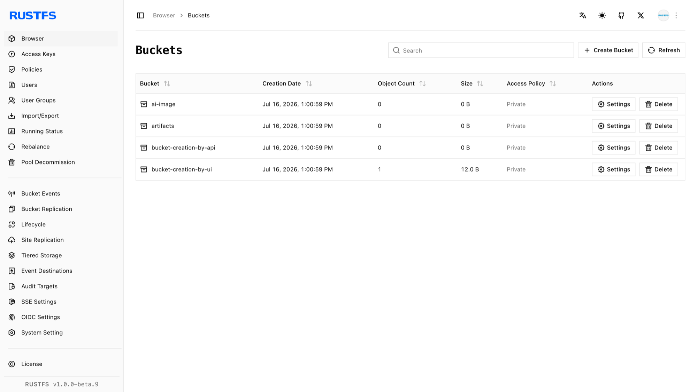
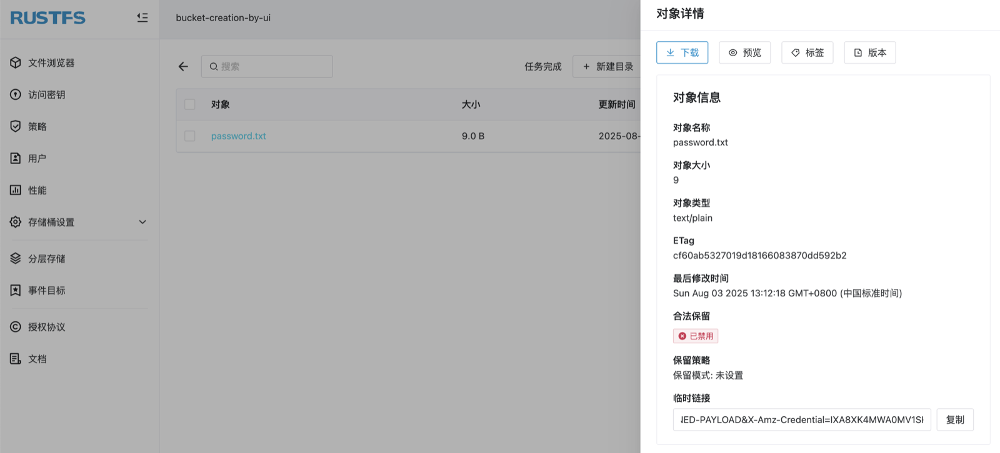

Once your RustFS server is running, the embedded web console is the fastest way to verify the installation and start working with your data. This short tutorial walks you through your first session.

## 1. Open the Console

The console listens on port `9001` by default. In your browser, open:

```text
http://<server-ip>:9001
```

For a local test install, that is `http://127.0.0.1:9001`.

## 2. Sign In

Sign in with the credentials configured at install time:

- If you used the [Linux quick-start script](./linux/quick-start.md), the access key and secret key were printed at the end of the installation output.
- If you started RustFS via Docker or a systemd unit, use the values of `RUSTFS_ACCESS_KEY` and `RUSTFS_SECRET_KEY` from your configuration (see the [Docker guide](./docker/index.md)).

> For production deployments, change any default credentials before exposing the console. See the [Security Checklist](./checklists/security-checklists.md).

## 3. A Quick Tour

After signing in you land on the console home page, which shows:

- **Buckets** — a list of your buckets, with a **Create Bucket** button in the top left.
- **Usage overview** — object count and storage consumption at a glance.
- **Access Keys** — management of programmatic credentials (see step 6).

## 4. Create Your First Bucket

1. On the home page, in the top left corner, select **Create Bucket**.
2. Enter a bucket name (for example `my-first-bucket`) and click **Create**.



Full details, including `mc` and API alternatives, are in [Bucket Creation](../management/bucket/creation.md).

## 5. Upload Your First Object

1. Click the bucket you just created.
2. In the top right corner, select **Upload File/Folder**.
3. Choose one or more local files and click **Start Upload**.


Click the uploaded object to view its details — size, ETag, content type, and a shareable link.



More options are covered in [Object Creation](../management/object/creation.md).

## 6. Create Access Keys for Applications

The console sign-in credentials are administrator credentials — applications should use their own keys instead. Go to **Access Keys** in the console to create a scoped access key / secret key pair for your S3 clients and SDKs. See [Access Key Management](../administration/iam/access-token.md) for the full walkthrough.

## Next Steps

- Point any S3-compatible client at `http://<server-ip>:9000` (the S3 API port) with your new access keys.
- Explore [IAM management](../administration/iam/index.md) to add users and policies.
- Review the [production checklists](./checklists/index.md) before going live.
