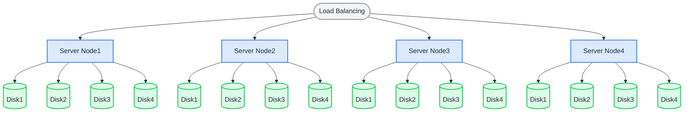

Multiple Node Multiple Disk (MNMD) mode is the deployment mode for production workloads, providing enterprise-grade performance, security, and scalability. A minimum of **4 servers** is required, each with at least 1 disk, to safely start a distributed object storage cluster.

## Topology and Planning

In the following architecture, requests are distributed to the servers through load balancing. With the default 12 + 4 erasure coding layout, each object is split into 12 data shards and 4 parity shards stored on different disks across different servers:

- Any single server failure or maintenance does not affect data security.
- Corruption of up to 4 disks does not affect data security.



Before installation, review the [Pre-Installation Checklists](../checklists/index.md) and ensure all items meet production guidance.

## Hostnames

Creating a RustFS cluster requires **identical, sequential** hostnames. There are two ways to achieve sequential hostnames:

**1. DNS Configuration:**

Configure your DNS resolution server to ensure name continuity.

**2. HOSTS Configuration:**

Modify the local alias settings in `/etc/hosts` as follows:

```bash title="/etc/hosts"
vim /etc/hosts
127.0.0.1 localhost localhost.localdomain localhost4 localhost4.localdomain4
::1 localhost localhost.localdomain localhost6 localhost6.localdomain6
192.168.1.1 node1
192.168.1.2 node2
192.168.1.3 node3
192.168.1.4 node4
```

## Prerequisites and Service Setup

On **every node**, complete the [common prerequisites and service setup](./prerequisites-and-service.md) — operating system, firewall, time synchronization, disk formatting, service user, binary download, and systemd unit — then continue below. Remember that all nodes must use the same listening port and must have synchronized clocks.

## Configure Environment Variables

1. Create the same configuration file on every node. `RUSTFS_VOLUMES` uses brace expansion to enumerate all nodes and all disk mount points (this example: 4 nodes × 4 disks):

```ini title="/etc/default/rustfs"
# Use a unique access key and a strong, random secret (e.g. openssl rand -base64 24)
RUSTFS_ACCESS_KEY=<your-access-key>
RUSTFS_SECRET_KEY=<your-secret-key>
RUSTFS_VOLUMES="http://node{1...4}:9000/data/rustfs{0...3}"
RUSTFS_ADDRESS=":9000"
RUSTFS_CONSOLE_ENABLE=true
RUST_LOG=error
RUSTFS_OBS_LOG_DIRECTORY="/var/logs/rustfs/"
```

:::note

The access key, secret key, and `RUSTFS_VOLUMES` value must be identical on all nodes. The hostnames (`node1` – `node4`) must match the DNS or `/etc/hosts` configuration above.

:::

2. Create the storage and log directories on every node:

```bash
sudo mkdir -p /data/rustfs{0..3} /var/logs/rustfs /opt/tls
sudo chmod -R 750 /data/rustfs* /var/logs/rustfs
```

## Start Service and Verification

1. Start the service on every node and enable auto-start on boot:

```bash
sudo systemctl enable --now rustfs
```

2. Verify the service status:

```bash
systemctl status rustfs
```

3. Check the service port:

```bash
netstat -ntpl
```

4. View log files:

```bash
tail -f /var/logs/rustfs/rustfs*.log
```

5. Access the console: enter any node's IP address (or the load balancer address) and the console port (default 9001) in a browser. You should see:


## Next Steps

- Put a load balancer in front of the cluster — see the [Nginx integration guide](../../integration/nginx.md).
- Enable TLS for production traffic — see [TLS configuration](../../integration/tls-configured.md).
- Review [Availability and Resiliency](../../upgrade-scale/availability-and-resiliency.md) before scaling.
