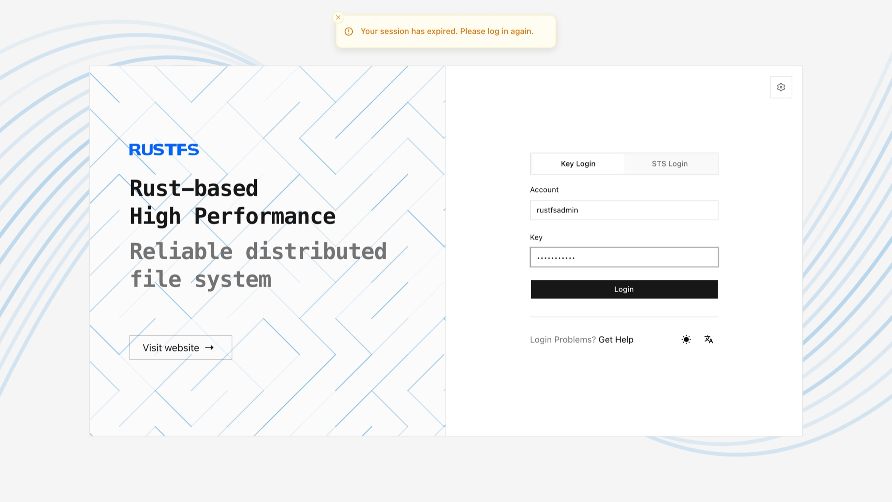

This guide takes you from an empty Linux server to a working RustFS instance: install, log in to the Console, create a bucket, and upload your first object. Production planning (multi-node layout, hardware sizing) is deliberately left for [the next step](#next-steps).

**Prerequisites**

- A Linux server (x86_64 or aarch64) with `systemd`, and root or sudo access
- `unzip` installed, and outbound network access to download the package
- Ports `9000` (S3 API) and `9001` (Console) reachable from your machine

## 1. Install and start RustFS

Run the official installation script:

```bash
curl -O https://rustfs.com/install_rustfs.sh && bash install_rustfs.sh
```

The script installs the binary to `/usr/local/bin/rustfs`, registers a `rustfs` systemd service, and starts it. By default it stores data in `/data/rustfs0` and listens on port `9000` (S3 API) and `9001` (Console); the data path and ports can be adjusted during installation. On success it prints a summary like:

```text
RustFS has been installed and started successfully!
Service port: 9000,  Console port: 9001,  Data directory: /data/rustfs0

[SECURITY WARNING] Please change the default value for RUSTFS_ACCESS_KEY/RUSTFS_SECRET_KEY immediately ...
  Config file: /etc/default/rustfs
```

## 2. Set your credentials

The generated config file ships placeholder credentials. Set your own access key and secret key, then restart the service:

```ini title="/etc/default/rustfs" {1,2}
RUSTFS_ACCESS_KEY=<your-access-key>
RUSTFS_SECRET_KEY=<your-secret-key>   ; e.g. output of: openssl rand -base64 24
```

```bash
sudo systemctl restart rustfs
sudo systemctl status rustfs --no-pager   # should report: active (running)
```

:::warning[Do not keep default credentials]

If `RUSTFS_ACCESS_KEY` / `RUSTFS_SECRET_KEY` are not set, the server falls back to the built-in default `rustfsadmin` / `rustfsadmin` — acceptable for a throwaway local test, never for anything reachable by others.

:::

## 3. Log in to the Console

Open `http://<server-ip>:9001` in your browser and sign in with the access key and secret key from step 2.



## 4. Create a bucket and upload a file

1. In the Console home page, select **Create Bucket**, name it (for example `my-bucket`), and confirm.
2. Open the bucket and use the upload action to add any local file.
3. Click the uploaded object to view its details — you have a working object store.

Prefer the command line? The same two operations with the [MinIO Client (`mc`)](../../developer/mc.md):

```bash
mc alias set rustfs http://<server-ip>:9000 <your-access-key> <your-secret-key>
mc mb rustfs/my-bucket
mc cp ./hello.txt rustfs/my-bucket
mc ls rustfs/my-bucket
```

```text
Bucket created successfully `rustfs/my-bucket`.
[2026-07-15 10:00:00 UTC]  12B hello.txt
```

<a id="mode"></a>

## Next steps

The quick install runs RustFS in **Single Node Single Disk (SNSD)** mode — zero redundancy, right for evaluation and development. Where to go from here:

- **Plan a production deployment** — choose a topology, then follow its guide:
  - [Single Node Single Disk (SNSD)](./single-node-single-disk.md) — dev and small workloads
  - [Single Node Multiple Disk (SNMD)](./single-node-multiple-disk.md) — disk-level fault tolerance on one machine
  - [Multiple Node Multiple Disk (MNMD)](./multiple-node-multiple-disk.md) — production-grade availability and scale, with the [pre-installation checklists](../checklists/index.md)
- **Prefer containers?** — [Install with Docker](../docker/index.md)
- **Connect your application** — [SDKs and examples](../../developer/sdk/index.md)
