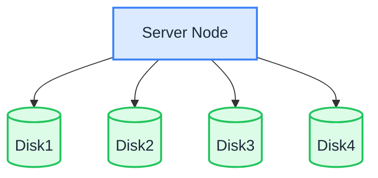

In Single Node Multiple Disk (SNMD) mode, one server stores data in sharded form across multiple data disks. Each object is split into K data shards and M parity shards (erasure coding), so the loss of up to M disks does not cause data loss.

:::warning

SNMD is suitable for medium, non-critical business. Damage to at most M disks does not pose a data risk, but if the entire server fails or more than M disks are damaged, data will be lost. Keep backups of important data. For node-level fault tolerance, use [MNMD](./multiple-node-multiple-disk.md).

:::

## Topology and Planning



- 1 server with multiple data disks (this example uses 4 disks mounted at `/data/rustfs0` through `/data/rustfs3`).
- Erasure coding spreads data and parity shards across the disks; fault tolerance is limited to disk failures within the single node.
- Format each disk with XFS and mount it separately (e.g., labels `RUSTFS0` – `RUSTFS3`), as described in the prerequisites page.
- For production deployments, also review the [Pre-Installation Checklists](../checklists/index.md).

## Prerequisites and Service Setup

Complete the [common prerequisites and service setup](./prerequisites-and-service.md) — operating system, firewall, time synchronization, disk formatting, service user, binary download, and systemd unit — then continue below.

## Configure Environment Variables

1. Create the configuration file. `RUSTFS_VOLUMES` uses brace expansion to enumerate the four disk mount points:

```ini title="/etc/default/rustfs"
# Use a unique access key and a strong, random secret (e.g. openssl rand -base64 24)
RUSTFS_ACCESS_KEY=<your-access-key>
RUSTFS_SECRET_KEY=<your-secret-key>
RUSTFS_VOLUMES="/data/rustfs{0...3}"
RUSTFS_ADDRESS=":9000"
RUSTFS_CONSOLE_ENABLE=true
RUST_LOG=error
RUSTFS_OBS_LOG_DIRECTORY="/var/logs/rustfs/"
```

2. Create the storage and log directories:

```bash
sudo mkdir -p /data/rustfs{0..3} /var/logs/rustfs /opt/tls
sudo chmod -R 750 /data/rustfs* /var/logs/rustfs
```

## Start Service and Verification

1. Start the service and enable auto-start on boot:

```bash
sudo systemctl enable --now rustfs
```

2. Verify the service status:

```bash
systemctl status rustfs
```

3. Check the service port:

```bash
netstat -ntpl
```

4. View log files:

```bash
tail -f /var/logs/rustfs/rustfs*.log
```

5. Access the console: enter the server's IP address and the console port (default 9001) in a browser. You should see:


## Next Steps

- Need node-level fault tolerance and horizontal scalability? See [Multiple Node Multiple Disk Mode (MNMD)](./multiple-node-multiple-disk.md).
- Just experimenting? [Single Node Single Disk Mode (SNSD)](./single-node-single-disk.md) is simpler to set up.
