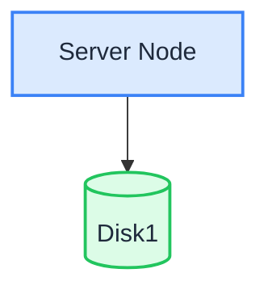

In Single Node Single Disk (SNSD) mode, one server stores all data on a single data disk. It is the simplest deployment mode and the same topology that the [Linux Quick Start](./quick-start.md) script sets up.

:::warning

A single disk offers no redundancy: if the disk fails, data is lost. SNSD is suitable for development, testing, and low-density non-critical business. For production use, maintain regular data backups or choose [SNMD](./single-node-multiple-disk.md) / [MNMD](./multiple-node-multiple-disk.md).

:::

## Topology and Planning



- 1 server, 1 data disk (e.g., an XFS-formatted disk mounted at `/data/rustfs0`).
- No erasure coding across disks — fault tolerance depends entirely on backups.
- For production deployments, also review the [Pre-Installation Checklists](../checklists/index.md).

## Prerequisites and Service Setup

Complete the [common prerequisites and service setup](./prerequisites-and-service.md) — operating system, firewall, time synchronization, disk formatting, service user, binary download, and systemd unit — then continue below.

## Configure Environment Variables

1. Create the configuration file with the single-disk volume path:

```ini title="/etc/default/rustfs"
# Use a unique access key and a strong, random secret (e.g. openssl rand -base64 24)
RUSTFS_ACCESS_KEY=<your-access-key>
RUSTFS_SECRET_KEY=<your-secret-key>
RUSTFS_VOLUMES="/data/rustfs0"
RUSTFS_ADDRESS=":9000"
RUSTFS_CONSOLE_ENABLE=true
RUST_LOG=error
RUSTFS_OBS_LOG_DIRECTORY="/var/logs/rustfs/"
```

2. Create the storage and log directories:

```bash
sudo mkdir -p /data/rustfs0 /var/logs/rustfs /opt/tls
sudo chmod -R 750 /data/rustfs* /var/logs/rustfs
```

## Start Service and Verification

1. Start the service and enable auto-start on boot:

```bash
sudo systemctl enable --now rustfs
```

2. Verify the service status:

```bash
systemctl status rustfs
```

3. Check the service port:

```bash
netstat -ntpl
```

4. View log files:

```bash
tail -f /var/logs/rustfs/rustfs*.log
```

5. Access the console: enter the server's IP address and the console port (default 9001) in a browser. You should see:


## Next Steps

- Need disk-level redundancy on one server? See [Single Node Multiple Disk Mode (SNMD)](./single-node-multiple-disk.md).
- Need a production cluster? See [Multiple Node Multiple Disk Mode (MNMD)](./multiple-node-multiple-disk.md).
