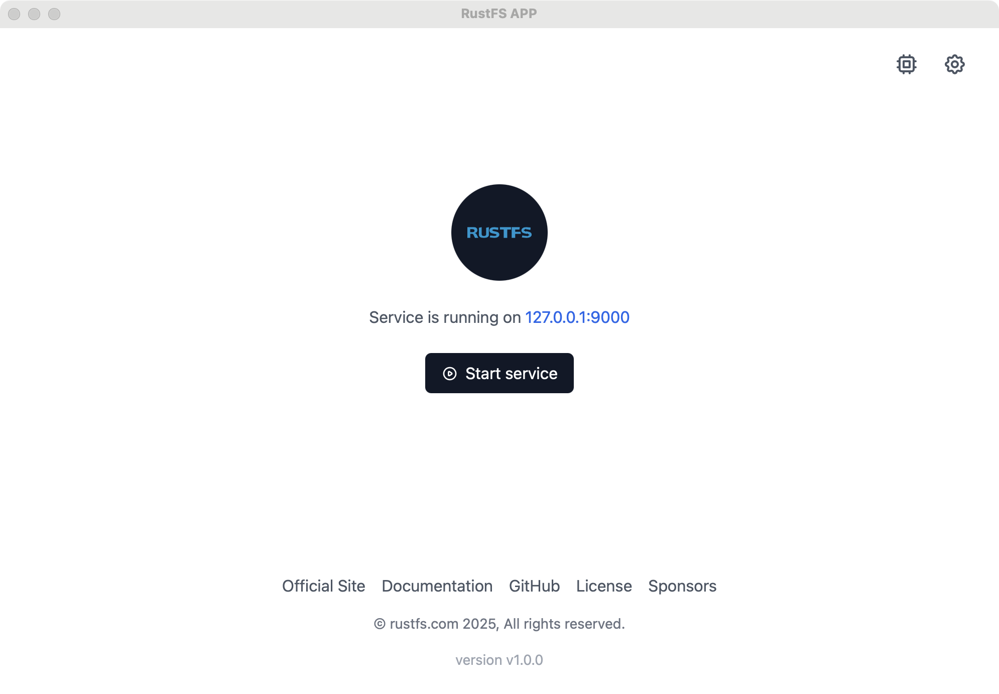
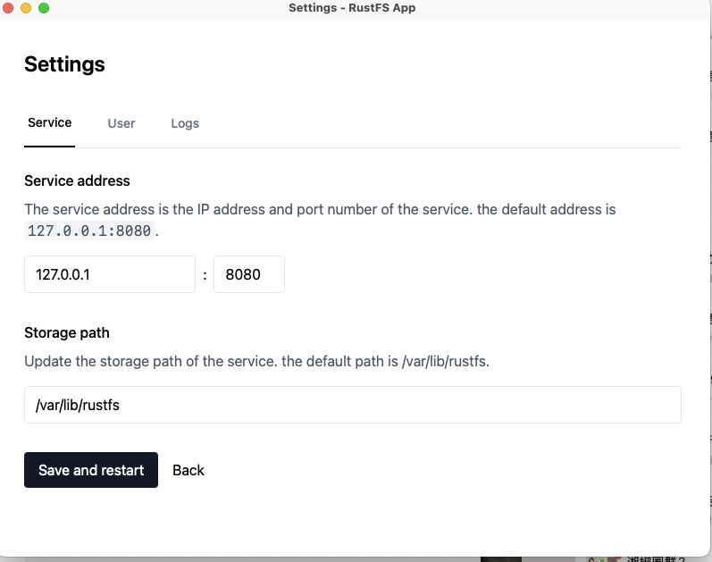

On macOS, you can use three methods for installation:

1. Docker
2. Graphical one-click startup package
3. Binary package

> This article mainly explains how to use the RustFS **graphical one-click startup package** to quickly launch RustFS.

## 1. Preparation

:::note

**Graphical startup mode** only supports single-node single-disk mode, more suitable for development, debugging, and testing environments.

:::

1. For detailed introduction about startup modes, please refer to [Installation Modes](../linux/quick-start.md#mode)
2. Download the installation package, modify permissions, and start.

## 2. Download

Go to the official website download page and download the latest RustFS installation package.

## 3. Modify Permissions

Please confirm that this program has relevant execution permissions in the macOS operating system.

## 4. Start the Service

1. Double-click the startup icon
2. Click configure disk
3. Click "Start Service", and RustFS service starts successfully.

## 5. Modify Configuration

Click the modify button (gear-shaped button) in the upper right corner to modify:

1. Server default port
2. Default administrator username and password
3. Specified disk directory

## 6. Access Console

After successful startup, visit `http://127.0.0.1:7001` to access the console.

:::note

Port `7001` applies to the macOS desktop launcher. If you run the standalone `rustfs` server binary instead, the console listens on port `9001` by default.

:::
