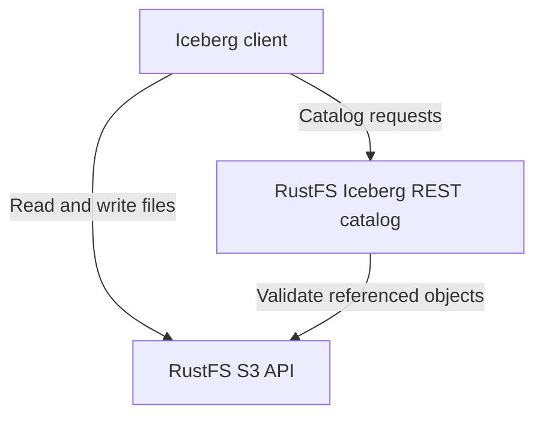

RustFS S3 Tables は、組み込み REST カタログを通じて **Apache Iceberg** テーブルを管理します。テーブルデータ、マニフェスト、Iceberg メタデータは、RustFS 内の S3 オブジェクトとして保存されます。このガイドでは、専用テーブルバケットの有効化、クライアント接続、権限、メンテナンスの制限を説明します。

:::note[プレビューの状態と対象バージョン]

S3 Tables はプレビュー機能です。クライアントの互換性は、以下に示すワークフローに限られます。このページは RustFS コミット [`7e0c6711`](https://github.com/rustfs/rustfs/commit/7e0c67111b97703d47e23719b0264a739c8acea8) に基づき、2026 年 9 月 8 日に確認しました。別のカタログ操作やクライアントを使用する前に、[サポートマトリクス](https://github.com/rustfs/rustfs/blob/7e0c67111b97703d47e23719b0264a739c8acea8/docs/architecture/s3-tables-support-matrix.md)とデプロイ済みのバージョンを確認してください。

:::

## 仕組み

Iceberg クライアントは REST カタログを使用してテーブルを検出し、メタデータの変更をコミットします。テーブルファイルの読み書きには S3 API を使用します。どちらのインターフェイスも、RustFS の S3 API ポートで提供されます。



| リソース | 用途 |
| --- | --- |
| テーブルバケット | カタログ用に有効化した既存の S3 バケットです。バケット名がクライアントの `warehouse` になります。 |
| 名前空間 | 同じウェアハウス内でテーブルをまとめる論理的なグループです。 |
| テーブル | Iceberg スキーマ、スナップショット、カタログが管理する現在のメタデータの場所です。 |

テーブルバケットを有効にしても、既存の Parquet ファイルが自動的に Iceberg テーブルとして登録されるわけではありません。Iceberg クライアントでテーブルを作成または登録します。`location` を指定しない場合は RustFS が保存先を割り当てます。指定する場合は同じバケット内に置く必要があります。クライアントは返された保存先を使用してください。

デフォルトの `object` カタログバックエンドは、カタログの状態を RustFS オブジェクトストレージに永続化します。テーブルのコミットでは、基準となるメタデータと参照先オブジェクトを検証してから、現在のメタデータを指すポインターを条件付きで更新します。書き込みが競合した場合、クライアントはテーブルを再読み込みして競合を解決する必要があります。トランザクションの範囲は単一テーブルです。

## 前提条件

- 上記の S3 Tables エンドポイントを備えた RustFS を起動します。[インストール](/installation)を参照してください。
- [AWS CLI](/developer/examples/aws-cli) と、`--aws-sigv4` および `--fail-with-body` をサポートする `curl` 7.76 以降をインストールします。
- このチュートリアル専用の新しいバケットを用意します。例では `my-bucket` を使用します。
- カタログ操作と S3 オブジェクトの両方にアクセスできる既存の管理者アカウントを使用します。組み込みの `consoleAdmin` ポリシーは、このチュートリアルの操作をカバーします。アプリケーションには、範囲を絞ったポリシーを設定してください。

例では `http://localhost:9000` を使用します。サーバーのエンドポイントに置き換え、ローカルテスト環境以外では証明書の検証を有効にした [TLS](/integration/tls-configured) を使用してください。

:::warning[テーブルバケットのライフサイクル動作]

テーブルバケットは、通常のバケットライフサイクルの有効期限処理から除外されます。既存のバケットでこのモードを有効にすると、有効期限ルールの適用方法が変わります。スナップショットの期限切れ処理やテーブルファイルのクリーンアップには、Iceberg の参照関係を認識するカタログメンテナンスを使用してください。

:::

## 1. バケットを作成する

サンプルクライアントのエンドポイントと認証情報を設定します。

```bash
export RUSTFS_ENDPOINT="http://localhost:9000"
export AWS_ACCESS_KEY_ID="<your-access-key>"
export AWS_SECRET_ACCESS_KEY="<your-secret-key>"
export AWS_DEFAULT_REGION="us-east-1"
```

専用バケットを作成します。

```bash
aws --endpoint-url "$RUSTFS_ENDPOINT" s3api create-bucket --bucket my-bucket
```

これらの例はアクセスキーとシークレットアクセスキーを使用し、一時セッショントークンは使用しません。以降のリクエストと PyIceberg ガイドでも、同じシェル環境を使用します。

## 2. テーブルバケットを有効にする

テーブルバケットのエンドポイントに、本文が空の SigV4 署名付きリクエストを送信します。

```bash
curl --fail-with-body --silent --show-error \
	--aws-sigv4 "aws:amz:us-east-1:s3" \
	--user "$AWS_ACCESS_KEY_ID:$AWS_SECRET_ACCESS_KEY" \
	--header "x-amz-content-sha256: e3b0c44298fc1c149afbf4c8996fb92427ae41e4649b934ca495991b7852b855" \
	--request PUT "$RUSTFS_ENDPOINT/iceberg/v1/buckets/my-bucket"
```

同じ認証情報で状態を読み取ります。

```bash
curl --fail-with-body --silent --show-error \
	--aws-sigv4 "aws:amz:us-east-1:s3" \
	--user "$AWS_ACCESS_KEY_ID:$AWS_SECRET_ACCESS_KEY" \
	--header "x-amz-content-sha256: e3b0c44298fc1c149afbf4c8996fb92427ae41e4649b934ca495991b7852b855" \
	"$RUSTFS_ENDPOINT/iceberg/v1/buckets/my-bucket"
```

どちらのリクエストも、成功すると HTTP `200` を返します。レスポンスに次の値が含まれていることを確認します。

```json
{
	"table-bucket": "my-bucket",
	"enabled": true,
	"catalog-type": "iceberg-rest",
	"warehouse": "my-bucket",
	"catalog-entry-present": true
}
```

これはレスポンスの抜粋です。返される `catalog-uri` はバケット固有のルートです。Iceberg REST クライアントの設定には、次のセクションに示すクライアント用のベース URI を使用します。

## 3. Iceberg クライアントを接続する

例の RustFS エンドポイントには、次の設定を使用します。

| 設定 | 値 |
| --- | --- |
| REST カタログ URI | `http://localhost:9000/iceberg` |
| ウェアハウスとプレフィックス | `my-bucket` |
| REST 認証 | AWS Signature Version 4、署名サービス名は `s3` |
| リージョン | `us-east-1` |
| S3 ファイルエンドポイント | `http://localhost:9000` を使用し、パス形式でアドレス指定 |

クライアントはカタログ URI に `/v1` を追加します。ウェアハウスには S3 URI や AWS S3 Tables ARN ではなく、バケット名を指定します。同じアカウントを使用する場合でも、REST リクエストの署名と S3 ファイルアクセスの両方を設定します。

別の Iceberg REST カタログをすでに運用している場合は、[Apache Iceberg 連携](/developer/integration/big-data/iceberg)の外部カタログを使用する構成を参照してください。

## 権限と認証情報

テーブルバケットの有効化には `admin:SetTableBucket`、状態の確認には `admin:GetTableBucket` が必要です。カタログの検出には `admin:GetTableCatalog` を使用します。名前空間とテーブルの操作には、それぞれ `admin:SetTableNamespace`、`admin:CreateTable`、`admin:GetTableMetadata`、`admin:CommitTable` などの RustFS 管理アクションがあります。

テーブルファイルの読み書きには、通常の S3 権限も必要です。RustFS はウェアハウス内のオブジェクトパスに対してテーブル権限を確認します。読み取りには対応する `admin:GetTableMetadata` の認可、書き込みには `admin:SetTableMetadata` の認可が必要です。カタログのコミット権限だけでは、その前に行う S3 ファイルの書き込みは許可されません。両方のインターフェイスに対して [IAM ポリシー](/security-compliance/iam/policies)を設定してください。

カタログによる認証情報の払い出しは、デフォルトで無効です。有効にした場合、対応クライアントは `X-Iceberg-Access-Delegation: vended-credentials` を使用してネゴシエーションを行い、呼び出し元にはテーブル認証情報を要求する権限が必要です。カタログへの初回接続にも、認可済みの主体が必要です。リンク先の PyIceberg チュートリアルでは、明示的に設定した認証情報を使用します。

## メンテナンスとデータ保護

メタデータの削除とバックグラウンドメンテナンスは、デフォルトで無効です。RustFS は計画の作成、スケジューラーの実行、ワーカーの実行を明示的な操作として提供します。組み込みの定期メンテナンススケジューラーはありません。削除を有効にする前に、メンテナンス計画と保持される参照を確認してください。

テーブルを削除すると、カタログのエントリは削除されますが、基になるオブジェクトは残ります。必要なテーブルメンテナンスは登録解除前に実施します。登録解除後は、メンテナンス操作でテーブルを見つけられなくなります。残ったオブジェクトのクリーンアップには、残存するすべての参照を考慮した別の計画が必要です。スナップショットやほかのメタデータが参照している可能性のある S3 パスを再帰的に削除しないでください。

このチュートリアルでは、デフォルトのカタログバックエンドを使用します。既存のデプロイを `durable-strong` に切り替えるには、移行前の検査と書き込み元の協調的な遮断を含む[カタログ切り替え手順](https://github.com/rustfs/rustfs/blob/7e0c67111b97703d47e23719b0264a739c8acea8/docs/operations/s3-tables-cutover-runbook.md)が必要です。

## クライアントの互換性と制限

ソースリポジトリで維持されている検証範囲は次のとおりです。

| クライアント | 検証範囲 |
| --- | --- |
| PyIceberg | 作成、追加、再読み込み、スキャン、カタログ操作の自動検証。 |
| DuckDB Iceberg 1.5.5 | 汎用 REST カタログを使用した、単一テーブルの読み書きとスキーマ変更の自動検証。 |
| Spark | 明示的に有効化する実環境テストハーネス。デプロイする Spark と Iceberg の正確なバージョンで検証してください。 |
| Trino | 手動の読み取り専用テスト。書き込みの互換性は保証していません。 |

Iceberg フォーマット v1 と v2 をサポートし、デフォルトは v2 です。ステージングによるテーブル作成、テーブル削除時のデータ消去、Iceberg フォーマット v3 はサポートしていません。

RustFS S3 Tables は、SQL 実行エンジン、複数テーブルにまたがるアトミックトランザクション、リージョン間で独立したアクティブ・アクティブ書き込みを提供しません。AWS S3 Tables のコントロールプレーンとの完全な互換性も表明していません。別のエンジンやベンダー固有のプロファイルを使用する前に、[サポートマトリクス](https://github.com/rustfs/rustfs/blob/7e0c67111b97703d47e23719b0264a739c8acea8/docs/architecture/s3-tables-support-matrix.md)を確認してください。

## 次のステップ

- [PyIceberg チュートリアル](/developer/integration/big-data/pyiceberg)を実行します。
- アプリケーションへのアクセスを許可する前に、[IAM ポリシー](/security-compliance/iam/policies)を確認します。
- リポジトリの[クライアント適合性チェック](https://github.com/rustfs/rustfs/blob/7e0c67111b97703d47e23719b0264a739c8acea8/scripts/table-catalog/README.md)を使用して、ほかのクライアントバージョンを検証します。
