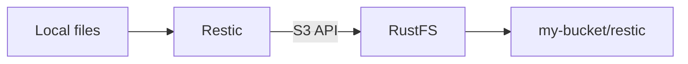

Restic は、スナップショットをリポジトリに保存するコマンドラインのバックアップツールです。このページでは、Restic を RustFS に向け、ローカルディレクトリをバックアップし、スナップショットを復元し、RustFS 内の保存オブジェクトを確認します。

実行中の RustFS インスタンス、`my-bucket` のようなバケット、インストール済みの Restic、バケット用のアクセスキー、Restic リポジトリ用のパスワードが必要です。

:::note[パス形式のアドレス指定]

Restic の S3 backend では、RustFS に対してパス形式のアドレス指定を使用します。このページでは `-o s3.bucket-lookup=path` を設定し、リポジトリ URL にバケット名を含めます。

:::

## アーキテクチャ



Restic は S3 API を通じて、リポジトリのメタデータとバックアップスナップショットを RustFS に書き込みます。このページのリポジトリのプレフィックスは `restic`、バケットは `my-bucket` です。

## 1. バケットを準備する

RustFS Console を `http://localhost:9001` で開き、`my-bucket` を作成するか、バックアップ専用の既存バケットを選択します。


バックアップジョブごとに専用バケットを使います。スクリーンショットは英語表示のライトテーマです。

## 2. Restic リポジトリを初期化する

認証情報、リージョン、リポジトリのパスワード、リポジトリの場所を設定します。

```bash
export AWS_ACCESS_KEY_ID=<your-access-key>
export AWS_SECRET_ACCESS_KEY=<your-secret-key>
export AWS_DEFAULT_REGION=us-east-1
export RESTIC_PASSWORD=<your-restic-password>
export RESTIC_REPOSITORY=s3:http://localhost:9000/my-bucket/restic
```

`restic init` をパス形式のバケット参照で実行します。

```bash
restic -o s3.bucket-lookup=path init
```

リポジトリのパスワードはスナップショットデータを保護します。RustFS のアクセスキーとは分けて保管してください。

## 3. データをバックアップする

小さなテストディレクトリを作成してバックアップします。

```bash
mkdir -p ~/Documents/restic-demo
printf 'hello from RustFS\n' > ~/Documents/restic-demo/hello.txt
restic -o s3.bucket-lookup=path backup ~/Documents/restic-demo
```

バックアップが完了すると、Restic がスナップショット ID を表示します。ファイルを変更してから同じコマンドを再実行すると、2 つ目のスナップショットが作成されます。

## 4. スナップショットを復元する

最新のスナップショットを別のディレクトリに復元します。

```bash
mkdir -p ~/Documents/restic-restore
restic -o s3.bucket-lookup=path restore latest --target ~/Documents/restic-restore
```

必要に応じて、特定のスナップショット ID を復元して以前の版を戻せます。

## 5. RustFS でリポジトリを確認する

RustFS Console で `my-bucket` を開き、Restic が `restic/` プレフィックス配下にリポジトリオブジェクトを作成したことを確認します。

リポジトリチェックも実行できます。

```bash
restic -o s3.bucket-lookup=path check
```

## 次の手順

- [CLI Client (rc)](/operations/rc) でバケットを作成し、コマンドラインからオブジェクトを確認します。
- RustFS を信頼できないネットワークの外に公開する場合は [TLS Configuration](/integration/tls-configured) を確認します。